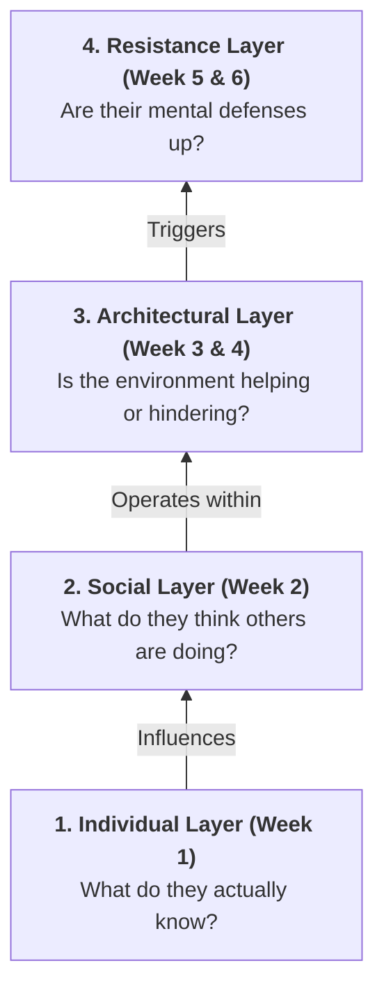

# File: README.md
# Description: This is the master study guide for the Communication & Influence course. It uses a GitHub README style to provide a high-signal overview of all literature, including conceptual models, societal use-cases, and detailed key take-aways for every paper.

# 🎓 Communication & Influence: Master Overview
> **Description:** A professor-level, plain-language synthesis of the entire Communication & Influence curriculum (2025-2026). Designed for rapid conceptual understanding, memorization, and real-world application.

---

## 🏗️ The Conceptual Model: "The Influence Stack"

Think of changing societal behavior as penetrating a series of defensive walls. You cannot just give people facts and expect them to change. You have to penetrate four distinct layers. 

### Visual Hierarchy

*If the visual above doesn't render in your markdown viewer, use this conceptual table:*

| Layer | The Core Question | The Barrier to Change |
| :--- | :--- | :--- |
| **4. Resistance** | How do they react to persuasion? | They know you're trying to manipulate them. |
| **3. Architecture** | Is the good choice easy? | The system rewards bad behavior (e.g., cheap fast food). |
| **2. Social** | What do others think/do? | Fear of standing out or being judged (Pluralistic Ignorance). |
| **1. Individual** | What are the facts? | The Information Deficit Model (facts alone aren't enough). |

---

## 📅 Week 1: The Knowledge Paradox
**The Core Concept:** Why "more facts" fails to change minds.

### 📄 Mildenberger & Tingley (2019): Second-Order Opinions
*   **Plain Language:** We have *First-order opinions* (what we believe) and *Second-order opinions* (what we think *others* believe). This paper proves we are terrible at guessing what others think. We assume nobody cares, so we stay silent. 
*   **The Mnemonic:** 🪞 **The Social Mirror.** Are you looking in the mirror thinking you are the only one who cares?

**🚀 Key Take-Aways:**
- **Stubborn Inaccuracy:** People in the US (and likely elsewhere) systematically underestimate public support for climate policies by about 20-30%.
- **The False Consensus Effect:** People often assume their own views are more popular than they are, *except* when it comes to climate change, where even the majority thinks they are the minority.
- **Policy Paralysis:** Politicians also suffer from this. They are afraid to pass "popular" laws because they *think* the laws are unpopular.
- **Mechanism:** Information about *social consensus* is more powerful for behavior change than information about *scientific facts*.

---

## 📅 Week 2: Social Norms & The Cost of Speaking Up
**The Core Concept:** Interpersonal dynamics and why we stay quiet.

### 📄 Geiger & Swim (2016): Climate of Silence
*   **Plain Language:** Following Week 1, because we think others don't care, we don't talk about it. Silence breeds more silence. 

**🚀 Key Take-Aways:**
- **Pluralistic Ignorance:** This is the "Ghost in the Room." Everyone thinks everyone else is fine with the status quo, even if everyone privately hates it.
- **Interpersonal Activism:** The most effective way to change minds is through casual conversation, yet this is exactly what people avoid most.
- **Barriers:** People stay silent because of: 1) Lack of knowledge, 2) Fear of appearing incompetent, and 3) Fear of social backlash.

### 📄 Steentjes (2017) & Klaperski (2025): The Cost of Confrontation
*   **Plain Language:** When you *do* speak up to correct someone's behavior, there is a social penalty. 

**🚀 Key Take-Aways:**
- **Competence vs. Warmth:** If you confront someone about their unsustainable behavior, they might respect your *knowledge* (Competence) but they will like you less (Warmth).
- **Social Cost:** Correcting a peer can lead to "social exclusion." This is why people avoid being the "Environmental Police" at a party.
- **Identity Defense:** If a norm is tied to a person's identity (e.g., "I am a car enthusiast"), correcting them feels like a personal attack, triggering a defensive response.

---

## 📅 Week 3: Fixing the Environment (Nudges vs. Boosts)
**The Core Concept:** Bypassing persuasion by changing the environment.

### 📄 Hertwig & Grune-Yanoff (2017): Nudges vs. Boosts
*   **Plain Language:** Sometimes persuasion is too hard. Instead, change the environment.

**🚀 Key Take-Aways:**
- **Nudge (Steering):** Works on System 1 (Intuitive). It doesn't teach you anything; it just makes the "right" path the easiest one (e.g., placing fruit at eye level).
- **Boost (Empowering):** Works on System 2 (Analytical). It gives you a "cognitive tool" so you can make better choices forever (e.g., teaching people how to spot "greenwashing" in ads).
- **The Trade-off:** Nudges are cheap and fast but can be seen as "manipulative." Boosts are ethical and long-lasting but require the person's active cooperation and effort.

---

## 📅 Week 4: The Scale Problem (Individuals vs. Systems)
**The Core Concept:** Who is to blame—the person or the rules?

### 📄 Chater & Loewenstein (2023): I-frame vs. S-frame
*   **Plain Language:** The biggest debate in behavioral science right now. 

**🚀 Key Take-Aways:**
- **The I-Frame Trap:** If we only focus on individual behavior (nudges to save water), we accidentally imply that the problem is the *individual's fault*.
- **Deflection Strategy:** Corporations love I-frames. By promoting "Carbon Footprints," they shift the blame from their massive factories onto your lightbulbs.
- **Systemic Change (S-frame):** Real change requires changing the "System"—laws, taxes, and infrastructure.
- **The Interaction:** I-frame interventions are only useful if they build public support for S-frame policies. If they *replace* S-frame policies, they are actively harmful.

---

## 📅 Week 5: The Credibility of Science
**The Core Concept:** Communicating truth in a polarized world.

### 📄 Van der Linden et al. (2015): The Gateway Belief
*   **Plain Language:** People don't read science reports. They look for a shortcut: "Do the experts agree?"

**🚀 Key Take-Aways:**
- **Causal Chain:** Consensus Message ➔ Gateway Belief (Scientists agree) ➔ Key Beliefs (Climate change is real/human-caused) ➔ Support for Action.
- **The "Consensus Gap":** The public thinks only 50-60% of scientists agree. Correcting this to 97% is a "small change with a big impact."
- **Heuristic Processing:** Scientific consensus acts as a "mental shortcut" for people who don't have time to study the data.

### 📄 Meijers & Rutjens (2014): Compensatory Control
*   **Plain Language:** When the world feels chaotic, people comfort themselves by believing "Technology will save us." 

**🚀 Key Take-Aways:**
- **Moral Licensing:** If you tell people "Science is making huge progress," they feel less guilty about their own bad habits.
- **Psychological Order:** Belief in science provides a sense of "order" and "predictability" in an unpredictable world.
- **The Side-Effect:** High belief in scientific progress reduces the intention to act environmentally. People essentially "delegate" the work of saving the planet to the scientists.

---

## 📅 Week 6: Resistance & Mental Immunity
**The Core Concept:** How to bypass our psychological defense mechanisms.

### 📄 Fransen (2023) & Basol (2020): Inoculation Theory
*   **Plain Language:** People hate being manipulated. When they sense an ad or a warning, their defenses go up. 

**🚀 Key Take-Aways:**
- **Resistance Strategies:** People resist through:
    1.  **Avoidance:** Walking away or looking at their phone.
    2.  **Contesting:** Arguing against the source ("That's just propaganda!").
    3.  **Empowerment:** Validating their own choice ("I've done my own research").
- **Inoculation (Pre-bunking):** The only way to stop fake news is to get there *first*. By showing people how a lie is constructed (the "tactic") before they see the lie itself, you make them "immune."
- **Confidence Boost:** Successful inoculation makes people feel more confident in their ability to spot lies, making them less likely to be swayed by emotional rhetoric later.
