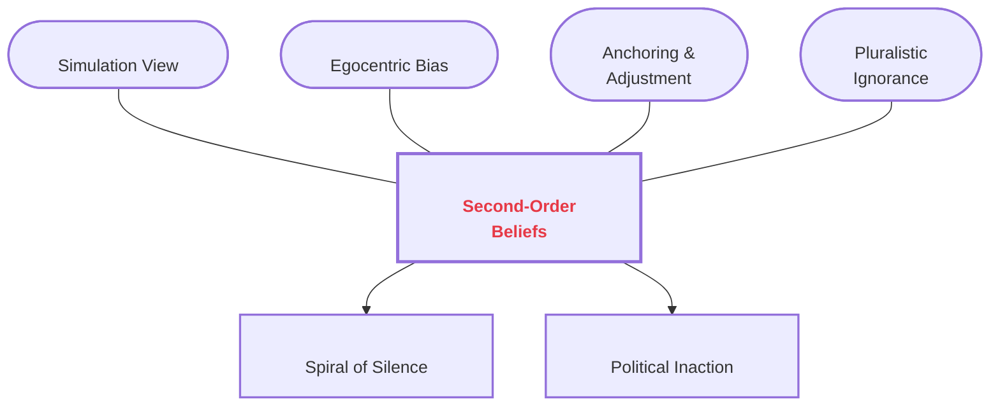
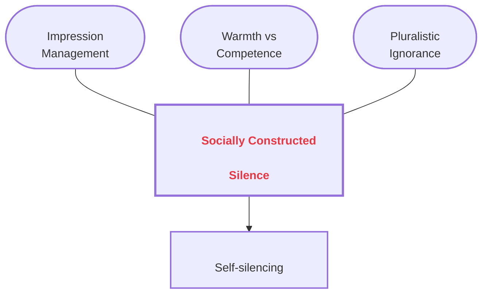
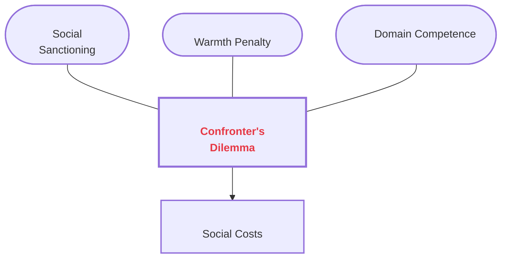
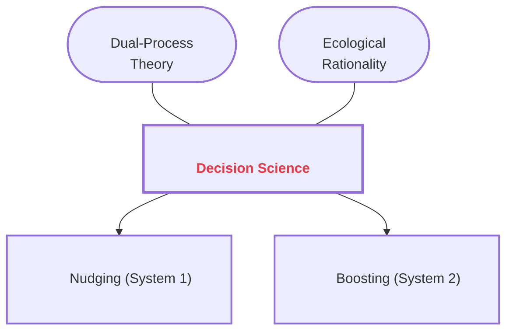
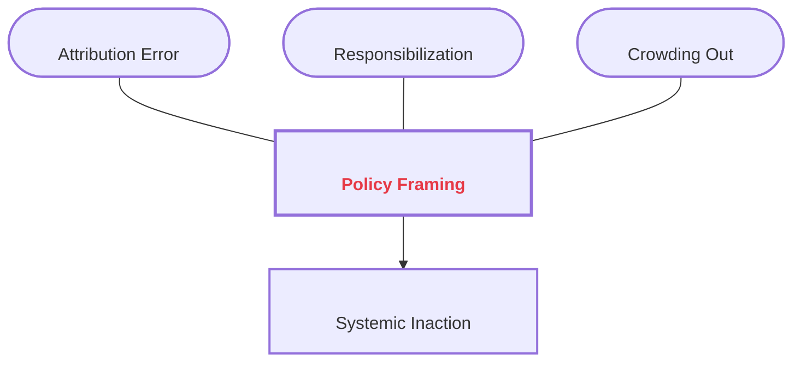
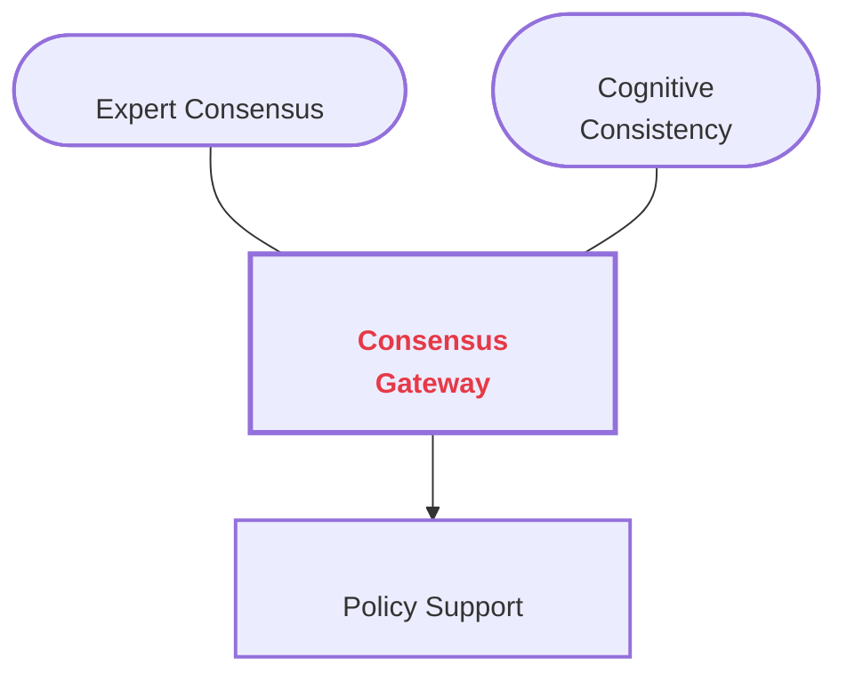
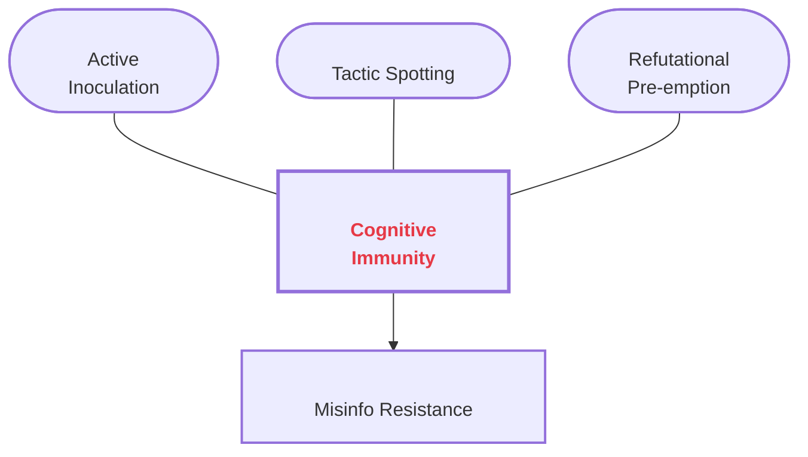

# Course Mastery Guide: SOW-BS033 Communication and Influence (Encyclopedia Edition)

This guide is a master-level study resource optimized for the MSc Behavioural Science curriculum. It features deep-dive literature summaries, GitHub-over-engineered conceptual models, and verbatim keyword styling.

### 1. Global Topology

**Figure 1**

*Structural Map of Social Influence and Communication Theories*

```mermaid
%%{init: { 'flowchart': { 'padding': 30, 'useMaxWidth': false, 'htmlLabels': true }, 'theme': 'neutral', 'themeVariables': { 'fontSize': '12px', 'fontFamily': '-apple-system,BlinkMacSystemFont,"Segoe UI",Helvetica,Arial,sans-serif' }}}%%
graph TD
    classDef sandbox stroke-width:2px;
    classDef hub stroke-width:3px,font-weight:bold;

    A["<br/>&nbsp;&nbsp;&nbsp;&nbsp;&nbsp;&nbsp; SOW-BS033:<br/>&nbsp;&nbsp;&nbsp;&nbsp;&nbsp;&nbsp; <span style='color:#e63946'><b>Comms & Influence</b></span> &nbsp;&nbsp;&nbsp;&nbsp;&nbsp;&nbsp;<br/>"]:::hub --> B["<br/>&nbsp;&nbsp;&nbsp;&nbsp;&nbsp;&nbsp; Information &<br/>&nbsp;&nbsp;&nbsp;&nbsp;&nbsp;&nbsp; Belief Systems &nbsp;&nbsp;&nbsp;&nbsp;&nbsp;&nbsp;<br/>"]:::sandbox
    A --> C["<br/>&nbsp;&nbsp;&nbsp;&nbsp;&nbsp;&nbsp; Social Norms &<br/>&nbsp;&nbsp;&nbsp;&nbsp;&nbsp;&nbsp; Interactions &nbsp;&nbsp;&nbsp;&nbsp;&nbsp;&nbsp;<br/>"]:::sandbox
    A --> D["<br/>&nbsp;&nbsp;&nbsp;&nbsp;&nbsp;&nbsp; Choice<br/>&nbsp;&nbsp;&nbsp;&nbsp;&nbsp;&nbsp; Architecture &nbsp;&nbsp;&nbsp;&nbsp;&nbsp;&nbsp;<br/>"]:::sandbox
    A --> E["<br/>&nbsp;&nbsp;&nbsp;&nbsp;&nbsp;&nbsp; Systemic vs.<br/>&nbsp;&nbsp;&nbsp;&nbsp;&nbsp;&nbsp; Individual &nbsp;&nbsp;&nbsp;&nbsp;&nbsp;&nbsp;<br/>"]:::sandbox
    A --> F["<br/>&nbsp;&nbsp;&nbsp;&nbsp;&nbsp;&nbsp; Resistance &<br/>&nbsp;&nbsp;&nbsp;&nbsp;&nbsp;&nbsp; Inoculation &nbsp;&nbsp;&nbsp;&nbsp;&nbsp;&nbsp;<br/>"]:::sandbox

    B --> B1["<br/>&nbsp;&nbsp;&nbsp;&nbsp;&nbsp;&nbsp; Mildenberger &nbsp;&nbsp;&nbsp;&nbsp;&nbsp;&nbsp;<br/>"]:::sandbox
    B --> B2["&nbsp;&nbsp;&nbsp;&nbsp;&nbsp;&nbsp; Van der Linden &nbsp;&nbsp;&nbsp;&nbsp;&nbsp;&nbsp;"]:::sandbox
    B --> B3["&nbsp;&nbsp;&nbsp;&nbsp;&nbsp;&nbsp; Meijers & Rutjens &nbsp;&nbsp;&nbsp;&nbsp;&nbsp;&nbsp;"]:::sandbox

    C --> C1["&nbsp;&nbsp;&nbsp;&nbsp;&nbsp;&nbsp; Geiger & Swim &nbsp;&nbsp;&nbsp;&nbsp;&nbsp;&nbsp;"]:::sandbox
    C --> C2["&nbsp;&nbsp;&nbsp;&nbsp;&nbsp;&nbsp; Steentjes &nbsp;&nbsp;&nbsp;&nbsp;&nbsp;&nbsp;"]:::sandbox
    C --> C3["&nbsp;&nbsp;&nbsp;&nbsp;&nbsp;&nbsp; Klaperski &nbsp;&nbsp;&nbsp;&nbsp;&nbsp;&nbsp;"]:::sandbox

    D --> D1["&nbsp;&nbsp;&nbsp;&nbsp;&nbsp;&nbsp; Hertwig &nbsp;&nbsp;&nbsp;&nbsp;&nbsp;&nbsp;"]:::sandbox
    D --> D2["&nbsp;&nbsp;&nbsp;&nbsp;&nbsp;&nbsp; Dorresteijn &nbsp;&nbsp;&nbsp;&nbsp;&nbsp;&nbsp;"]:::sandbox
    D --> D3["&nbsp;&nbsp;&nbsp;&nbsp;&nbsp;&nbsp; Shiota &nbsp;&nbsp;&nbsp;&nbsp;&nbsp;&nbsp;"]:::sandbox

    E --> E1["&nbsp;&nbsp;&nbsp;&nbsp;&nbsp;&nbsp; Chater & Loewen &nbsp;&nbsp;&nbsp;&nbsp;&nbsp;&nbsp;"]:::sandbox
    E --> E2["&nbsp;&nbsp;&nbsp;&nbsp;&nbsp;&nbsp; Gonzales-Arcos &nbsp;&nbsp;&nbsp;&nbsp;&nbsp;&nbsp;"]:::sandbox

    F --> F1["&nbsp;&nbsp;&nbsp;&nbsp;&nbsp;&nbsp; Fransen &nbsp;&nbsp;&nbsp;&nbsp;&nbsp;&nbsp;"]:::sandbox
    F --> F2["&nbsp;&nbsp;&nbsp;&nbsp;&nbsp;&nbsp; Basol &nbsp;&nbsp;&nbsp;&nbsp;&nbsp;&nbsp;"]:::sandbox
```

*Note.* This figure provides a comprehensive hierarchical overview of the SOW-BS033 course themes. It illustrates the primary conceptual domains—ranging from information-based belief systems to the social dynamics of interaction, environmental design of choice, and systemic framing.

**Diagram Glossary (Figure 1)**
*   **Information & Belief Systems:** The study of how individuals acquire, update, and meta-perceive scientific information and collective norms.
*   **Social Norms & Interactions:** The exploration of how interpersonal talk and group-level misperceptions (pluralistic ignorance) shape behavior.
*   **Choice Architecture:** The design of environments (nudges) or skill-building (boosts) to steer or empower decision-making.
*   **Systemic vs. Individual:** The critical evaluation of whether behavioral problems should be solved at the level of the person (i-frame) or the system (s-frame).
*   **Resistance & Inoculation:** The study of psychological defense mechanisms against persuasive manipulation and misinformation.

---

### 🟢 Week 1: The Social Construction of Belief

#### Mildenberger & Tingley (2019): Beliefs about Climate Beliefs

**Detailed Abstract**  
This research challenges the traditional <b>Information Deficit Model</b>—the assumption that providing more scientific facts is the primary route to behavioral change. The authors argue that collective action is often paralyzed not by a lack of knowledge, but by biased <b>second-order beliefs</b>: our perceptions of what *others* believe. Through six massive surveys in the US and China, the study identifies a systemic <b>egocentric bias</b>, where individuals' own views anchor their estimates of the collective norm. This leads to a <b>pluralistic ignorance effect</b>, where a majority incorrectly assumes they are in the minority. This misperception creates a <b>spiral of silence</b>, where individuals self-censor to avoid social isolation. Crucially, political elites (e.g., congressional staffers) are found to be even more biased than the public, often underestimating constituent support for climate policy by significant margins. This paper fulfill's the objective of outlining how social perceptions shape political reality.

**Figure 2**

*Theoretical Topology of Second-Order Belief Construction*

*Note.* This conceptual model explains the psychological construction of social reality as described by Mildenberger & Tingley. The central Hub represents the meta-cognitive state of holding a second-order belief.

**Diagram Glossary (Figure 2)**
*   **Second-Order Beliefs:** A person's estimate of what other people think or believe.
*   **Simulation View:** Making an inference about another's mind by imagining yourself in their situation.
*   **Egocentric Bias:** Using your own belief as the primary reference point for guessing the beliefs of others.
*   **Anchoring & Adjustment:** A mental shortcut where you start with an initial value (anchor) and fail to adjust away from it sufficiently.
*   **Pluralistic Ignorance:** When a majority of people hold a belief but incorrectly think that most others disagree with them.
*   **Spiral of Silence:** The behavioral outcome where people stop expressing their views because they fear they are in the minority.
*   **Political Inaction:** The failure of policy-makers to enact change because they misperceive a lack of public mandate.

**How to remember**  
Think of the **"Social Mirror."** Your <b>second-order beliefs</b> are just a reflection of your own views (<b>egocentric bias</b>). You assume everyone sees what you see, which leads to the **"Lonely Majority"**—everyone wants to act, but no one speaks because they think they're alone.

---

### 🔵 Week 2: Interpersonal Communication & Social Norms

#### Geiger & Swim (2016): Climate of Silence

**Detailed Abstract**  
Investigates the "Climate of Silence" where public discussion lags behind private concern. The study identifies <b>pluralistic ignorance</b> as the key driver, motivated by <b>impression management</b>. Individuals fear that speaking up will damage their perceived <b>warmth</b> and **competence**, leading to <b>self-silencing</b> to protect their social reputation.

**Figure 3**

*Psychological Barriers to Climate Discussion*

*Note.* This diagram shows how reputation management concerns (Warmth vs Competence) mediate the relationship between private concern and public silence.

**Diagram Glossary (Figure 3)**
*   **Socially Constructed Silence:** A quietness in society caused by shared psychological misperceptions rather than a lack of actual interest.
*   **Impression Management:** The process of trying to control how other people view you.
*   **Warmth vs Competence:** The two main ways we judge people (how "nice" they are vs how "smart/capable" they are).
*   **Pluralistic Ignorance:** Thinking you are the only one who cares when actually most people care.
*   **Self-silencing:** Choosing not to speak your mind to avoid social awkwardness or judgment.

#### Klaperski-van der Wal et al. (2025): The Competent Confronter

**Figure 4**

*Theoretical Tradeoffs in Behavioral Confrontation*

**Diagram Glossary (Figure 4)**
*   **Confronter's Dilemma:** The conflict between wanting to stand up for your values and wanting to be liked by your friends.
*   **Social Sanctioning:** When a group "punishes" a member (e.g., by ignoring them) for breaking a social rule.
*   **Warmth Penalty:** Being seen as less friendly or pleasant because you corrected someone else's behavior.
*   **Domain Competence:** Being seen as very knowledgeable about the specific topic you are talking about.
*   **Social Costs:** The negative impact on your reputation or friendships after you speak up.

---

### 🟡 Week 3: Beyond Nagging Nudges

#### Hertwig & Grune-Yanoff (2017): Nudging and Boosting

**Figure 5**

*Taxonomy of Behavioral Policy Interventions*

**Diagram Glossary (Figure 5)**
*   **Decision Science:** The study of how people make choices and how to help them make better ones.
*   **Dual-Process Theory:** The idea that the brain has two modes: System 1 (fast/emotional) and System 2 (slow/logical).
*   **Ecological Rationality:** The idea that our "gut feelings" are actually smart if they match the situation we are in.
*   **Nudging:** Gently pushing people toward a choice by changing their environment (e.g., placing healthy food at eye-level).
*   **Boosting:** Giving people a new skill or rule-of-thumb so they can make better choices themselves.

---

### 🟠 Week 4: I-frames, S-frames, and System Change

#### Chater & Loewenstein (2023): The i-frame and the s-frame

**Figure 6**

*Structural Dynamics of Policy Framing*

**Diagram Glossary (Figure 6)**
*   **Policy Framing:** How a problem is "packaged" or described to the public.
*   **Attribution Error:** Blaming an individual's character for a problem that is actually caused by the system.
*   **Responsibilization:** Making individuals feel it is their personal duty to solve massive problems like climate change.
*   **Crowding Out:** When focusing on small individual actions makes people care less about big systemic changes (like laws).
*   **Systemic Inaction:** When no major changes happen because everyone is focused on small, individual-level "nudges."

---

### 🔴 Week 5: The Credibility of Science Communication

#### Van der Linden et al. (2015): Gateway Belief Model

**Figure 7**

*The Consensus Domino Effect*

**Diagram Glossary (Figure 7)**
*   **Consensus Gateway:** A "key" belief (that scientists agree) which opens the door to other beliefs.
*   **Expert Consensus:** The degree to which experts in a field agree on a specific fact.
*   **Cognitive Consistency:** The human drive to make all our internal beliefs match each other logically.
*   **Policy Support:** Willingness to vote for or fund government actions to solve a problem.

---

### 🟣 Week 6: Resistance to Persuasion & Inoculation

#### Basol et al. (2020): Good News about Bad News

**Figure 8**

*The Mechanism of Cognitive Immunity*

**Diagram Glossary (Figure 8)**
*   **Cognitive Immunity:** A "mental vaccine" that makes you resistant to being tricked by lies.
*   **Active Inoculation:** Building immunity by practicing how to create (and refute) fake news yourself.
*   **Tactic Spotting:** Learning to recognize the specific "tricks" used in misinformation (like impersonating experts).
*   **Refutational Pre-emption:** Seeing a lie and its explanation *before* you hear it in the real world.
*   **Misinfo Resistance:** The ability to not be fooled by fake news or manipulative arguments.

**How to remember**  
The **"Fire Drill."** You run a fake drill (inoculation) so your brain knows the exits when a real fire (misinformation) starts.
