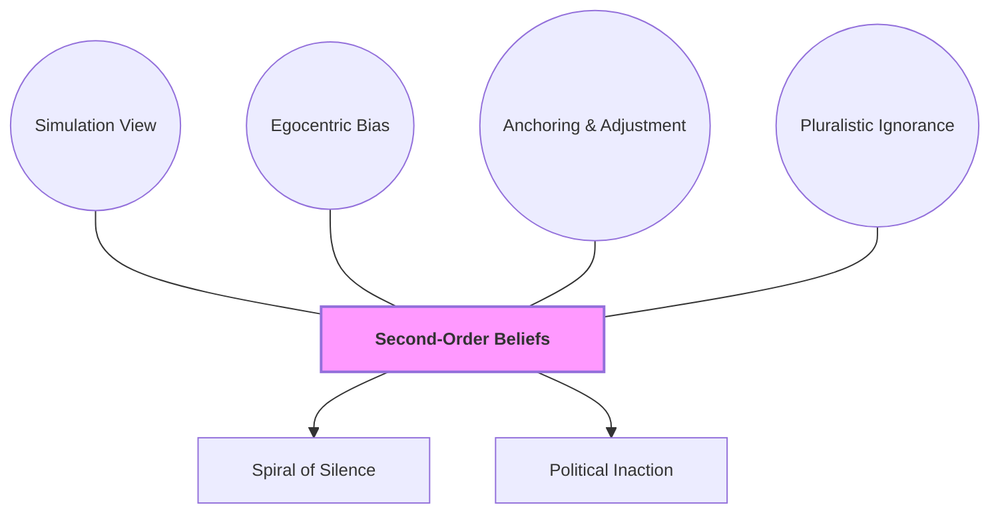
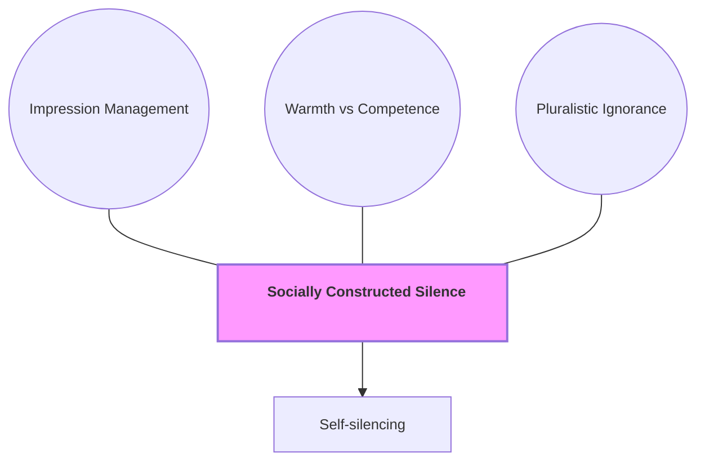
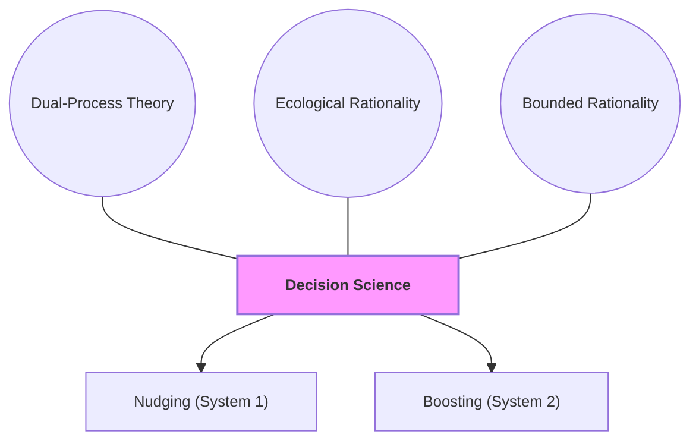
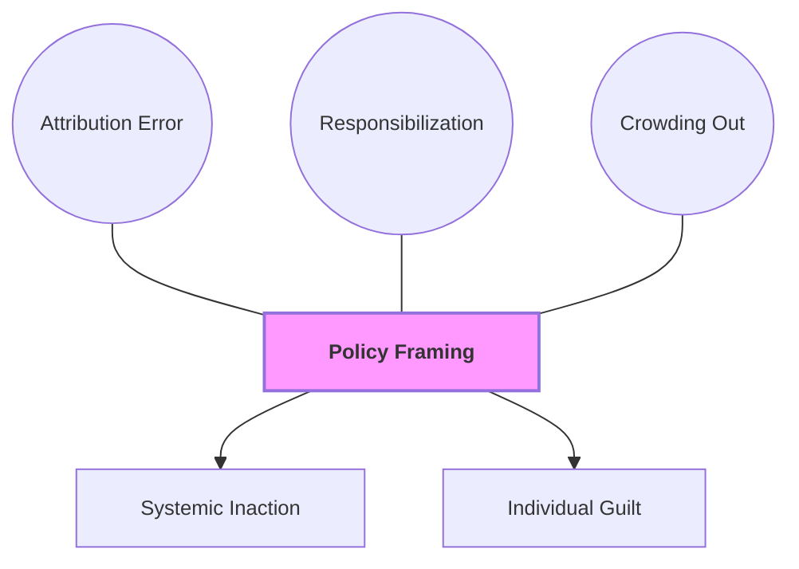
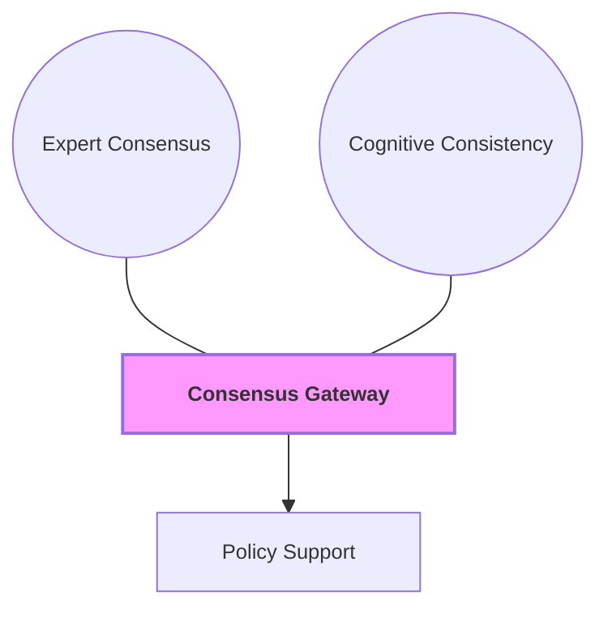
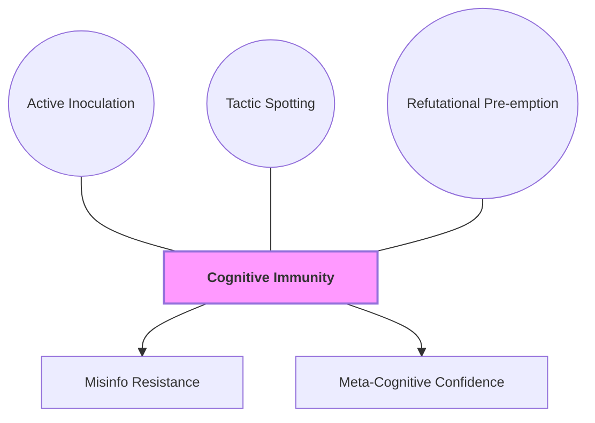

# Course Mastery Guide: SOW-BS033 Communication and Influence (Encyclopedia Edition)

This guide is a master-level study resource optimized for the MSc Behavioural Science curriculum. It features deep-dive literature summaries, APA-formatted conceptual models, and verbatim keyword styling to facilitate the learning objectives of outlining, explaining, and critically evaluating social influence perspectives.

### 1. Global Topology

**Figure 1**

*Structural Map of Social Influence and Communication Theories*

```mermaid
%%{init: { 'flowchart': { 'padding': 15, 'nodeSpacing': 50, 'rankSpacing': 50, 'curve': 'basis' }, 'themeVariables': { 'fontSize': '13px' }}}%%
graph TD
    A["&nbsp;&nbsp; SOW-BS033: &nbsp;&nbsp;<br/>&nbsp;&nbsp; Communication & Influence &nbsp;&nbsp;"]:::hub --> B["&nbsp;&nbsp; Information & Beliefs &nbsp;&nbsp;"]
    A --> C["&nbsp;&nbsp; Social Norms & Interactions &nbsp;&nbsp;"]
    A --> D["&nbsp;&nbsp; Choice Architecture &nbsp;&nbsp;"]
    A --> E["&nbsp;&nbsp; Systemic vs. Individual &nbsp;&nbsp;"]
    A --> F["&nbsp;&nbsp; Resistance & Inoculation &nbsp;&nbsp;"]

    B --> B1["&nbsp;&nbsp; Mildenberger &nbsp;&nbsp;"]
    B --> B2["&nbsp;&nbsp; Van der Linden &nbsp;&nbsp;"]
    B --> B3["&nbsp;&nbsp; Meijers & Rutjens &nbsp;&nbsp;"]

    C --> C1["&nbsp;&nbsp; Geiger & Swim &nbsp;&nbsp;"]
    C --> C2["&nbsp;&nbsp; Steentjes &nbsp;&nbsp;"]
    C --> C3["&nbsp;&nbsp; Klaperski &nbsp;&nbsp;"]

    D --> D1["&nbsp;&nbsp; Hertwig &nbsp;&nbsp;"]
    D --> D2["&nbsp;&nbsp; Dorresteijn &nbsp;&nbsp;"]
    D --> D3["&nbsp;&nbsp; Shiota &nbsp;&nbsp;"]

    E --> E1["&nbsp;&nbsp; Chater & Loewen &nbsp;&nbsp;"]
    E --> E2["&nbsp;&nbsp; Gonzales-Arcos &nbsp;&nbsp;"]

    F --> F1["&nbsp;&nbsp; Fransen &nbsp;&nbsp;"]
    F --> F2["&nbsp;&nbsp; Basol &nbsp;&nbsp;"]

    classDef hub font-weight:bold,stroke-width:3px;
    classDef default stroke-width:2px;
```

*Note.* This figure provides a hierarchical overview of the course themes, illustrating the relationship between core modules and the foundational literature. The topology is designed to help students outline the broad perspectives covered in SOW-BS033, from information-based belief systems to systemic framing and psychological resistance.

---

### 🟢 Week 1: The Social Construction of Belief

#### Mildenberger & Tingley (2019): Beliefs about Climate Beliefs

**Detailed Abstract**  
This research challenges the traditional **Information Deficit Model**—the assumption that public inaction stems purely from a lack of scientific knowledge. The authors argue that collective action depends not just on what individuals believe (first-order beliefs), but on **second-order beliefs**: their perceptions of what others believe. Utilizing six surveys across the US and China, the study maps these perceptions among the public and political elites. They find a consistent **egocentric bias**, where individuals use their own beliefs as a heuristic anchor, leading to a **pluralistic ignorance effect**. In this state, a majority may privately support climate action but publicly assume they are in the minority. This misperception creates a **spiral of silence**, where fear of social sanctions prevents the expression of pro-climate views. Crucially, the study shows that political elites (e.g., congressional staffers) are even more biased than the public, often underestimating constituent support for climate policy by 30-40%. This fulfills the learning objective of explaining how social perceptions can paralyze policy momentum regardless of scientific facts.

**Core Definitions**  
*   **Second-order beliefs**: An individual's perception or estimate of the distribution of beliefs within a population.
*   **Information Deficit Model**: The assumption that providing more scientific information will automatically lead to behavioral or policy shifts.
*   **Egocentric Bias**: The cognitive tendency to use one's own internal state as a starting point for estimating the states of others.
*   **Pluralistic Ignorance Effect**: A psychological state where individuals hold a belief but mistakenly assume that the majority of others do not share it.
*   **Simulation View**: Making inferences about others' minds by imagining oneself in their position.
*   **Spiral of Silence**: The tendency of people to remain silent when they feel their views are in the minority, fearing social isolation.

**Figure 2**

*Theoretical Topology of Second-Order Belief Construction*

*Note.* This conceptual network illustrates the psychological drivers that transform subjective individual beliefs into biased meta-perceptions of the collective. The "Hub" represents the meta-belief, while the circular satellite nodes represent the cognitive mechanisms (Simulation, Bias, Anchoring) that lead to the phenomenon of Pluralistic Ignorance. The rectangular output nodes show the behavioral consequences: a "Spiral of Silence" among the public and "Political Inaction" among elites who misjudge their mandates.

**How to remember**  
To remember Week 1, use the analogy of the **"Social Mirror."** When you look at a mirror, you think you're seeing the room (society), but you're actually just seeing yourself. In behavioral terms, your **Second-Order Beliefs** are just reflections of your own **Egocentric Bias**. 

**🔗 Mnemonic: S.E.A. Silence**  
- **S**imulation (Guessing minds)
- **E**gocentric (Guessing from self)
- **A**nchoring (Sticking to the guess)
- Leads to **Silence** (Spiral of Silence).

---

### 🔵 Week 2: Interpersonal Communication & Social Norms

#### Geiger & Swim (2016): Climate of Silence

**Detailed Abstract**  
This paper investigates the psychological barriers to discussing climate change in everyday social life. The authors hypothesize that a **socially constructed silence** is maintained by **pluralistic ignorance**—the false belief that others do not share one's concern. The study focuses on **impression management**, specifically the dimensions of **warmth** (being likeable) and **competence** (being capable). Participants feared that speaking up would lead to being labeled with negative stereotypes, resulting in **self-silencing**. Interestingly, the results showed that the fear of appearing **incompetent** was a more powerful driver of silence than the fear of being perceived as cold or unfriendly. This illustrates the objective of explaining social influence by showing how group-level "silence" is not a lack of concern, but a strategic avoidance of social judgment.

**Core Definitions**  
*   **Socially Constructed Silence**: A state where a topic is not discussed because participants mutually misperceive each other as disinterested.
*   **Impression Management**: The process by which individuals attempt to control the impressions others form of them.
*   **Warmth**: A social evaluation dimension related to friendliness and helpfulness.
*   **Competence**: A social evaluation dimension related to intelligence and skill.
*   **Self-silencing**: The active suppression of one's thoughts or feelings to avoid social conflict or negative evaluation.

**Figure 3**

*The Mechanism of Self-Silencing*

*Note.* This diagram shows how reputation concerns mediate the relationship between private belief and public action. The "Hub" is the collective state of silence, which is "constructed" by the three explanatory satellite nodes. The arrows demonstrate that while an individual may feel concern, the "Impression Management" filter forces them into "Self-silencing" to preserve their perceived social "Warmth" and "Competence."

**How to remember**  
Think of the **"Confronter's Tightrope."** You are walking a wire where one side is being "Nice but Useless" (High Warmth, No Change) and the other is being "Right but Alone" (High Competence, High Social Cost). To stay on the rope, you must be a "Competent Confronter."

**🔗 Mnemonic: W.A.C. Out**  
- **W**armth & **A**ccuracy (Competence)
- Lead to **C**onversation
- Breaking the **Out**cast fear.

---

### 🟡 Week 3: Beyond Nagging Nudges

#### Hertwig & Grune-Yanoff (2017): Nudging and Boosting

**Detailed Abstract**  
This paper provides a theoretical foundation for behavioral policy, distinguishing between **Nudges** and **Boosts**. Nudges aim to steer behavior without forbidding options, typically by changing the **Choice Architecture**. They rely on a **Dual-System Architecture**, targeting **System 1** (fast, automatic) by leveraging **Cognitive Deficiencies** like inertia or loss aversion. In contrast, Boosts aim to empower individuals by building **competences**. They assume **Ecological Rationality**—the idea that the mind is a toolbox of heuristics that can be trained. Boosts are more transparent and build lasting skills, whereas nudges are local "repairs" that may not persist once the intervention is removed. This critically evaluates the effectiveness of individual-level interventions in light of human agency and cognitive malleability.

**Core Definitions**  
*   **Nudge**: An intervention that steers behavior by changing the environment without forbidding options or changing economic incentives.
*   **Boost**: An intervention that empowers people by improving their decision-making skills or competences.
*   **Choice Architecture**: The design of different ways in which choices can be presented to consumers.
*   **Ecological Rationality**: The theory that human decision strategies are rational when they match the structure of the environment.
*   **Bounded Rationality**: The idea that decision-making is limited by the information available, the cognitive limitations of the mind, and the time available.

**Figure 4**

*Taxonomy of Behavioral Policy Interventions*

*Note.* This taxonomy contrasts the two major approaches to behavioral change. The "Decision Science" Hub branches into the theoretical assumptions (Dual-Process, Rationality) that justify either Nudging (targeting automatic System 1) or Boosting (targeting deliberative System 2). The arrows indicate the path from theoretical assumption to intervention type.

**How to remember**  
Think of a **"GPS vs. A Map."** A **Nudge** is like a GPS—it tells you exactly where to turn (steering you), but if the GPS breaks, you're lost. A **Boost** is like teaching you how to read a map—it empowers you with a skill that works even if the technology changes.

**🔗 Mnemonic: B.E.S.T.**  
- **B**oost **E**mpowers
- **S**teer **T**hrough Nudge.

---

### 🟠 Week 4: I-frames, S-frames, and System Change

#### Chater & Loewenstein (2023): The i-frame and the s-frame

**Detailed Abstract**  
This provocative paper critiques the behavioral science community's preoccupation with the **i-frame** (individual-level focus). The authors argue that by focusing on small individual nudges, scientists have inadvertently supported corporate **responsibilization**—shifting the blame for systemic failures (e.g., climate change, obesity) onto individual choices. This focus triggers a **crowding out** effect, where public support for necessary **s-frame** (systemic) changes like taxes or regulation is reduced because people feel the problem is being solved by individual actions. The authors advocate for a shift toward designing systems that make good behavior the default, rather than trying to "fix" the fallible individual. This fulfills the objective of critically evaluating perspectives by revealing the hidden political consequences of purely psychological interventions.

**Core Definitions**  
*   **i-frame**: A perspective that focuses on individuals as the primary target for behavioral change interventions.
*   **s-frame**: A perspective that focuses on the rules, infrastructure, and systems that shape behavior.
*   **Responsibilization**: The process of framing societal problems as the moral responsibility of the individual consumer.
*   **Crowding Out**: When individual-level interventions reduce the perceived need or support for systemic policy changes.
*   **Fundamental Attribution Error**: Overestimating the role of personal traits and underestimating situational factors in behavior.

**Figure 5**

*Structural Dynamics of Policy Framing*

*Note.* This model illustrates the diversionary effect of the i-frame. The "Policy Framing" Hub leads to individual guilt but systemic inaction because the cognitive mechanisms (Attribution Error, Responsibilization) hide the need for s-frame structural change. The "Crowding Out" spoke explains why the small "wins" of the i-frame prevent the large "wins" of the s-frame.

**How to remember**  
Imagine a sinking boat. The **i-frame** approach is giving every passenger a small cup to bail out the water (individual responsibility). The **s-frame** approach is fixing the massive hole in the hull (systemic change). If everyone is busy bailing with cups, they might forget to demand that the captain fixes the hole.

**🔗 Mnemonic: I.S. Fix**  
- **I**ndividual (Small cup)
- **S**ystem (Large fix)
- Don't let the **I** hide the **S**.

---

### 🔴 Week 5: The Credibility of Science Communication

#### Van der Linden et al. (2015): The Gateway Belief Model

**Detailed Abstract**  
This experimental study introduces and tests the **Gateway Belief Model (GBM)**. The authors argue that public support for climate policy is blocked by a lack of awareness of the scientific consensus. They demonstrate that communicating a simple fact—that 97% of climate scientists agree—acts as a "gateway" that shifts foundational beliefs. This process relies on **cognitive consistency**: once an individual accepts that the experts agree, they update their other beliefs (causality, risk, and reality of climate change) to align with this new fact. This sequentially leads to increased support for public policy. The study provides strong evidence for the effectiveness of consensus messaging as a simple, low-cost communicative intervention that can bypass ideological polarization in some contexts.

**Core Definitions**  
*   

<b>Gateway Belief Model (GBM)</b>
The theory that shifting a single foundational belief (consensus) triggers a cascading effect on other related beliefs and policy support.

*   

<b>Cognitive Consistency</b>
The psychological drive to maintain a logical and consistent set of beliefs and attitudes.

**Figure 6**

*The Consensus Domino Effect*

*Note.* This diagram maps the cascading effect of consensus information. The "Hub" is the Gateway Belief itself. The satellite nodes represent the psychological requirements (Expertise and Consistency) that allow the consensus message to "unlock" the final behavioral output: increased Policy Support.

#### Meijers & Rutjens (2014): Affirming Belief in Progress

**Detailed Abstract**  
This research explores the paradoxical effect of believing in scientific progress on environmental behavior. Grounded in **Compensatory Control Theory**, the authors argue that humans have a fundamental need to perceive the world as orderly and predictable. When personal control is threatened, people compensate by believing in external sources of order, such as science or government. Through four experiments, the authors show that affirming belief in scientific progress creates a **hydraulic relationship**: as belief in science's ability to "save us" goes up, the motivation for individual pro-environmental action goes down. This is a form of **moral licensing** or outsourced responsibility, where the individual feels they no longer need to act because "the system" has it under control. This critical perspective is vital for the learning objective of evaluating perspectives in light of empirical findings.

**Core Definitions**  
*   

<b>Compensatory Control Theory</b>
The theory that individuals maintain a sense of order by believing in external systems (Science/God) when their personal control is low.

*   

<b>Hydraulic Relationship</b>
A dynamic where an increase in one variable (belief in science) leads to a proportional decrease in another (individual motivation).

**How to remember**  
Think of science as a **"Security Blanket."** The **Gateway Belief (Van der Linden)** says that knowing the blanket exists (consensus) makes you feel it's real. However, **Compensatory Control (Meijers)** warns that if the blanket feels *too* warm and safe, you might just fall asleep (passivity) instead of getting up to fix the house.

**🔗 Mnemonic: G.C.S.**  
- **G**ateway (Consensus)
- **C**ompensatory (Control)
- leads to **S**leep (Passivity).

---

### 🟣 Week 6: Resistance to Persuasion & Inoculation

#### Fransen et al. (2023): Sixty Years Later

**Detailed Abstract**  
This paper presents a large-scale replication of McGuire’s 1961 experiment on **Inoculation Theory**. Using the biological metaphor of a vaccine, the theory posits that individuals can be made resistant to persuasive attacks by pre-exposure to weakened versions of counterarguments. The process of **refutational pre-emption** involves providing both the attack and its refutation in advance. This triggers **threat awareness**, motivating the person to develop "mental antibodies" (their own counterarguments). The replication focuses on **cultural truisms**—beliefs so widely accepted (e.g., "brushing teeth is good") that they have never been attacked and are thus vulnerable. The study successfully replicates the original findings, proving that inoculation is more effective than simple "supportive" messaging at building long-term resistance to misinformation.

**Core Definitions**  
*   

<b>Inoculation Theory</b>
A theory of resistance to persuasion that uses pre-exposure to weakened counterarguments to build mental defense.

*   

<b>Refutational Pre-emption</b>
The mechanism of exposing an audience to a counterargument and then immediately refuting it.

*   

<b>Threat Awareness</b>
The realization that one's current beliefs are vulnerable to attack, which motivates active defense building.

*   

<b>Cultural Truisms</b>
Beliefs that are widely shared and rarely challenged, making them particularly vulnerable to sudden persuasion.

#### Basol et al. (2020): Good News about Bad News

**Detailed Abstract**  
This study extends inoculation theory into the digital age through the "Bad News" game. The authors shift from issue-specific inoculation to **broad-spectrum inoculation**, which focuses on identifying the *tactics* of misinformation rather than specific facts. Through **active inoculation**, players learn by doing—creating their own fake news using tactics like polarization, emotional manipulation, and impersonation. The research demonstrates that this gamified approach significantly boosts participants' ability to spot and resist real-world misinformation. It builds **cognitive immunity** by making individuals active participants in their own defense, rather than passive recipients of warnings. This fulfill's the course objective of making appropriate choices in terms of communicative design for robust behavioral outcomes.

**Core Definitions**  
*   

<b>Broad-Spectrum Inoculation</b>
Building resistance against general categories of misinformation tactics rather than specific topics.

*   

<b>Active Inoculation</b>
A defense-building process where the individual actively engages in refuting or creating arguments, rather than passively reading them.

*   

<b>Cognitive Immunity</b>
The state of being resistant to manipulative communication or misinformation.

**Figure 7**

*The Mechanism of Cognitive Immunity*

*Note.* This figure models the build-up of mental resistance through the identification of manipulative communicative tactics. The "Hub" represents the state of Immunity, which is constructed through Active participation and pre-emptive refutation. The output nodes show that successful inoculation leads not just to resistance, but to increased Meta-Cognitive Confidence in one's own ability to judge truth.

**How to remember**  
Think of Inoculation as a **"Fire Drill."** You don't wait for a real fire to learn how to use the exit. You run a "fake" drill (pre-exposure) so that when the real threat arrives, your body knows exactly what to do without panicking.

**🔗 Mnemonic: F.A.C.T.**  
- **F**ire drill (Inoculation)
- **A**ctive (Doing the game)
- **C**ounter-arguments (Refutation)
- **T**hreat awareness.
