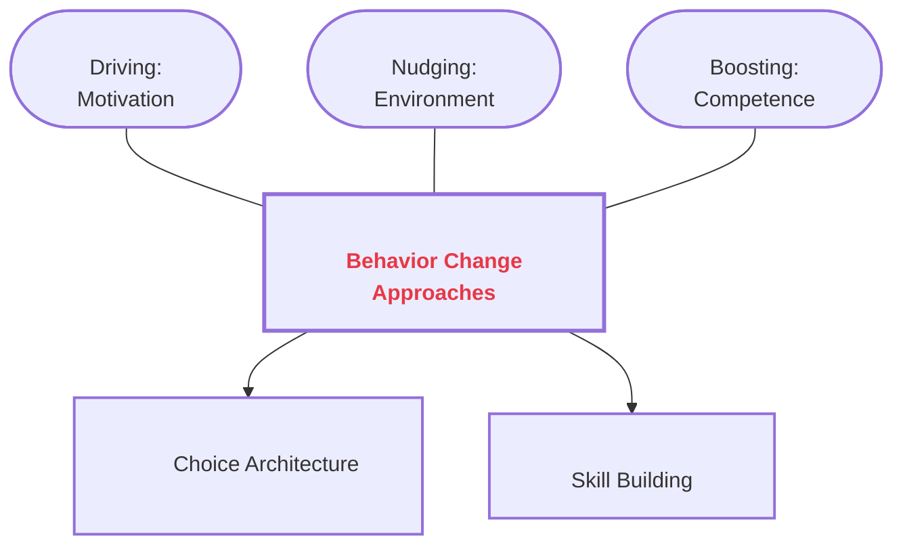

# Course Mastery Guide: SOW-BS033 Communication and Influence (Encyclopedia Edition)

This guide is a master-level study resource optimized for the MSc Behavioural Science curriculum. It features deep-dive literature summaries, GitHub-hardened conceptual models, and verbatim keyword styling.

### 1. Global Topology

**Figure 1**

*Structural Map of Social Influence and Communication Theories*

```mermaid
%%{init: { 'flowchart': { 'padding': 30, 'useMaxWidth': false, 'htmlLabels': true }, 'theme': 'neutral', 'themeVariables': { 'fontSize': '12px', 'fontFamily': '-apple-system,BlinkMacSystemFont,"Segoe UI",Helvetica,Arial,sans-serif' }}}%%
graph TD
    classDef sandbox stroke-width:2px;
    classDef hub stroke-width:3px,font-weight:bold;

    A["<br/>&nbsp;&nbsp;&nbsp;&nbsp;&nbsp;&nbsp; SOW-BS033:<br/>&nbsp;&nbsp;&nbsp;&nbsp;&nbsp;&nbsp; <span style='color:#e63946'><b>Comms & Influence</b></span> &nbsp;&nbsp;&nbsp;&nbsp;&nbsp;&nbsp;<br/>"]:::hub --> B["<br/>&nbsp;&nbsp;&nbsp;&nbsp;&nbsp;&nbsp; Information &<br/>&nbsp;&nbsp;&nbsp;&nbsp;&nbsp;&nbsp; Belief Systems &nbsp;&nbsp;&nbsp;&nbsp;&nbsp;&nbsp;<br/>"]:::sandbox
    A --> C["<br/>&nbsp;&nbsp;&nbsp;&nbsp;&nbsp;&nbsp; Social Norms &<br/>&nbsp;&nbsp;&nbsp;&nbsp;&nbsp;&nbsp; Interactions &nbsp;&nbsp;&nbsp;&nbsp;&nbsp;&nbsp;<br/>"]:::sandbox
    A --> D["<br/>&nbsp;&nbsp;&nbsp;&nbsp;&nbsp;&nbsp; Driving, Nudging,<br/>&nbsp;&nbsp;&nbsp;&nbsp;&nbsp;&nbsp; & Boosting &nbsp;&nbsp;&nbsp;&nbsp;&nbsp;&nbsp;<br/>"]:::sandbox
    A --> E["<br/>&nbsp;&nbsp;&nbsp;&nbsp;&nbsp;&nbsp; Systemic vs.<br/>&nbsp;&nbsp;&nbsp;&nbsp;&nbsp;&nbsp; Individual &nbsp;&nbsp;&nbsp;&nbsp;&nbsp;&nbsp;<br/>"]:::sandbox
    A --> F["<br/>&nbsp;&nbsp;&nbsp;&nbsp;&nbsp;&nbsp; Resistance &<br/>&nbsp;&nbsp;&nbsp;&nbsp;&nbsp;&nbsp; Inoculation &nbsp;&nbsp;&nbsp;&nbsp;&nbsp;&nbsp;<br/>"]:::sandbox

    B --> B1["<br/>&nbsp;&nbsp;&nbsp;&nbsp;&nbsp;&nbsp; Mildenberger &nbsp;&nbsp;&nbsp;&nbsp;&nbsp;&nbsp;<br/>"]:::sandbox
    B --> B2["&nbsp;&nbsp;&nbsp;&nbsp;&nbsp;&nbsp; Van der Linden &nbsp;&nbsp;&nbsp;&nbsp;&nbsp;&nbsp;"]:::sandbox
    B --> B3["&nbsp;&nbsp;&nbsp;&nbsp;&nbsp;&nbsp; Meijers & Rutjens &nbsp;&nbsp;&nbsp;&nbsp;&nbsp;&nbsp;"]:::sandbox

    C --> C1["&nbsp;&nbsp;&nbsp;&nbsp;&nbsp;&nbsp; Geiger & Swim &nbsp;&nbsp;&nbsp;&nbsp;&nbsp;&nbsp;"]:::sandbox
    C --> C2["&nbsp;&nbsp;&nbsp;&nbsp;&nbsp;&nbsp; Steentjes &nbsp;&nbsp;&nbsp;&nbsp;&nbsp;&nbsp;"]:::sandbox
    C --> C3["&nbsp;&nbsp;&nbsp;&nbsp;&nbsp;&nbsp; Klaperski &nbsp;&nbsp;&nbsp;&nbsp;&nbsp;&nbsp;"]:::sandbox

    D --> D1["&nbsp;&nbsp;&nbsp;&nbsp;&nbsp;&nbsp; Hertwig &nbsp;&nbsp;&nbsp;&nbsp;&nbsp;&nbsp;"]:::sandbox
    D --> D2["&nbsp;&nbsp;&nbsp;&nbsp;&nbsp;&nbsp; Dorresteijn &nbsp;&nbsp;&nbsp;&nbsp;&nbsp;&nbsp;"]:::sandbox
    D --> D3["&nbsp;&nbsp;&nbsp;&nbsp;&nbsp;&nbsp; Shiota &nbsp;&nbsp;&nbsp;&nbsp;&nbsp;&nbsp;"]:::sandbox

    E --> E1["&nbsp;&nbsp;&nbsp;&nbsp;&nbsp;&nbsp; Chater & Loewen &nbsp;&nbsp;&nbsp;&nbsp;&nbsp;&nbsp;"]:::sandbox
    E --> E2["&nbsp;&nbsp;&nbsp;&nbsp;&nbsp;&nbsp; Gonzales-Arcos &nbsp;&nbsp;&nbsp;&nbsp;&nbsp;&nbsp;"]:::sandbox

    F --> F1["&nbsp;&nbsp;&nbsp;&nbsp;&nbsp;&nbsp; Fransen &nbsp;&nbsp;&nbsp;&nbsp;&nbsp;&nbsp;"]:::sandbox
    F --> F2["&nbsp;&nbsp;&nbsp;&nbsp;&nbsp;&nbsp; Basol &nbsp;&nbsp;&nbsp;&nbsp;&nbsp;&nbsp;"]:::sandbox
```

*Note.* This figure provides a comprehensive hierarchical overview of the SOW-BS033 course themes. It illustrates the primary conceptual domains—ranging from information-based belief systems to the social dynamics of interaction, the tripartite approach to behavioral change (Driving, Nudging, Boosting), and systemic framing.

**Diagram Glossary (Figure 1)**
*   **Information & Belief Systems:** The study of how individuals acquire, update, and meta-perceive scientific information and collective norms.
*   **Social Norms & Interactions:** The exploration of how interpersonal talk and group-level misperceptions (pluralistic ignorance) shape behavior.
*   **Driving, Nudging, & Boosting:** The three-pillar framework for behavior change interventions, focusing on motivation, environment, and competence.
*   **Systemic vs. Individual:** The critical evaluation of whether behavioral problems should be solved at the level of the person (i-frame) or the system (s-frame).
*   **Resistance & Inoculation:** The study of psychological defense mechanisms against persuasive manipulation and misinformation.

---

### 🟢 Week 1: The Social Construction of Belief

#### Mildenberger & Tingley (2019): Beliefs about Climate Beliefs

**Detailed Abstract**  
This research challenges the traditional <b>Information Deficit Model</b>—the assumption that public inaction stems purely from a lack of scientific facts. This model rests on the flawed <b>Knowledge-Behaviour Hypothesis</b>, which assumes that accurate information automatically translates into behavior. The lecture highlights three critical failures of this hypothesis: (1) <b>Motivated Reasoning</b> (information is processed in self-serving ways), (2) <b>Bounded Rationality</b> (inherent cognitive flaws like the endowment effect), and (3) <b>Environmental Contingency</b> (behavior driven by situational factors rather than knowledge). Mildenberger & Tingley argue that collective action is paralyzed by biased <b>second-order beliefs</b>: our perceptions of what others believe. Identifying a systemic <b>egocentric bias</b>, they show how a <b>pluralistic ignorance effect</b> causes a majority to self-censor in a <b>spiral of silence</b>. Correcting these meta-perceptions is essential for unlocking policy support.

**Core Definitions**  
*   **Second-order beliefs**: Perceptions of the distribution of beliefs within a population.
*   **Information Deficit Model**: The assumption that lack of information is the primary driver of skepticism/inaction.
*   **Knowledge-Behaviour Hypothesis**: The assumption that information processing is the primary driver of change.
*   **Motivated Reasoning**: Processing information to confirm pre-existing goals/beliefs.
*   **Egocentric Bias**: Using one's own internal state to estimate others'.
*   **Pluralistic Ignorance Effect**: Falsely believing one's views are in the minority.
*   **Spiral of Silence**: Withholding views due to fear of isolation.

---

### 🔵 Week 2: Interpersonal Communication & Social Norms

#### Geiger & Swim (2016): Climate of Silence

**Detailed Abstract**  
Investigates the "Climate of Silence" maintained by <b>pluralistic ignorance</b> and <b>impression management</b>. Individuals fear damaging their perceived <b>warmth</b> and **competence**, leading to <b>self-silencing</b>. This <b>socially constructed silence</b> can be broken by providing accurate information about group concern.

#### Klaperski-van der Wal et al. (2025): The Competent Confronter

**Detailed Abstract**  
This research examines the <b>social costs</b> of confronting unsustainable behavior. It addresses the <b>confronter's dilemma</b>: the tension between change (competence) and harmony (warmth). The study provides the first empirical support for the emergence of **beneficial competence ascriptions** for confronters who remain logical and calm, mitigating social penalties.

---

### 🟡 Week 3: Driving, Nudging, and Boosting

#### The Tripartite Framework of Behavior Change

**Detailed Abstract**  
The lecture introduces a comprehensive three-pillar approach to behavior change: **Driving**, **Nudging**, and **Boosting**. 
1. <b>Driving</b> (Motivation) uses high-pressure influence, focusing on **Motivation**, goals, values, and social rewards (e.g., Cialdini’s persuasion principles). Research by **Nolan et al. (2008)** shows that while people *think* environmental values drive them, the <b>descriptive norm</b> ("the neighbors also do") is the strongest motivator. Obstacles to driving include **reactance** and effort.
2. <b>Nudging</b> (Choice Architecture) uses low-pressure environmental steering. As defined by Thaler & Sunstein, it alters behavior without forbidding options. It leverages System 1 <b>cognitive deficiencies</b>.
3. <b>Boosting</b> (Competence) builds lasting <b>competences</b> by targeting System 2 or sharpening heuristics. It assumes <b>ecological rationality</b> and respects autonomy.

#### Hertwig & Grune-Yanoff (2017): Nudging and Boosting

**Figure 5**

*Taxonomy of Behavioral Change Approaches*

**Diagram Glossary (Figure 5)**
*   **Driving:** Increasing internal pressure through rewards, goals, and social norms (Motivation).
*   **Nudging:** Steering behavior through the environment (Choice Architecture).
*   **Boosting:** Increasing individual ability to make good choices (Competence).

#### Challenges in Behavior Change
*   **Repetitive Nudges:** Can impact perceived transparency and autonomy (Wachner et al., 2021).
*   **Enduring Effects:** Behavior often reverts once a nudge is removed.
*   **Spill-over:** Challenges in reaching behaviors in different contexts (e.g., from hospital to home).
*   **Effort:** Boosting requires significant cognitive effort from the individual.

---

### 🟠 Week 4: I-frames, S-frames, and System Change

#### Chater & Loewenstein (2023): The i-frame and the s-frame

**Detailed Abstract**  
Critiques the <b>i-frame</b> (individual focus) for enabling corporate <b>responsibilization</b>. Shifting the burden of global issues onto consumers triggers <b>crowding out</b>, where support for <b>s-frames</b> (systemic change) is reduced. The lecture notes contrast the i-frame (nudging, status quo remains) with the s-frame (policy/law, changing status quo).

---

### 🔴 Week 5: The Credibility of Science Communication

#### Van der Linden et al. (2015): Gateway Belief Model

**Detailed Abstract**  
The <b>Gateway Belief Model (GBM)</b> demonstrates that consensus messaging triggers <b>cognitive consistency</b>, leading to increased policy support.

#### Meijers & Rutjens (2014): Affirming Belief in Progress

**Detailed Abstract**  
Uses <b>Compensatory Control Theory</b> to show that belief in scientific progress creates a <b>hydraulic relationship</b> where individual motivation is reduced through <b>moral licensing</b>.

---

### 🟣 Week 6: Resistance to Persuasion & Inoculation

#### Fransen et al. (2023): Sixty Years Later

**Detailed Abstract**  
Replicates <b>Inoculation Theory</b>, showing how <b>refutational pre-emption</b> builds resistance against persuasive attacks on <b>cultural truisms</b>.

#### Basol et al. (2020): Good News about Bad News

**Detailed Abstract**  
Uses <b>active inoculation</b> to build <b>broad-spectrum inoculation</b> and **cognitive immunity** against misinformation tactics.

**How to remember**  
The **"Fire Drill."** You run a fake drill (inoculation) so your brain knows the exits when a real fire (misinformation) starts.
