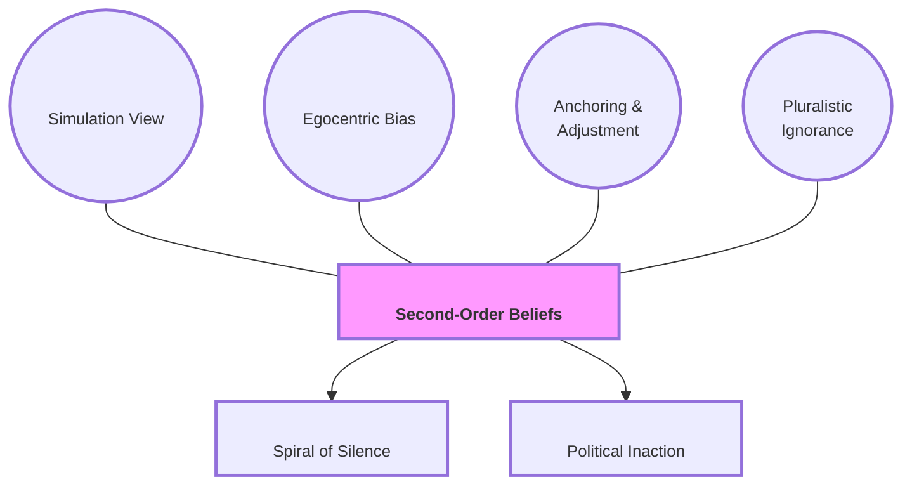
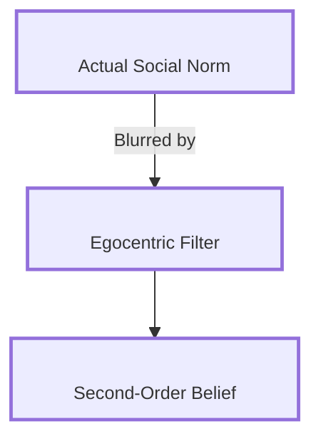
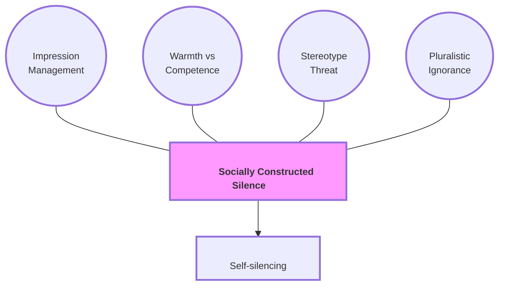
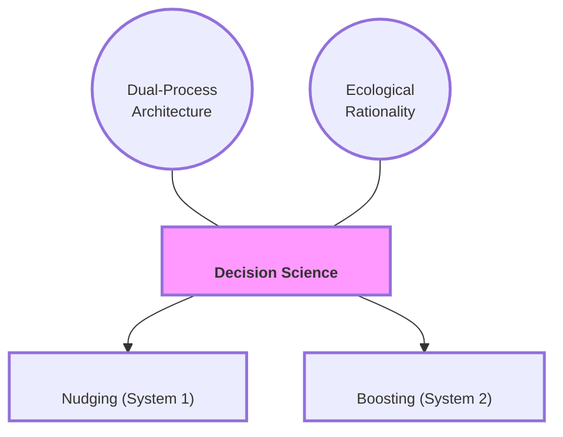
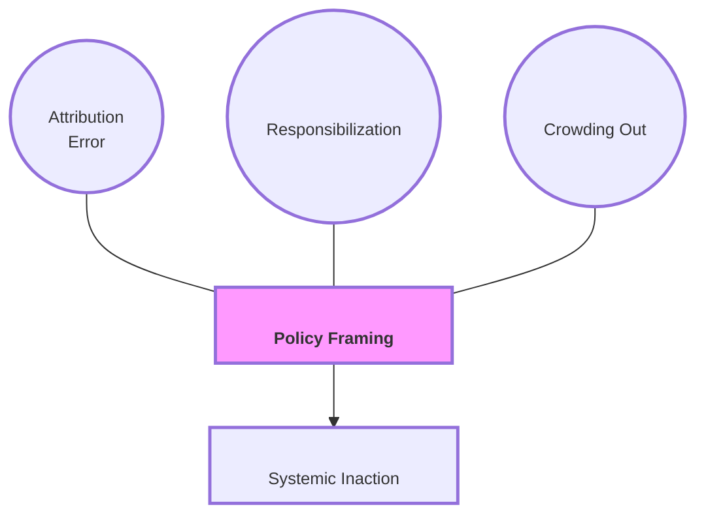
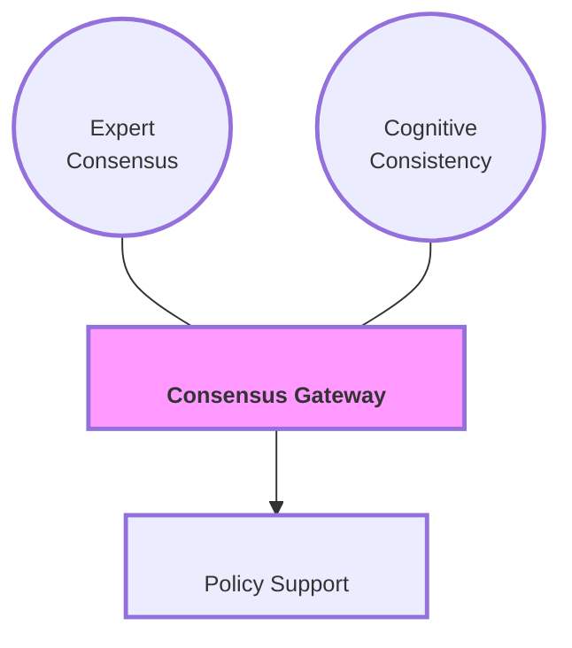
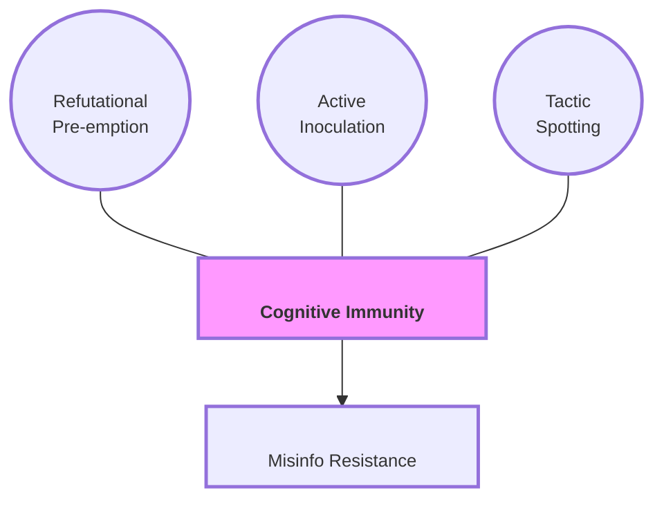

# Course Mastery Guide: SOW-BS033 Communication and Influence (Encyclopedia Edition)

This guide is a master-level study resource optimized for the MSc Behavioural Science curriculum. It features substantive deep-dives into literature, APA-formatted conceptual models, and verbatim keyword styling.

### 1. Global Mindmap (Course Topology)

**Figure 1**  
*Structural Map of Social Influence and Communication Theories*  

```mermaid
%%{init: { 'flowchart': { 'padding': 10, 'nodeSpacing': 50, 'rankSpacing': 50, 'curve': 'basis' }, 'themeVariables': { 'fontSize': '13px' }}}%%
graph TD
    A["<br/>&nbsp;&nbsp;&nbsp;&nbsp;&nbsp;&nbsp; SOW-BS033: &nbsp;&nbsp;&nbsp;&nbsp;&nbsp;&nbsp;<br/>&nbsp;&nbsp;&nbsp;&nbsp;&nbsp;&nbsp; Communication & Influence &nbsp;&nbsp;&nbsp;&nbsp;&nbsp;&nbsp;<br/>"]:::hub --> B["<br/>&nbsp;&nbsp;&nbsp;&nbsp;&nbsp;&nbsp; Information & Beliefs &nbsp;&nbsp;&nbsp;&nbsp;&nbsp;&nbsp;<br/>"]
    A --> C["<br/>&nbsp;&nbsp;&nbsp;&nbsp;&nbsp;&nbsp; Social Norms & Interactions &nbsp;&nbsp;&nbsp;&nbsp;&nbsp;&nbsp;<br/>"]
    A --> D["<br/>&nbsp;&nbsp;&nbsp;&nbsp;&nbsp;&nbsp; Choice Architecture &nbsp;&nbsp;&nbsp;&nbsp;&nbsp;&nbsp;<br/>"]
    A --> E["<br/>&nbsp;&nbsp;&nbsp;&nbsp;&nbsp;&nbsp; Systemic vs. Individual &nbsp;&nbsp;&nbsp;&nbsp;&nbsp;&nbsp;<br/>"]
    A --> F["<br/>&nbsp;&nbsp;&nbsp;&nbsp;&nbsp;&nbsp; Resistance & Inoculation &nbsp;&nbsp;&nbsp;&nbsp;&nbsp;&nbsp;<br/>"]

    B --> B1["<br/>&nbsp;&nbsp;&nbsp;&nbsp;&nbsp;&nbsp; Mildenberger &nbsp;&nbsp;&nbsp;&nbsp;&nbsp;&nbsp;<br/>"]
    B --> B2["<br/>&nbsp;&nbsp;&nbsp;&nbsp;&nbsp;&nbsp; Van der Linden &nbsp;&nbsp;&nbsp;&nbsp;&nbsp;&nbsp;<br/>"]
    B --> B3["<br/>&nbsp;&nbsp;&nbsp;&nbsp;&nbsp;&nbsp; Meijers & Rutjens &nbsp;&nbsp;&nbsp;&nbsp;&nbsp;&nbsp;<br/>"]

    C --> C1["<br/>&nbsp;&nbsp;&nbsp;&nbsp;&nbsp;&nbsp; Geiger & Swim &nbsp;&nbsp;&nbsp;&nbsp;&nbsp;&nbsp;<br/>"]
    C --> C2["<br/>&nbsp;&nbsp;&nbsp;&nbsp;&nbsp;&nbsp; Steentjes &nbsp;&nbsp;&nbsp;&nbsp;&nbsp;&nbsp;<br/>"]
    C --> C3["<br/>&nbsp;&nbsp;&nbsp;&nbsp;&nbsp;&nbsp; Klaperski &nbsp;&nbsp;&nbsp;&nbsp;&nbsp;&nbsp;<br/>"]

    D --> D1["<br/>&nbsp;&nbsp;&nbsp;&nbsp;&nbsp;&nbsp; Hertwig &nbsp;&nbsp;&nbsp;&nbsp;&nbsp;&nbsp;<br/>"]
    D --> D2["<br/>&nbsp;&nbsp;&nbsp;&nbsp;&nbsp;&nbsp; Dorresteijn &nbsp;&nbsp;&nbsp;&nbsp;&nbsp;&nbsp;<br/>"]
    D --> D3["<br/>&nbsp;&nbsp;&nbsp;&nbsp;&nbsp;&nbsp; Shiota &nbsp;&nbsp;&nbsp;&nbsp;&nbsp;&nbsp;<br/>"]

    E --> E1["<br/>&nbsp;&nbsp;&nbsp;&nbsp;&nbsp;&nbsp; Chater & Loewen &nbsp;&nbsp;&nbsp;&nbsp;&nbsp;&nbsp;<br/>"]
    E --> E2["<br/>&nbsp;&nbsp;&nbsp;&nbsp;&nbsp;&nbsp; Gonzales-Arcos &nbsp;&nbsp;&nbsp;&nbsp;&nbsp;&nbsp;<br/>"]

    F --> F1["<br/>&nbsp;&nbsp;&nbsp;&nbsp;&nbsp;&nbsp; Fransen &nbsp;&nbsp;&nbsp;&nbsp;&nbsp;&nbsp;<br/>"]
    F --> F2["<br/>&nbsp;&nbsp;&nbsp;&nbsp;&nbsp;&nbsp; Basol &nbsp;&nbsp;&nbsp;&nbsp;&nbsp;&nbsp;<br/>"]

    classDef hub font-weight:bold,stroke-width:3px;
    classDef default stroke-width:2.5px;
```

*Note.* This figure provides a hierarchical overview of the course themes, illustrating the relationship between core modules and the foundational literature.

---

### 🟢 Week 1: The Social Construction of Belief

**Paper Summaries (Max 500 words per paper):**

*   **Mildenberger & Tingley (2019): Beliefs about Climate Beliefs**
    *   **Core Premise & Experimental Design:** Challenges the **Information Deficit Model** by investigating **second-order beliefs**—perceptions of what others believe. 
    *   **Theories & Mechanisms:** 
        *   **Simulation View**: Heuristic anchoring on one's own beliefs.
        *   **Egocentric Bias**: Leading to a **pluralistic ignorance effect**.
        *   **Anchoring and Adjustment**: Insufficient adjustment from initial anchors.
    *   **Behavioral Mapping:** **Spiral of Silence** and political inaction.

**Figure 2**  
*Theoretical Topology of Second-Order Belief Construction*  

*Note.* Illustrates the psychological drivers leading to collective behavioral silence.

### 📕 Master Glossary (Week 1)
*   

<b>Second-order beliefs</b>
Perceptions of others' beliefs.

#### Conceptual & Memorizing (Max 500 words per week)
**Figure 3**  
*The Causal Path of Belief Misperception*  

*Note.* Transformation of social reality into biased meta-perceptions.

---

### 🔵 Week 2: Interpersonal Communication & Social Norms

**Paper Summaries (Max 500 words per paper):**

*   **Geiger & Swim (2016): Climate of Silence**
    *   **Theories:** **pluralistic ignorance**, **self-silencing**, **socially constructed silence**. 
    *   **Mechanisms:** **Impression Management** (Warmth vs Competence).

**Figure 4**  
*Psychological Barriers to Climate Discussion*  

*Note.* Demonstrates mediation of public expression by reputation concerns.

---

### 🟡 Week 3: Beyond Nagging Nudges

**Figure 5**  
*Taxonomy of Behavioral Policy Interventions*  

*Note.* Contrasts environmental steering with cognitive empowerment.

---

### 🟠 Week 4: I-frames, S-frames, and System Change

**Figure 6**  
*Structural Dynamics of Policy Framing*  

*Note.* Diversionary effects of i-frame interventions on systemic momentum.

---

### 🔴 Week 5: The Credibility of Science Communication

**Figure 7**  
*Gateway Belief Model and Scientific Consensus*  

*Note.* Domino effect of consensus on foundational beliefs and policy support.

---

### 🟣 Week 6: Resistance to Persuasion & Inoculation

**Figure 8**  
*Cognitive Immunity and Inoculation Mechanisms*  

*Note.* Build-up of "mental antibodies" through pre-emptive tactic exposure.
