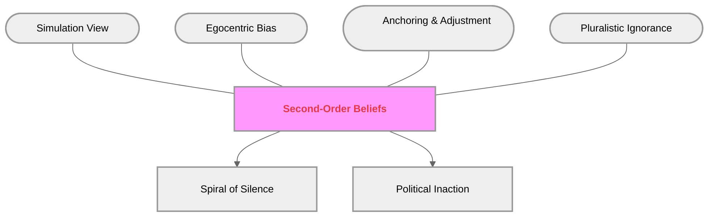
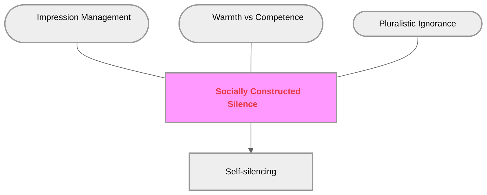
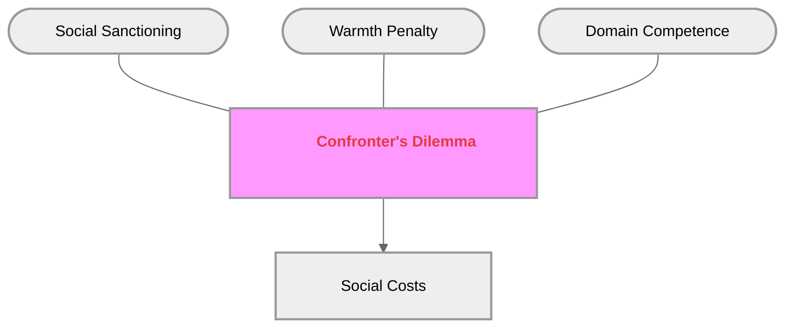
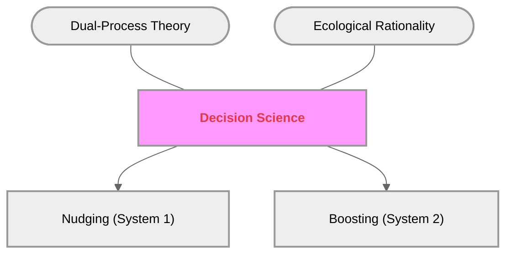
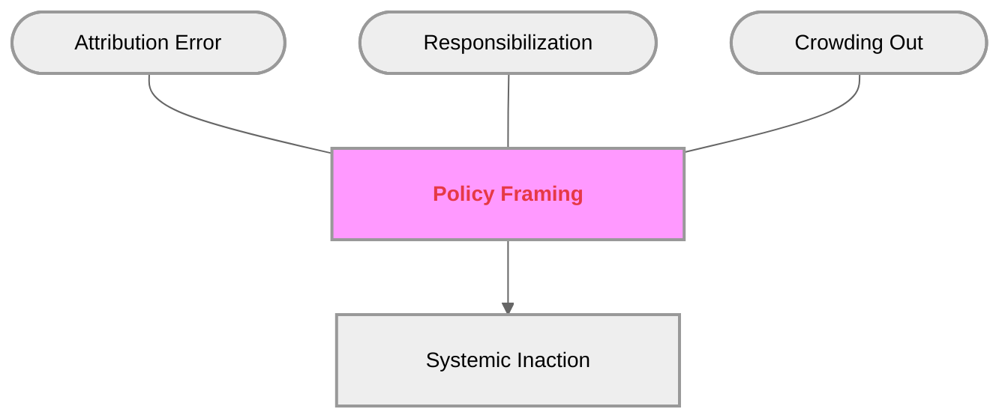
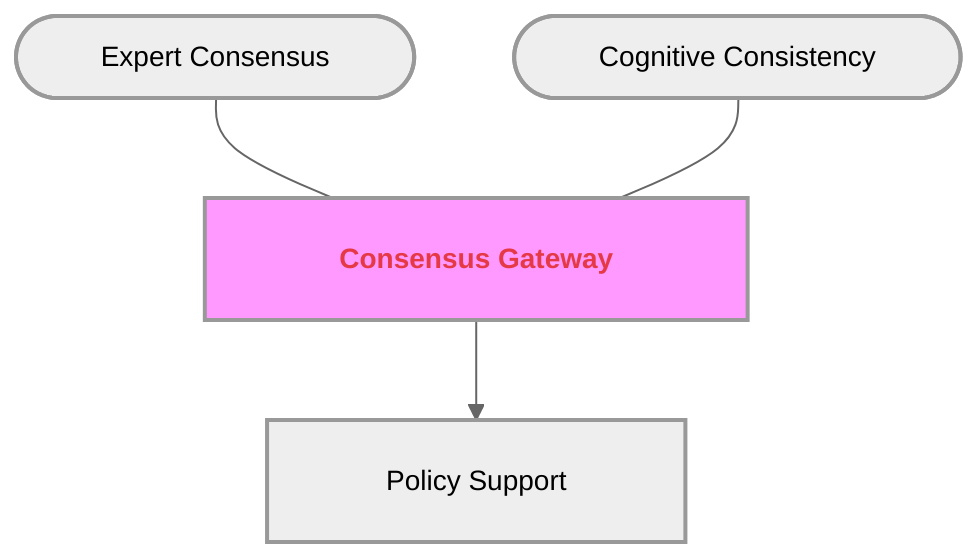
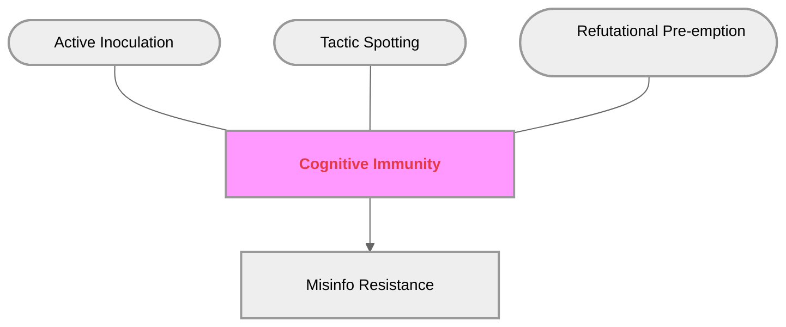

# Course Mastery Guide: SOW-BS033 Communication and Influence (Encyclopedia Edition)

This guide is a master-level study resource optimized for the MSc Behavioural Science curriculum. It features deep-dive literature summaries, GitHub-optimized conceptual models, and verbatim keyword styling.

### 1. Global Topology

**Figure 1**

*Structural Map of Social Influence and Communication Theories*

```mermaid
%%{init: { 'flowchart': { 'padding': 20, 'nodeSpacing': 50, 'rankSpacing': 50, 'useMaxWidth': false }, 'theme': 'neutral', 'themeVariables': { 'fontSize': '14px' }}}%%
graph TD
    A["&nbsp;&nbsp;&nbsp;&nbsp;&nbsp;&nbsp;&nbsp;&nbsp; SOW-BS033: &nbsp;&nbsp;&nbsp;&nbsp;&nbsp;&nbsp;&nbsp;&nbsp;<br/>&nbsp;&nbsp;&nbsp;&nbsp;&nbsp;&nbsp;&nbsp;&nbsp; <span style='color:#e63946'><b>Communication & Influence</b></span> &nbsp;&nbsp;&nbsp;&nbsp;&nbsp;&nbsp;&nbsp;&nbsp;"]:::hub --> B["&nbsp;&nbsp;&nbsp;&nbsp; Information & Beliefs &nbsp;&nbsp;&nbsp;&nbsp;"]
    A --> C["&nbsp;&nbsp;&nbsp;&nbsp; Social Norms & Interactions &nbsp;&nbsp;&nbsp;&nbsp;"]
    A --> D["&nbsp;&nbsp;&nbsp;&nbsp; Choice Architecture &nbsp;&nbsp;&nbsp;&nbsp;"]
    A --> E["&nbsp;&nbsp;&nbsp;&nbsp; Systemic vs. Individual &nbsp;&nbsp;&nbsp;&nbsp;"]
    A --> F["&nbsp;&nbsp;&nbsp;&nbsp; Resistance & Inoculation &nbsp;&nbsp;&nbsp;&nbsp;"]

    B --> B1["&nbsp;&nbsp;&nbsp;&nbsp; Mildenberger &nbsp;&nbsp;&nbsp;&nbsp;"]
    B --> B2["&nbsp;&nbsp;&nbsp;&nbsp; Van der Linden &nbsp;&nbsp;&nbsp;&nbsp;"]
    B --> B3["&nbsp;&nbsp;&nbsp;&nbsp; Meijers & Rutjens &nbsp;&nbsp;&nbsp;&nbsp;"]

    C --> C1["&nbsp;&nbsp;&nbsp;&nbsp; Geiger & Swim &nbsp;&nbsp;&nbsp;&nbsp;"]
    C --> C2["&nbsp;&nbsp;&nbsp;&nbsp; Steentjes &nbsp;&nbsp;&nbsp;&nbsp;"]
    C --> C3["&nbsp;&nbsp;&nbsp;&nbsp; Klaperski &nbsp;&nbsp;&nbsp;&nbsp;"]

    D --> D1["&nbsp;&nbsp;&nbsp;&nbsp; Hertwig &nbsp;&nbsp;&nbsp;&nbsp;"]
    D --> D2["&nbsp;&nbsp;&nbsp;&nbsp; Dorresteijn &nbsp;&nbsp;&nbsp;&nbsp;"]
    D --> D3["&nbsp;&nbsp;&nbsp;&nbsp; Shiota &nbsp;&nbsp;&nbsp;&nbsp;"]

    E --> E1["&nbsp;&nbsp;&nbsp;&nbsp; Chater & Loewen &nbsp;&nbsp;&nbsp;&nbsp;"]
    E --> E2["&nbsp;&nbsp;&nbsp;&nbsp; Gonzales-Arcos &nbsp;&nbsp;&nbsp;&nbsp;"]

    F --> F1["&nbsp;&nbsp;&nbsp;&nbsp; Fransen &nbsp;&nbsp;&nbsp;&nbsp;"]
    F --> F2["&nbsp;&nbsp;&nbsp;&nbsp; Basol &nbsp;&nbsp;&nbsp;&nbsp;"]

    classDef hub font-weight:bold,stroke-width:3px;
    classDef default stroke-width:2px;
```

*Note.* This figure provides a comprehensive hierarchical overview of the SOW-BS033 course themes. It illustrates the primary conceptual domains—ranging from information-based belief systems to the social dynamics of interaction, environmental design of choice, and systemic framing. The central hub is the course itself, which branches into the six thematic weeks. Each paper is categorized under its respective theoretical pillar to facilitate rapid identification of the course's diverse psychological perspectives.

---

### 🟢 Week 1: The Social Construction of Belief

#### Mildenberger & Tingley (2019): Beliefs about Climate Beliefs

**Detailed Abstract**  
This research challenges the traditional **Information Deficit Model</b>—the assumption that providing more scientific facts is the primary route to behavioral change. The authors argue that collective action is often paralyzed not by a lack of knowledge, but by biased **second-order beliefs</b>: our perceptions of what *others* believe. Through six massive surveys in the US and China, the study identifies a systemic **egocentric bias</b>, where individuals' own views anchor their estimates of the collective norm. This leads to a **pluralistic ignorance effect</b>, where a majority incorrectly assumes they are in the minority. This misperception creates a **spiral of silence</b>, where individuals self-censor to avoid social isolation. Crucially, political elites (e.g., congressional staffers) are found to be even more biased than the public, often underestimating constituent support for climate policy by significant margins. This paper fulfill's the objective of outlining how social perceptions shape political reality.

**Figure 2**

*Theoretical Topology of Second-Order Belief Construction*

*Note.* This conceptual network illustrates the psychological drivers that transform subjective individual beliefs into biased meta-perceptions of the collective. The central Hub (red-bolded) represents the meta-cognitive target. The rounded satellite nodes depict the internal cognitive mechanisms—Simulation (imagining others), Bias (projecting self), and Anchoring (clinging to initial estimates)—that contribute to the state of Pluralistic Ignorance. The final output boxes demonstrate the behavioral consequences: a collective "Spiral of Silence" and subsequent "Political Inaction," where policy-makers fail to act because they misjudge public consensus.

**How to remember**  
Think of the **"Social Mirror."** Your **second-order beliefs</b> are just a reflection of your own views (**egocentric bias</b>). You assume everyone sees what you see, which leads to the **"Lonely Majority"**—everyone wants to act, but no one speaks because they think they're alone.

---

### 🔵 Week 2: Interpersonal Communication & Social Norms

#### Geiger & Swim (2016): Climate of Silence

**Detailed Abstract**  
Investigates the "Climate of Silence" where public discussion lags behind private concern. The study identifies **pluralistic ignorance</b> as the key driver, motivated by **impression management</b>. Individuals fear that speaking up will damage their perceived **warmth</b> and **competence**, leading to **self-silencing</b> to protect their social reputation.

**Figure 3**

*Psychological Barriers to Climate Discussion*

*Note.* This diagram shows how reputation management concerns (Warmth vs Competence) mediate the relationship between private concern and public silence. The "Hub" is the collective quiet, while the satellites represent the social fears that force an individual into the behavior of "Self-silencing" to avoid being labeled with negative stereotypes.

#### Klaperski-van der Wal et al. (2025): The Competent Confronter

**Figure 4**

*Theoretical Tradeoffs in Behavioral Confrontation*

*Note.* Illustrates the social evaluation dimensions used during interpersonal confrontation. It maps how standing up for values (Competence) creates a risk of being perceived as socially abrasive (Warmth Penalty), leading to measurable "Social Costs."

---

### 🟡 Week 3: Beyond Nagging Nudges

#### Hertwig & Grune-Yanoff (2017): Nudging and Boosting

**Figure 5**

*Taxonomy of Behavioral Policy Interventions*

*Note.* Contrasts environmental steering (Nudges) with cognitive empowerment (Boosts) based on the underlying targeted psychological systems (System 1 vs System 2).

---

### 🟠 Week 4: I-frames, S-frames, and System Change

#### Chater & Loewenstein (2023): The i-frame and the s-frame

**Figure 6**

*Structural Dynamics of Policy Framing*

*Note.* This model illustrates the diversionary effect of individual-level framing (**i-frame</b>). It shows how shifting blame onto consumers (**responsibilization</b>) leads to "Systemic Inaction" by "Crowding Out" support for broader systemic changes.

---

### 🔴 Week 5: The Credibility of Science Communication

#### Van der Linden et al. (2015): Gateway Belief Model

**Figure 7**

*The Consensus Domino Effect*

*Note.* This model maps the "domino effect" of expert consensus messaging. Once the foundational perception of agreement is shifted (Consensus Gateway), the drive for "Cognitive Consistency" updates causal and risk beliefs, sequentially driving "Policy Support."

---

### 🟣 Week 6: Resistance to Persuasion & Inoculation

#### Basol et al. (2020): Good News about Bad News

**Figure 8**

*The Mechanism of Cognitive Immunity*

*Note.* Models the build-up of mental defense. The Immunity Hub is established through "Active Inoculation" (learning by doing) and "Tactic Spotting," creating a measurable resistance to persuasive manipulation.
