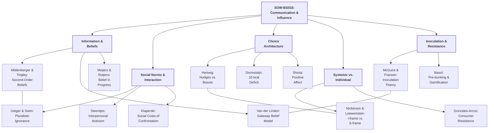
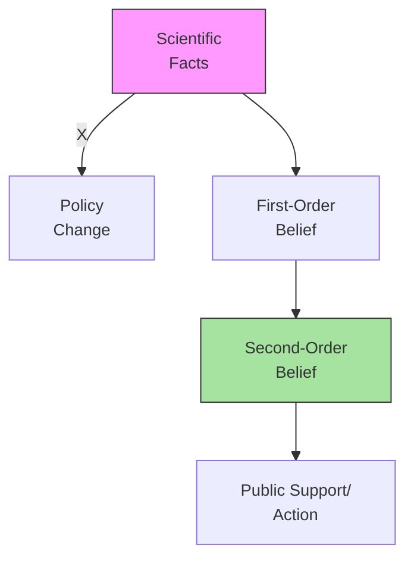
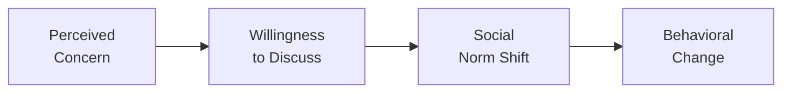
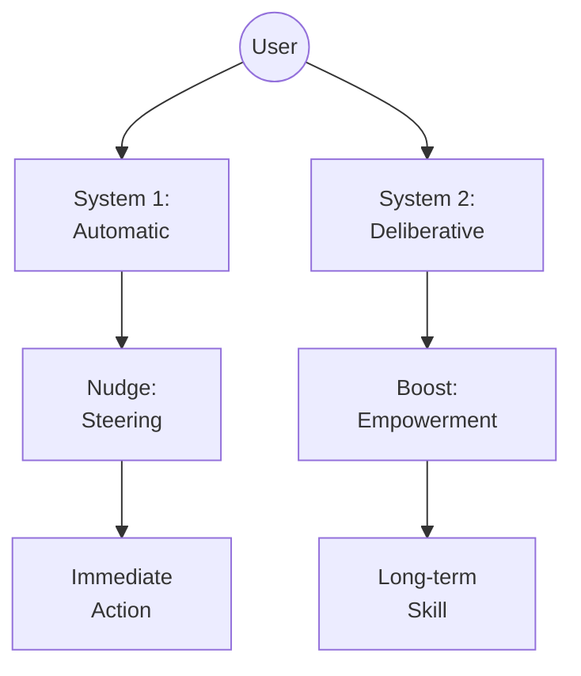
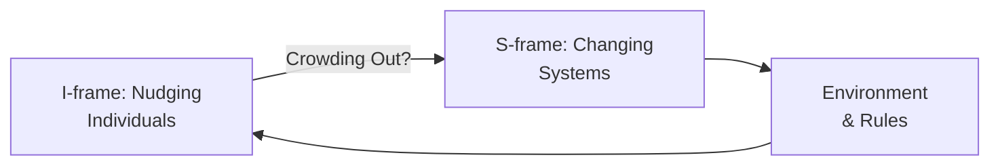
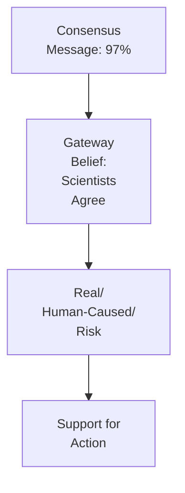
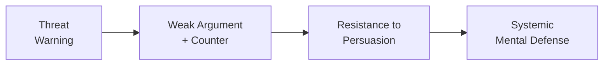

# Course Mastery Guide: SOW-BS033 Communication and Influence

This guide is designed to optimize your learning, memorization, and application of the core theories in social influence and communication science.

### 1. Global Mindmap (Network)

---

### 🟢 Week 1: The Social Construction of Belief

**Paper Summaries (Max 100 words per paper):**
*   **Mildenberger & Tingley (2019)**: This paper challenges the "Information Deficit Model" by focusing on **second-order beliefs** (perceptions of others' beliefs). Through US surveys, the authors show that both pro-climate and anti-climate groups stubbornly underestimate the actual majority support for climate policy. This "social mirror" error creates a barrier to action, as individuals fear they are in the minority. The findings suggest that correcting misperceptions of the "social norm" is more effective than providing more raw scientific facts.

**Key Terms & Definitions:**
*   

<b>Second-Order Beliefs</b>
A person's perception of the distribution of beliefs in their community or society. It is "what I think you think."

*   

<b>Information Deficit Model</b>
The flawed assumption that public skepticism or inaction is purely due to a lack of scientific knowledge, and that providing more facts will automatically lead to behaviour change.

*   

<b>Pluralistic Ignorance</b>
A psychological state where a majority of group members privately reject a norm, but incorrectly assume that most others accept it, leading them to support the norm publicly.

#### Critiques
*   **The Power of Structures (S-frames):** While correcting second-order beliefs is vital, it may be insufficient if structural barriers exist. Even if I know 70% of my neighbours support biking, if there are no bike lanes, belief correction won't lead to action.
*   **Measurement Stability:** Second-order opinions can be volatile and influenced by media "loudness," making them a moving target for communicators.

#### Conceptual & Memorizing (Max 200 words per week)
*   **🧠 Conceptual Tip:** Imagine a room full of people where everyone is secretly worried about a leak in the ceiling, but no one speaks up because everyone else *looks* calm. You don't need to tell them the ceiling is leaking (they know); you just need to tell them everyone else is worried too.
*   **🔗 Mnemonic:** **"The Lonely Majority"** — You are part of the majority, but you feel alone in it.
*   **🖼️ Visual Model:**

---

### 🔵 Week 2: Interpersonal Communication & Social Norms

**Paper Summaries (Max 100 words per paper):**
*   **Geiger & Swim (2016)**: Investigates **pluralistic ignorance** as a barrier to climate discussion. People underestimate how much others care about climate change, leading to a "climate of silence." Correcting these perceptions increases willingness to discuss the topic.
*   **Klaperski-van der Wal et al. (2025)**: Explores the "Confronter's Dilemma." While confronting others on unsustainable behaviour can be effective, it carries **social costs** (being perceived as annoying or judgmental). However, "competent confronters" can mitigate these costs.
*   **Steentjes et al. (2017)**: Defines **interpersonal activism**—how individuals influence each other through daily social norms. Norms are not just "fixed" but are actively negotiated through talk.

**Key Terms & Definitions:**
*   

<b>Interpersonal Activism</b>
The act of influencing others' sustainability attitudes or behaviours through everyday social interactions rather than organized movements.

*   

<b>Descriptive Norms</b>
Perceptions of how people *actually* behave in a given situation.

*   

<b>Injunctive Norms</b>
Perceptions of what behaviours are *approved or disapproved* of by others.

#### Critiques
*   **Replication of "Social Costs":** The perceived social costs of confrontation vary wildly across cultures (e.g., individualist vs. collectivist), suggesting that Klaperski's findings might not generalize globally.
*   **Causal Direction:** Does talking lead to concern, or does concern lead to talking? Geiger & Swim's model assumes a specific path that might be more cyclical in reality.

#### Conceptual & Memorizing (Max 200 words per week)
*   **🧠 Conceptual Tip:** Being the "conscience" of the group is like being a referee: people might complain about the whistle, but without it, the game falls apart.
*   **🔗 Mnemonic:** **"D.I.N."** — **D**escriptive (Doing), **I**njunctive (Ideal/Internal), **N**orms (Network).
*   **🖼️ Visual Model:**

---

### 🟡 Week 3: Beyond Nagging Nudges: Applying Social Influence Theories

**Paper Summaries (Max 100 words per paper):**
*   **Hertwig & Grune-Yanoff (2017)**: Distinguishes between **Nudges** (environment-based "steering" of System 1) and **Boosts** (skill-based empowerment of System 2). While nudges are effective and low-cost, boosts are more transparent and build long-term competence.
*   **Dorresteijn et al. (2013)**: A field study implementing "10 kcal deficit" nudges in a hospital (e.g., smaller soup bowls, point-of-decision prompts for stairs). Shows that small, cumulative environmental changes can significantly impact population health without requiring conscious effort.
*   **Shiota et al. (2021)**: Explores **Positive Affect** as a tool for behaviour change. Positive emotions (awe, pride) broaden cognitive scope and increase receptivity to new information, unlike fear-based appeals which can cause "freezing" or avoidance.

**Key Terms & Definitions:**
*   

<b>Nudge</b>
Any aspect of the choice architecture that alters people's behaviour in a predictable way without forbidding any options or significantly changing their economic incentives.

*   

<b>Boost</b>
Interventions that aim to improve people’s decision-making competence by training their skills or decision heuristics.

*   

<b>System 1 vs. System 2</b>
System 1 is fast, intuitive, and emotional; System 2 is slower, more deliberative, and logical.

#### Critiques
*   **The Ethics of Transparency:** Nudges are often criticized for being "paternalistic" or manipulative because they bypass conscious choice. Boosts solve this but are harder to implement at scale.
*   **Cumulative Impact:** While 10 kcal is small, the long-term effectiveness of such nudges is often questioned due to "compensatory eating" (people eating more later).

#### Conceptual & Memorizing (Max 200 words per week)
*   **🧠 Conceptual Tip:** A **Nudge** is like moving the snacks to a high shelf so you're too lazy to reach them. A **Boost** is learning how to read the nutrition label so you *choose* not to buy them.
*   **🔗 Mnemonic:** **"B.E.S.T."** — **B**oost **E**mpowers, **S**teer **T**hrough **N**udges.
*   **🖼️ Visual Model:**

---

### 🟠 Week 4: I-frames, S-frames, and System Change

**Paper Summaries (Max 100 words per paper):**
*   **Chater & Loewenstein (2023)**: Critiques the **I-frame** (Individual-level solutions like nudges) for distracting from **S-frames** (Systemic-level solutions like taxes/laws). I-frame interventions can inadvertently shift blame onto individuals and reduce public support for necessary systemic changes.
*   **Gonzales-Arcos et al. (2021)**: Examines **Consumer Resistance** to sustainability interventions. When people feel their freedom is threatened (reactance), they resist. The paper argues that for interventions to work, they must align with consumers' existing identities and values.

**Key Terms & Definitions:**
*   

<b>I-frame (Individual Frame)</b>
Focusing on individual behavior and choices as the primary driver of societal change.

*   

<b>S-frame (Systemic Frame)</b>
Focusing on the rules, infrastructure, and economic incentives that shape everyone's behavior.

*   

<b>Psychological Reactance</b>
An unpleasant motivational arousal that emerges when people experience a threat to or loss of their free behaviors.

#### Critiques
*   **The "False Dichotomy":** Critics of Chater & Loewenstein argue that I-frames and S-frames are not mutually exclusive; I-frames (like a plastic bag tax) can be the "gateway" that makes S-frame legislation politically possible.
*   **Implementation Paralysis:** If we only focus on S-frames, we might wait forever for government action while ignoring effective small-scale changes.

#### Conceptual & Memorizing (Max 200 words per week)
*   **🧠 Conceptual Tip:** If a boat is sinking, an **I-frame** is handing everyone a bucket to bail out water. An **S-frame** is fixing the hole in the hull.
*   **🔗 Mnemonic:** **"I"** for **I**ndividual, **"S"** for **S**ystem.
*   **🖼️ Visual Model:**

---

### 🔴 Week 5: The Credibility of Science Communication

**Paper Summaries (Max 100 words per paper):**
*   **Van der Linden et al. (2015)**: The **Gateway Belief Model** (GBM). Communicating the scientific consensus (e.g., "97% of scientists agree") acts as a gateway that shifts key beliefs about climate change, which in turn increases support for public policy.
*   **Meijers & Rutjens (2014)**: **Compensatory Control**. When people feel a lack of personal control, they compensate by believing in scientific progress. Paradoxically, strong belief in "science will save us" can *reduce* individual motivation to act pro-environmentally (moral licensing).

**Key Terms & Definitions:**
*   

<b>Gateway Belief</b>
A foundational belief (like scientific consensus) that, once changed, leads to a "domino effect" on other related beliefs and attitudes.

*   

<b>Compensatory Control</b>
The psychological tendency to look for order and predictability in external systems (like science or religion) when personal control is threatened.

#### Critiques
*   **The "Preaching to the Choir" Effect:** Consensus messages might only work for those already open to science, while deeply polarized individuals might reject the "97%" as part of a conspiracy.
*   **Moral Licensing:** Highlighting scientific breakthroughs might be "too effective," leading the public to think they no longer need to make personal sacrifices.

#### Conceptual & Memorizing (Max 200 words per week)
*   **🧠 Conceptual Tip:** **Gateway Belief** is like a "Master Key" that opens several doors at once. **Compensatory Control** is like using a GPS because you're lost—you trust the "system" because you don't know the way yourself.
*   **🔗 Mnemonic:** **"G.B.M."** — **G**ateway **B**elief **M**atters.
*   **🖼️ Visual Model:**

---

### 🟣 Week 6: Resistance to Persuasion & Inoculation

**Paper Summaries (Max 100 words per paper):**
*   **Fransen et al. (2023)**: Revisits **Inoculation Theory**. Just as a vaccine introduces a weak virus to build immunity, "pre-bunking" introduces a weak version of a manipulative argument (and its refutation) to build psychological resistance against future misinformation.
*   **Basol et al. (2020)**: **Gamification of Inoculation**. Using tools like the "Bad News" game to teach people the *tactics* of fake news (e.g., emotional manipulation, polarization). This "active" participation is more effective than passive warnings.

**Key Terms & Definitions:**
*   

<b>Inoculation Theory</b>
The theory that social pressure or persuasive messages can be resisted if the individual is exposed to a "weakened" version of the argument in advance.

*   

<b>Pre-bunking</b>
The process of debunking lies or myths *before* they are encountered by the target audience.

*   

<b>Reactance</b>
The "don't tell me what to do" response when people feel their freedom of choice is being limited.

#### Critiques
*   **Decay of Immunity:** Just like biological vaccines, psychological inoculation "wears off" over time. Periodic "booster" messages are needed to maintain resistance.
*   **The "Backfire" Risk:** If the weakened argument is too strong, you might accidentally persuade the person *of the very thing* you're trying to protect them from.

#### Conceptual & Memorizing (Max 200 words per week)
*   **🧠 Conceptual Tip:** Inoculation is like a **Fire Drill**. You practice a "fake" fire so that when a "real" fire happens, you don't panic and you know exactly what to do.
*   **🔗 Mnemonic:** **"A.C.E."** — **A**voidance, **C**ontesting, **E**mpowerment (The three ways we resist).
*   **🖼️ Visual Model:**

