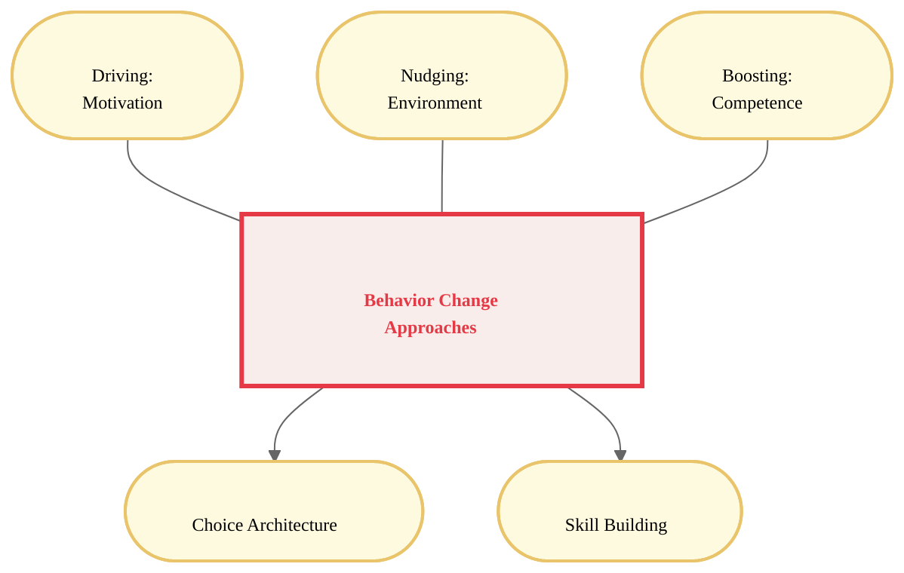
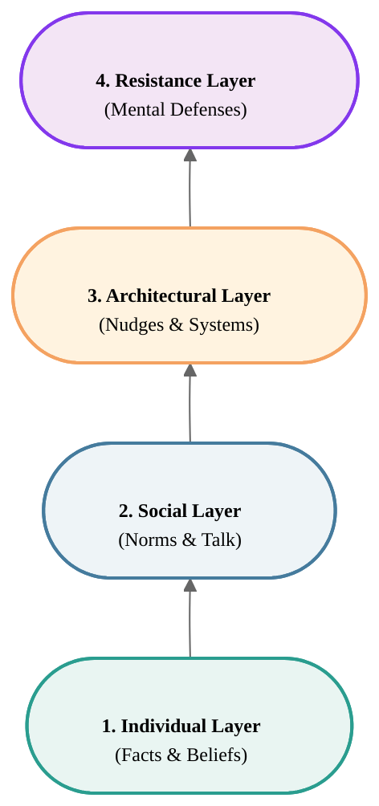

# Course Mastery Guide: SOW-BS033 Communication and Influence (Encyclopedia Edition)

> **Status:** This summary has been reviewed twice by the author. However, as a person, I may have made mistakes.

This guide is a master-level study resource optimized for the MSc Behavioural Science curriculum. It features deep-dive literature summaries, GitHub-hardened conceptual models, and verbatim keyword styling.

### 1. Global Topology

**Figure 1**

*Structural Map of Social Influence and Communication Theories*

```mermaid
%%{init: { "flowchart": { "padding": 30, "useMaxWidth": false, "htmlLabels": true }, "theme": "neutral", "themeVariables": { "fontSize": "12px", "fontFamily": "sans-serif" }}}%%
graph TD
    classDef hub fill:#f8edeb,stroke:#e63946,stroke-width:3px,font-weight:bold;
    classDef week1 fill:#e9f5f2,stroke:#2a9d8f,stroke-width:2px;
    classDef week2 fill:#eef4f7,stroke:#457b9d,stroke-width:2px;
    classDef week3 fill:#fefae0,stroke:#e9c46a,stroke-width:2px;
    classDef week4 fill:#fff3e0,stroke:#f4a261,stroke-width:2px;
    classDef week5 fill:#fbe9e7,stroke:#e76f51,stroke-width:2px;
    classDef week6 fill:#f3e5f5,stroke:#8338ec,stroke-width:2px;

    A["<br/>&nbsp;&nbsp;&nbsp;&nbsp;&nbsp;&nbsp; SOW-BS033:<br/>&nbsp;&nbsp;&nbsp;&nbsp;&nbsp;&nbsp; <span style='color:#e63946'><b>Comms & Influence</b></span> &nbsp;&nbsp;&nbsp;&nbsp;&nbsp;&nbsp;<br/>"]:::hub --> B(["<br/>&nbsp;&nbsp;&nbsp;&nbsp;&nbsp;&nbsp; Information &<br/>&nbsp;&nbsp;&nbsp;&nbsp;&nbsp;&nbsp; Belief Systems &nbsp;&nbsp;&nbsp;&nbsp;&nbsp;&nbsp;<br/>"]):::week1
    A --> C(["<br/>&nbsp;&nbsp;&nbsp;&nbsp;&nbsp;&nbsp; Social Norms &<br/>&nbsp;&nbsp;&nbsp;&nbsp;&nbsp;&nbsp; Interactions &nbsp;&nbsp;&nbsp;&nbsp;&nbsp;&nbsp;<br/>"]):::week2
    A --> D(["<br/>&nbsp;&nbsp;&nbsp;&nbsp;&nbsp;&nbsp; Driving, Nudging,<br/>&nbsp;&nbsp;&nbsp;&nbsp;&nbsp;&nbsp; & Boosting &nbsp;&nbsp;&nbsp;&nbsp;&nbsp;&nbsp;<br/>"]):::week3
    A --> E(["<br/>&nbsp;&nbsp;&nbsp;&nbsp;&nbsp;&nbsp; Systemic vs.<br/>&nbsp;&nbsp;&nbsp;&nbsp;&nbsp;&nbsp; Individual &nbsp;&nbsp;&nbsp;&nbsp;&nbsp;&nbsp;<br/>"]):::week4
    A --> F(["<br/>&nbsp;&nbsp;&nbsp;&nbsp;&nbsp;&nbsp; Resistance &<br/>&nbsp;&nbsp;&nbsp;&nbsp;&nbsp;&nbsp; Inoculation &nbsp;&nbsp;&nbsp;&nbsp;&nbsp;&nbsp;<br/>"]):::week6

    B --> B1(["<br/>&nbsp;&nbsp;&nbsp;&nbsp;&nbsp;&nbsp; Mildenberger &nbsp;&nbsp;&nbsp;&nbsp;&nbsp;&nbsp;<br/>"]):::week1
    B --> B2(["<br/>&nbsp;&nbsp;&nbsp;&nbsp;&nbsp;&nbsp; Van der Linden &nbsp;&nbsp;&nbsp;&nbsp;&nbsp;&nbsp;<br/>"]):::week5
    B --> B3(["<br/>&nbsp;&nbsp;&nbsp;&nbsp;&nbsp;&nbsp; Meijers & Rutjens &nbsp;&nbsp;&nbsp;&nbsp;&nbsp;&nbsp;<br/>"]):::week5

    C --> C1(["<br/>&nbsp;&nbsp;&nbsp;&nbsp;&nbsp;&nbsp; Geiger & Swim &nbsp;&nbsp;&nbsp;&nbsp;&nbsp;&nbsp;<br/>"]):::week2
    C --> C2(["<br/>&nbsp;&nbsp;&nbsp;&nbsp;&nbsp;&nbsp; Steentjes &nbsp;&nbsp;&nbsp;&nbsp;&nbsp;&nbsp;<br/>"]):::week2
    C --> C3(["<br/>&nbsp;&nbsp;&nbsp;&nbsp;&nbsp;&nbsp; Klaperski &nbsp;&nbsp;&nbsp;&nbsp;&nbsp;&nbsp;<br/>"]):::week2

    D --> D1(["<br/>&nbsp;&nbsp;&nbsp;&nbsp;&nbsp;&nbsp; Hertwig &nbsp;&nbsp;&nbsp;&nbsp;&nbsp;&nbsp;<br/>"]):::week3
    D --> D2(["<br/>&nbsp;&nbsp;&nbsp;&nbsp;&nbsp;&nbsp; Dorresteijn &nbsp;&nbsp;&nbsp;&nbsp;&nbsp;&nbsp;<br/>"]):::week3
    D --> D3(["<br/>&nbsp;&nbsp;&nbsp;&nbsp;&nbsp;&nbsp; Shiota &nbsp;&nbsp;&nbsp;&nbsp;&nbsp;&nbsp;<br/>"]):::week3

    E --> E1(["<br/>&nbsp;&nbsp;&nbsp;&nbsp;&nbsp;&nbsp; Chater & Loewen &nbsp;&nbsp;&nbsp;&nbsp;&nbsp;&nbsp;<br/>"]):::week4
    E --> E2(["<br/>&nbsp;&nbsp;&nbsp;&nbsp;&nbsp;&nbsp; Gonzales-Arcos &nbsp;&nbsp;&nbsp;&nbsp;&nbsp;&nbsp;<br/>"]):::week4

    F --> F1(["<br/>&nbsp;&nbsp;&nbsp;&nbsp;&nbsp;&nbsp; Fransen &nbsp;&nbsp;&nbsp;&nbsp;&nbsp;&nbsp;<br/>"]):::week6
    F --> F2(["<br/>&nbsp;&nbsp;&nbsp;&nbsp;&nbsp;&nbsp; Basol &nbsp;&nbsp;&nbsp;&nbsp;&nbsp;&nbsp;<br/>"]):::week6
```

*Note.* This figure provides a comprehensive hierarchical overview of the SOW-BS033 course themes. It illustrates the primary conceptual domains—ranging from information-based belief systems to the social dynamics of interaction, the tripartite approach to behavioral change (Driving, Nudging, Boosting), and systemic framing.

<b>Diagram Glossary (Figure 1)</b>

*   **Information & Belief Systems:** The study of how individuals acquire, update, and meta-perceive scientific information and collective norms.
*   **Social Norms & Interactions:** The exploration of how interpersonal talk and group-level misperceptions (pluralistic ignorance) shape behavior.
*   **Driving, Nudging, & Boosting:** The three-pillar framework for behavior change interventions, focusing on motivation, environment, and competence.
*   **Systemic vs. Individual:** The critical evaluation of whether behavioral problems should be solved at the level of the person (i-frame) or the system (s-frame).
*   **Resistance & Inoculation:** The study of psychological defense mechanisms against persuasive manipulation and misinformation.

---

### 🟢 Week 1: The Social Construction of Belief

#### Mildenberger & Tingley (2019): Beliefs about Climate Beliefs

**Detailed Abstract**  
This research challenges the traditional <b>Information Deficit Model</b>—the assumption that public inaction stems purely from a lack of scientific facts. This model rests on the flawed <b>Knowledge-Behaviour Hypothesis</b>, which assumes that accurate information automatically translates into behavior. The lecture highlights three critical failures of this hypothesis: (1) <b>Motivated Reasoning</b> (information is processed in self-serving ways), (2) <b>Bounded Rationality</b> (inherent cognitive flaws like the endowment effect), and (3) <b>Environmental Contingency</b> (behavior driven by situational factors rather than knowledge). Mildenberger & Tingley argue that collective action is paralyzed by biased <b>second-order beliefs</b>: our perceptions of what others believe. Identifying a systemic <b>egocentric bias</b>, they show how a <b>pluralistic ignorance effect</b> causes a majority to self-censor in a <b>spiral of silence</b>. Correcting these meta-perceptions is essential for unlocking policy support.

**Core Definitions**  
*   **Second-order beliefs**: Perceptions of the distribution of beliefs within a population.
*   **Information Deficit Model**: The assumption that lack of information is the primary driver of skepticism/inaction.
*   **Knowledge-Behaviour Hypothesis**: The assumption that information processing is the primary driver of change.
*   **Motivated Reasoning**: Processing information to confirm pre-existing goals/beliefs.
*   **Egocentric Bias**: Using one's own internal state to estimate others'.
*   **Pluralistic Ignorance Effect**: Falsely believing one's views are in the minority.
*   **Spiral of Silence**: Withholding views due to fear of isolation.

---

### 🔵 Week 2: Interpersonal Communication & Social Norms

#### Geiger & Swim (2016): Climate of Silence

**Detailed Abstract**  
Investigates the "Climate of Silence" maintained by <b>pluralistic ignorance</b> and <b>impression management</b>. Individuals fear damaging their perceived <b>warmth</b> and **competence**, leading to <b>self-silencing</b>. This <b>socially constructed silence</b> can be broken by providing accurate information about group concern.

#### Klaperski-van der Wal et al. (2025): The Competent Confronter

**Detailed Abstract**  
This research examines the <b>social costs</b> of confronting unsustainable behavior. It addresses the <b>confronter's dilemma</b>: the tension between change (competence) and harmony (warmth). The study provides the first empirical support for the emergence of **beneficial competence ascriptions** for confronters who remain logical and calm, mitigating social penalties.

---

### 🟡 Week 3: Driving, Nudging, and Boosting

#### The Tripartite Framework of Behavior Change

**Detailed Abstract**  
The lecture introduces a comprehensive three-pillar approach to behavior change: **Driving**, **Nudging**, and **Boosting**. 
1. <b>Driving</b> (Motivation) uses high-pressure influence, focusing on **Motivation**, goals, values, and social rewards (e.g., Cialdini’s persuasion principles). Research by **Nolan et al. (2008)** shows that while people *think* environmental values drive them, the <b>descriptive norm</b> ("the neighbors also do") is the strongest motivator. Obstacles to driving include **reactance** and effort.
2. <b>Nudging</b> (Choice Architecture) uses low-pressure environmental steering. As defined by Thaler & Sunstein, it alters behavior without forbidding options. It leverages System 1 <b>cognitive deficiencies</b>.
3. <b>Boosting</b> (Competence) builds lasting <b>competences</b> by targeting System 2 or sharpening heuristics. It assumes <b>ecological rationality</b> and respects autonomy.

#### Hertwig & Grune-Yanoff (2017): Nudging and Boosting

**Figure 5**

*Taxonomy of Behavioral Change Approaches*

<b>Diagram Glossary (Figure 5)</b>

*   **Driving:** Increasing internal pressure through rewards, goals, and social norms (Motivation).
*   **Nudging:** Steering behavior through the environment (Choice Architecture).
*   **Boosting:** Increasing individual ability to make good choices (Competence).

#### Challenges in Behavior Change
*   **Repetitive Nudges:** Can impact perceived transparency and autonomy (Wachner et al., 2021).
*   **Enduring Effects:** Behavior often reverts once a nudge is removed.
*   **Spill-over:** Challenges in reaching behaviors in different contexts (e.g., from hospital to home).
*   **Effort:** Boosting requires significant cognitive effort from the individual.

---

### 🟠 Week 4: I-frames, S-frames, and System Change

#### Chater & Loewenstein (2023): The i-frame and the s-frame

**Detailed Abstract**  
This paper provides a critical evaluation of the <b>i-frame</b> (individual focus) and its dominance in behavioral science. The authors argue that by focusing on small-scale, individual-level interventions (like nudges), researchers accidentally facilitate corporate <b>responsibilization</b>—the shifting of blame for systemic problems (like climate change or obesity) onto the consumer. This focus on the i-frame triggers a <b>crowding out effect</b>, where public and political support for more effective <b>s-frames</b> (systemic changes, such as taxes, regulations, or infrastructure) is diminished. The "Influence Stack" identifies that while i-frame interventions are easier to implement, they are often insufficient and can be actively harmful if they deflect attention from necessary policy changes.

**Core Definitions**  
*   **i-frame**: Focuses on individual behavior and choice architecture while keeping the status quo.
*   **s-frame**: Focuses on systemic changes, laws, and infrastructure that alter the status quo.
*   **Responsibilization**: Shifting the burden of systemic problems onto individual choices.
*   **Crowding Out**: When focus on one type of intervention reduces support for another.

**How to remember**  
The **"Leaky Boat."** The i-frame is like handing everyone a small cup to bail out water (individual effort), while the s-frame is actually plugging the hole in the hull (systemic fix). If you only talk about the cups, people forget the hole exists.

---

### 🔴 Week 5: The Credibility of Science Communication

#### Van der Linden et al. (2015): Gateway Belief Model

**Detailed Abstract**  
The <b>Gateway Belief Model (GBM)</b> posits that perceptions of <b>scientific consensus</b> act as a critical "gateway" to other key beliefs. In a randomized experiment, the authors show that exposing the public to a simple <b>consensus message</b> (e.g., "97% of climate scientists agree") significantly increases the perceived scientific agreement. This change then ripples through a causal chain, increasing the belief that climate change is happening, that it is human-caused, and that it is a serious problem. Ultimately, this increase in <b>cognitive consistency</b> leads to higher public support for climate policy. This approach leverages <b>heuristic processing</b>, where consensus acts as a mental shortcut for truth.

#### Meijers & Rutjens (2014): Affirming Belief in Progress

**Detailed Abstract**  
Drawing on <b>Compensatory Control Theory</b>, this research explores how belief in scientific progress affects environmental behavior. When individuals experience a lack of control, they often compensate by affirming belief in external sources of order, such as science. However, this creates a <b>hydraulic relationship</b>: as belief in scientific progress increases, individual motivation to act pro-environmentally decreases. This is a form of <b>moral licensing</b> or "delegation," where individuals feel that since science is solving the problem, they no longer need to exert effort.

**Core Definitions**  
*   **Consensus Messaging**: Communicating the degree of agreement among experts.
*   **Heuristic Processing**: Using mental shortcuts (like expert agreement) to form judgments.
*   **Compensatory Control**: Affirming external order to manage feelings of personal chaos.
*   **Hydraulic Relationship**: When an increase in one variable (belief in science) causes a decrease in another (individual effort).

**How to remember**  
The **"Magic Shield."** You believe science is building a giant shield to protect the earth, so you decide you don't need to wear your own raincoat anymore.

---

### 🟣 Week 6: Resistance to Persuasion & Inoculation

#### Fransen et al. (2023): Sixty Years Later

**Detailed Abstract**  
This paper revisits <b>Inoculation Theory</b> and its application to modern social issues. It confirms that <b>refutational pre-emption</b>—providing a weakened version of a counter-argument along with a refutation—builds strong resistance against subsequent persuasive attacks on <b>cultural truisms</b>. The study highlights three primary <b>resistance strategies</b> used by individuals: **Avoidance** (ignoring the message), **Contesting** (arguing against the source), and **Empowerment** (bolstering one's own existing beliefs).

#### Basol et al. (2020): Good News about Bad News

**Detailed Abstract**  
This research demonstrates the power of <b>active inoculation</b> through a game-based intervention (e.g., "Bad News"). By letting players "step into the shoes" of a fake news producer, they learn the <b>manipulation tactics</b> (e.g., emotional language, polarization, conspiracy theories). This "pre-bunking" approach builds <b>broad-spectrum inoculation</b> and **cognitive immunity**, making individuals more resistant to misinformation across various topics, even those not explicitly covered in the game.

**Core Definitions**  
*   **Refutational Pre-emption**: Pre-exposing individuals to a threat and providing the tools to defeat it.
*   **Active Inoculation**: Learning by doing (e.g., playing a game) to build resistance.
*   **Cognitive Immunity**: A mental state where one is resilient against manipulative rhetoric.
*   **Manipulation Tactics**: The specific techniques (polarization, trolling) used to spread misinformation.

**How to remember**  
The **"Fire Drill."** You run a fake drill (inoculation) so your brain knows the exits when a real fire (misinformation) starts.

---

### 🏗️ The Influence Stack: A Conceptual Synthesis

**Figure 6**

*The Hierarchical Layers of Behavioral Intervention*

<b>Diagram Glossary (Figure 6)</b>

*   **Individual Layer:** The foundational facts and first-order beliefs (Week 1).
*   **Social Layer:** The meta-perceptions and interpersonal communication (Week 2).
*   **Architectural Layer:** The environment and choice architecture (Week 3 & 4).
*   **Resistance Layer:** The psychological defenses against being influenced (Week 5 & 6).

