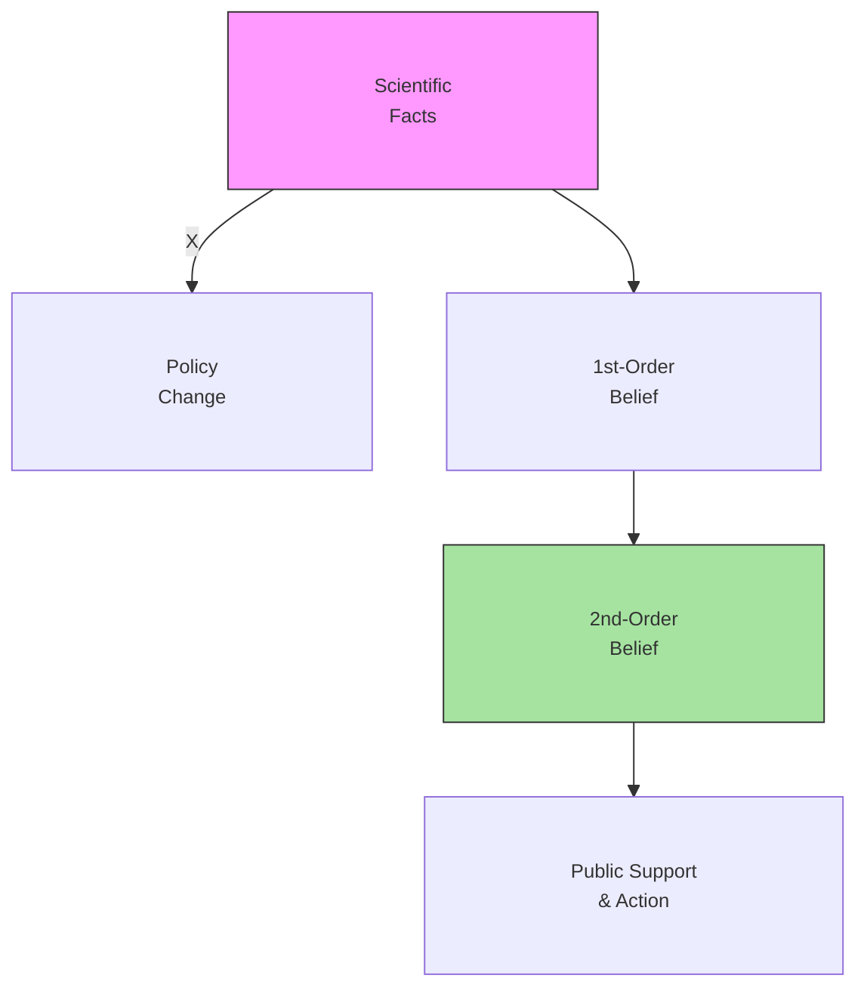
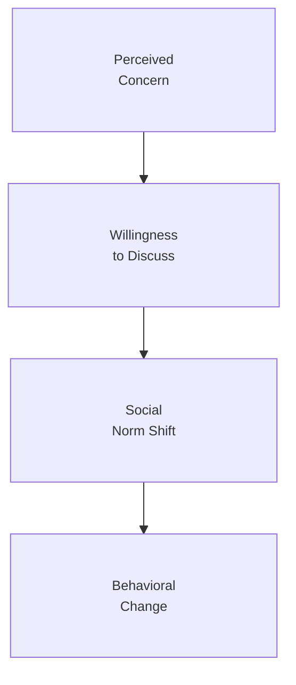
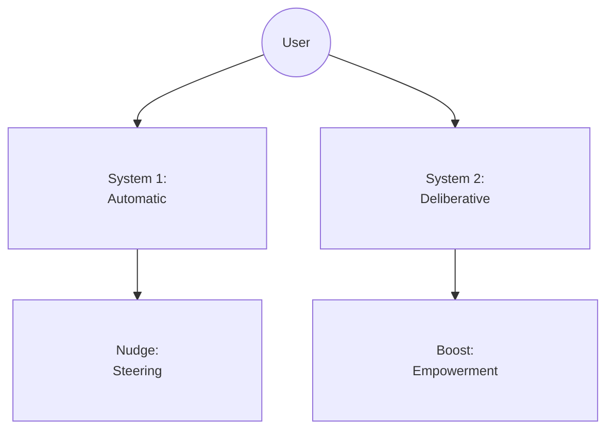
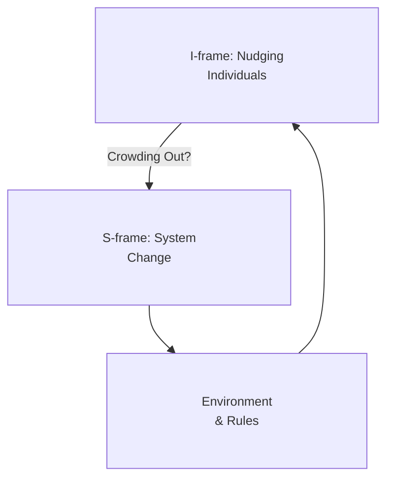
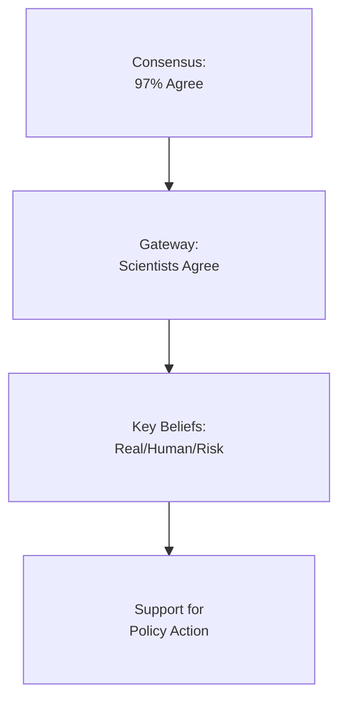
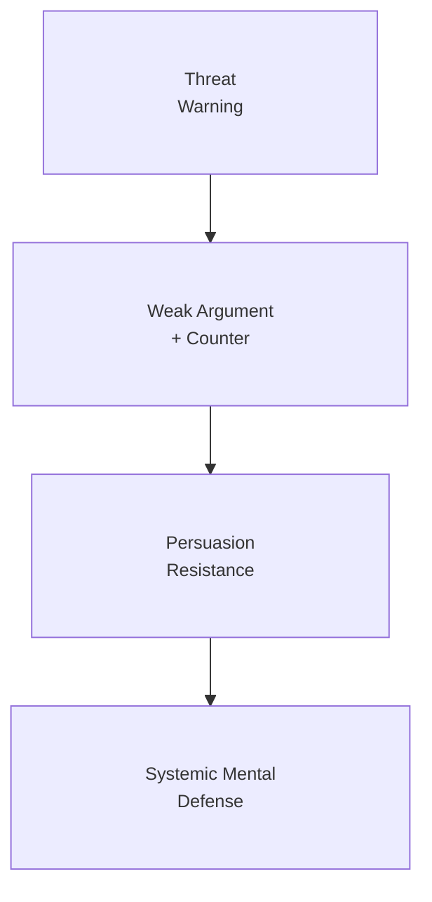

# Course Mastery Guide: SOW-BS033 Communication and Influence

This guide is designed to optimize your learning, memorization, and application of the core theories in social influence and communication science.

### 1. Global Mindmap (Network)

```mermaid
%%{init: {'flowchart': {'padding': 40, 'nodeSpacing': 50, 'rankSpacing': 50}, 'themeVariables': { 'fontSize': '13px' }}}%%
graph TD
    A["&nbsp;&nbsp;&nbsp;&nbsp; SOW-BS033: &nbsp;&nbsp;&nbsp;&nbsp;<br/>&nbsp;&nbsp;&nbsp;&nbsp; Comms & Influence &nbsp;&nbsp;&nbsp;&nbsp;"]:::category --> B["&nbsp;&nbsp;&nbsp;&nbsp; Information & &nbsp;&nbsp;&nbsp;&nbsp;<br/>&nbsp;&nbsp;&nbsp;&nbsp; Beliefs &nbsp;&nbsp;&nbsp;&nbsp;"]:::category
    A --> C["&nbsp;&nbsp;&nbsp;&nbsp; Social Norms & &nbsp;&nbsp;&nbsp;&nbsp;<br/>&nbsp;&nbsp;&nbsp;&nbsp; Interaction &nbsp;&nbsp;&nbsp;&nbsp;"]:::category
    A --> D["&nbsp;&nbsp;&nbsp;&nbsp; Choice &nbsp;&nbsp;&nbsp;&nbsp;<br/>&nbsp;&nbsp;&nbsp;&nbsp; Architecture &nbsp;&nbsp;&nbsp;&nbsp;"]:::category
    A --> E["&nbsp;&nbsp;&nbsp;&nbsp; Systemic vs. &nbsp;&nbsp;&nbsp;&nbsp;<br/>&nbsp;&nbsp;&nbsp;&nbsp; Individual &nbsp;&nbsp;&nbsp;&nbsp;"]:::category
    A --> F["&nbsp;&nbsp;&nbsp;&nbsp; Inoculation & &nbsp;&nbsp;&nbsp;&nbsp;<br/>&nbsp;&nbsp;&nbsp;&nbsp; Resistance &nbsp;&nbsp;&nbsp;&nbsp;"]:::category

    B --> B1["&nbsp;&nbsp;&nbsp;&nbsp; Mildenberger:<br/>2nd-Order Beliefs &nbsp;&nbsp;&nbsp;&nbsp;"]
    B --> B2["&nbsp;&nbsp;&nbsp;&nbsp; Van der Linden:<br/>Gateway Beliefs &nbsp;&nbsp;&nbsp;&nbsp;"]
    B --> B3["&nbsp;&nbsp;&nbsp;&nbsp; Meijers & Rutjens:<br/>Belief in Progress &nbsp;&nbsp;&nbsp;&nbsp;"]

    C --> C1["&nbsp;&nbsp;&nbsp;&nbsp; Geiger & Swim:<br/>Pluralistic Ignorance &nbsp;&nbsp;&nbsp;&nbsp;"]
    C --> C2["&nbsp;&nbsp;&nbsp;&nbsp; Steentjes:<br/>Interpersonal Activism &nbsp;&nbsp;&nbsp;&nbsp;"]
    C --> C3["&nbsp;&nbsp;&nbsp;&nbsp; Klaperski:<br/>Costs of Speak-Up &nbsp;&nbsp;&nbsp;&nbsp;"]

    D --> D1["&nbsp;&nbsp;&nbsp;&nbsp; Hertwig:<br/>Nudges vs. Boosts &nbsp;&nbsp;&nbsp;&nbsp;"]
    D --> D2["&nbsp;&nbsp;&nbsp;&nbsp; Dorresteijn:<br/>10 kcal Deficit &nbsp;&nbsp;&nbsp;&nbsp;"]
    D --> D3["&nbsp;&nbsp;&nbsp;&nbsp; Shiota:<br/>Positive Affect &nbsp;&nbsp;&nbsp;&nbsp;"]

    E --> E1["&nbsp;&nbsp;&nbsp;&nbsp; Chater & Loewen:<br/>I-frame vs S-frame &nbsp;&nbsp;&nbsp;&nbsp;"]
    E --> E2["&nbsp;&nbsp;&nbsp;&nbsp; Gonzales-Arcos:<br/>Consumer Resistance &nbsp;&nbsp;&nbsp;&nbsp;"]

    F --> F1["&nbsp;&nbsp;&nbsp;&nbsp; Fransen et al:<br/>Inoculation Theory &nbsp;&nbsp;&nbsp;&nbsp;"]
    F --> F2["&nbsp;&nbsp;&nbsp;&nbsp; Basol et al:<br/>Pre-bunking Game &nbsp;&nbsp;&nbsp;&nbsp;"]

    B1 --- C1
    D1 --- E1
    F1 --- B2

    classDef category font-weight:bold,stroke-width:2px,padding:40px;
```

---

### 🟢 Week 1: The Social Construction of Belief

**Paper Summaries (Max 250 words per paper):**
*   **Mildenberger & Tingley (2019)**: 
    *   **Core Premise & Method:** This study investigates the distribution and content of "second-order beliefs"—individuals' perceptions of what others believe—regarding climate change in the US and China. 
    *   **Theories & Mechanisms:** The authors draw on the **Simulation View**, where people use their own beliefs as a heuristic to imagine others' minds, often resulting in an **Egocentric Bias**. They highlight the **Anchoring and Adjustment Heuristic**, where individuals fail to sufficiently adjust their estimates away from their own perspective. This leads to **Pluralistic Ignorance**, where a majority incorrectly assumes they are in the minority.
    *   **Behavioral Examples:** This misperception creates a **Spiral of Silence**, where individuals refrain from participating in climate activism or supporting reforms because they underestimate the level of public consensus. For example, politicians may be disinclined to support climate legislation not because of their personal beliefs, but because they incorrectly assume their constituents do not support it. 
    *   **Findings:** Both climate believers and skeptics systematically underestimate the true level of pro-climate support in their societies. Experimentally correcting these second-order beliefs increases individual support for collective climate action.

**Key Terms & Definitions:**
*   

<b>Second-Order Beliefs</b>
Perceptions of the distribution of beliefs within a population ("what I think you think").

*   

<b>Information Deficit Model</b>
The assumption that providing more scientific facts will automatically lead to behavior change.

*   

<b>Egocentric Bias</b>
The tendency to judge others' beliefs based on one's own internal state.

#### Critiques
*   **Volatility of Perceptions:** Second-order opinions are highly susceptible to media framing and "loud" minority voices, making them unstable targets for long-term policy communication.

#### Conceptual & Memorizing (Max 200 words per week)
*   **🧠 Conceptual Tip:** Imagine a room where everyone is worried about a fire but stays seated because everyone else *looks* calm.
*   **🔗 Mnemonic:** **"The Social Mirror"** — We don't see the crowd; we see what we *think* the crowd sees.
*   **🖼️ Visual Model:**

---

### 🔵 Week 2: Interpersonal Communication & Social Norms

**Paper Summaries (Max 250 words per paper):**
*   **Geiger & Swim (2016)**:
    *   **Core Premise & Method:** Explores why people who care about climate change rarely talk about it, identifying **pluralistic ignorance** as a primary psychological barrier.
    *   **Theories & Mechanisms:** The study focuses on **Impression Management**, where individuals prioritize being viewed as competent and likeable. They identify two core dimensions of social evaluation: **Warmth** and **Competence**. People fear that speaking up will lead to **Self-Silencing** to avoid being stereotyped as "alarmists" or "complainers."
    *   **Behavioral Examples:** In a group project setting, a student might refrain from suggesting sustainable practices because they fear the group will perceive them as eccentric or socially difficult (low warmth). This creates a "climate of silence" that reinforces the status quo.
    *   **Findings:** Correcting misperceptions of others' concern levels significantly increases people's willingness to engage in climate conversations.
*   **Klaperski-van der Wal et al. (2025)**:
    *   **Core Premise & Method:** Investigates the social costs and benefits of confronting others on unsustainable behavior.
    *   **Theories & Mechanisms:** Explores the **Confronter's Dilemma**, where the desire to influence behavior (competence) clashes with the desire to maintain social harmony (warmth).
    *   **Behavioral Examples:** Confronting a friend for wasting water may lead to the friend perceiving the confronter as annoying or judgmental, resulting in a social "penalty."
*   **Steentjes et al. (2017)**:
    *   **Core Premise & Method:** Defines **Interpersonal Activism** as the daily negotiation of social norms through talk.
    *   **Theories & Mechanisms:** Differentiates between **Descriptive Norms** (what people do) and **Injunctive Norms** (what people approve of). 

**Key Terms & Definitions:**
*   

<b>Self-Silencing</b>
Withholding one's true opinions to avoid social sanctions or negative evaluation.

*   

<b>Impression Management</b>
The conscious or subconscious process in which people attempt to influence the perceptions other people have of them.

#### Critiques
*   **Cultural Specificity:** The social costs of confrontation (Klaperski) may be much lower in cultures that value direct communication (e.g., The Netherlands) compared to those that value high-context harmony.

#### Conceptual & Memorizing (Max 200 words per week)
*   **🧠 Conceptual Tip:** Talking about the climate is like being the first person to dance at a party—everyone wants to do it, but no one wants to be "that person."
*   **🔗 Mnemonic:** **"W.A.C."** — **W**armth **A**nd **C**ompetence (The dual filters of social judgment).
*   **🖼️ Visual Model:**

---

### 🟡 Week 3: Beyond Nagging Nudges: Applying Social Influence Theories

**Paper Summaries (Max 250 words per paper):**
*   **Hertwig & Grune-Yanoff (2017)**:
    *   **Core Premise & Method:** Compares **Nudges** (environmentally steered choices) with **Boosts** (competence-building skills). 
    *   **Theories & Mechanisms:** Based on the **Dual-System Architecture** (System 1 vs System 2). Nudges target System 1 by leveraging **Cognitive Deficiencies** like inertia and present bias. Boosts target System 2, assuming **Ecological Rationality**—that the mind is a toolbox of heuristics that can be sharpened.
    *   **Behavioral Examples:** A **Nudge** is setting retirement savings to "auto-enroll" (harnessing laziness). A **Boost** is teaching someone "simple rules of thumb" to calculate interest, empowering them to manage their own finances.
*   **Dorresteijn et al. (2013)**:
    *   **Core Premise & Method:** A field study in a Dutch hospital implementing "10 kcal deficit" nudges.
    *   **Theories & Mechanisms:** Uses **Choice Architecture** and **Point-of-Decision Prompts**. It leverages **Accessibility**, making the healthy choice (margarine) physically easier to reach than the unhealthy one (butter).
    *   **Behavioral Examples:** Placing signs by the elevator led to a significant increase in stair climbing without visitors realizing they were being "nudged."
*   **Shiota et al. (2021)**:
    *   **Core Premise & Method:** Reviews how positive affect (joy, awe, pride) drives behavior change.
    *   **Theories & Mechanisms:** **Broaden-and-Build Theory** posits that positive emotions broaden cognitive scope. It also discusses **Moral Licensing**, where one good deed leads to "earned" selfish behavior later.
    *   **Behavioral Examples:** Labeling vegetables as "Indulgent" rather than "Healthy" increases intake by triggering positive anticipation (Positive Reinforcement).

**Key Terms & Definitions:**
*   

<b>Boost</b>
Interventions aimed at improving people’s decision-making competence.

*   

<b>Moral Licensing</b>
The phenomenon where doing something "good" makes people feel entitled to do something "bad" later.

#### Critiques
*   **Paternalism:** Nudges are often critiqued for bypassing human agency, whereas boosts are seen as more transparent but harder to implement.

#### Conceptual & Memorizing (Max 200 words per week)
*   **🧠 Conceptual Tip:** A Nudge is a GPS that steers you; a Boost is teaching you how to read a map.
*   **🖼️ Visual Model:**

---

### 🟠 Week 4: I-frames, S-frames, and System Change

**Paper Summaries (Max 250 words per paper):**
*   **Chater & Loewenstein (2023)**:
    *   **Core Premise & Method:** A critical review of behavioral public policy, arguing that "i-frame" (individual) focus has distracted from "s-frame" (systemic) solutions.
    *   **Theories & Mechanisms:** Highlights the **Fundamental Attribution Error**, where we blame individual failings rather than systemic rules. Discusses **Crowding Out / Displacement Effects**, where minor individual-level progress reduces public appetite for major systemic changes. It also touches on **Responsibilization**, a neoliberal strategy to shift the burden of societal issues onto the consumer.
    *   **Behavioral Examples:** BP’s carbon footprint calculator shifts the guilt of climate change onto the individual’s lightbulb choices, deflecting attention from the need for a carbon tax (S-frame).
*   **Gonzales-Arcos et al. (2021)**:
    *   **Core Premise & Method:** Develops a theory of **Consumer Resistance** to sustainability interventions using Chile's plastic bag ban as a case study.
    *   **Theories & Mechanisms:** Grounded in **Social Practice Theory**, where behavior is a mix of Materials, Competences, and Meanings. They identify **Responsibilization Battles**—conflicts over who is responsible for the change—and **Unsettling Emotionality** (shame, frustration).
    *   **Behavioral Examples:** Consumers "stealing" disposable fruit bags to use for their groceries or feeling "shame" when they forget their reusable bags at the register.
    *   **Findings:** Resistance occurs not because people are lazy, but because the intervention disrupts their deeply embedded daily practices and triggers negative identity-related emotions.

**Key Terms & Definitions:**
*   

<b>Responsibilization</b>
The process of framing societal problems as individual responsibilities.

*   

<b>Social Practice Theory</b>
Viewing behavior as a complex web of materials (stuff), competences (skills), and meanings (values).

#### Critiques
*   **The False Dichotomy:** Critics argue that i-frames and s-frames are not mutually exclusive; i-frames often serve as the "gateway" to make s-frames politically viable.

#### Conceptual & Memorizing (Max 200 words per week)
*   **🧠 Conceptual Tip:** If a boat is sinking, an I-frame is handing everyone a bucket; an S-frame is fixing the hull.
*   **🖼️ Visual Model:**

---

### 🔴 Week 5: The Credibility of Science Communication

**Paper Summaries (Max 250 words per paper):**
*   **Van der Linden et al. (2015)**:
    *   **Core Premise & Method:** Experiments with the **Gateway Belief Model (GBM)** to see if consensus messaging can shift public policy support.
    *   **Theories & Mechanisms:** The **Gateway Belief Model** posits that a single foundational belief (97% consensus) can trigger a "domino effect" across other beliefs. This relies on **Cognitive Consistency**, where people update their perceptions of risk and causality to match the new expert-backed "fact."
    *   **Behavioral Examples:** Individuals who were previously skeptical of climate change increased their support for public action after being exposed to a simple pie chart showing the degree of scientific agreement.
*   **Meijers & Rutjens (2014)**:
    *   **Core Premise & Method:** Investigates why "belief in progress" can lead to lower environmental action.
    *   **Theories & Mechanisms:** **Compensatory Control Theory** states that humans need to feel the world is orderly. When personal control is low, people compensate by believing in external systems (Science/God). This creates a **Hydraulic Relationship**: as belief in scientific progress (external order) goes up, the motivation for personal action goes down.
    *   **Behavioral Examples:** Participants who read about rapid scientific breakthroughs in climate tech reported significantly lower intentions to recycle or save water (Moral Licensing / Outsourced Responsibility).
    *   **Findings:** Affirming science as an omniscient savior can make people passive observers rather than active participants.

**Key Terms & Definitions:**
*   

<b>Compensatory Control</b>
Seeking external sources of order when personal control is threatened.

*   

<b>Gateway Belief</b>
A core belief that, once changed, facilitates the updating of other related beliefs.

#### Critiques
*   **Backfire Effects:** For highly polarized individuals, consensus messaging (Van der Linden) can sometimes be perceived as a conspiracy, leading to even stronger resistance.

#### Conceptual & Memorizing (Max 200 words per week)
*   **🧠 Conceptual Tip:** Belief in progress is like a "Security Blanket"—it makes you feel safe, but it also makes you want to stay in bed.
*   **🖼️ Visual Model:**

---

### 🟣 Week 6: Resistance to Persuasion & Inoculation

**Paper Summaries (Max 250 words per paper):**
*   **Fransen et al. (2023)**:
    *   **Core Premise & Method:** A large-scale replication of McGuire's 1961 experiment on **Inoculation Theory**.
    *   **Theories & Mechanisms:** Uses the biological metaphor of a vaccine. **Refutational Pre-emption** involves exposing people to a weakened counterargument and then refuting it. This triggers **Threat Awareness**, which motivates the individual to produce "mental antibodies" (arguments) to defend their current position.
    *   **Behavioral Examples:** Strengthening "Cultural Truisms" (unquestioned beliefs like "brushing teeth is good") so that they can withstand sudden, strong persuasive attacks.
*   **Basol et al. (2020)**:
    *   **Core Premise & Method:** Tests the "Bad News" game—a gamified tool for building **Cognitive Immunity** against misinformation.
    *   **Theories & Mechanisms:** Shifting from issue-specific to **Broad-Spectrum Inoculation** (tactic-based). The game uses **Active Inoculation**, where players learn by *doing* (creating fake news themselves). Key tactics taught include **Polarization** (us vs them), **Emotional Language** (fear mongering), and **Impersonation** (fake experts).
    *   **Behavioral Examples:** After playing the game, participants were better able to spot "Discrediting" and "Trolling" tactics in real-world news headlines, increasing their confidence in their own judgments.
    *   **Findings:** Active, gamified inoculation is more effective and engaging than passive warnings or fact-checking.

**Key Terms & Definitions:**
*   

<b>Inoculation Theory</b>
Building resistance to persuasion by pre-exposing individuals to weakened counterarguments.

*   

<b>Pre-bunking</b>
The process of debunking misinformation tactics before the audience encounters them.

#### Critiques
*   **Decay Rates:** Psychological "immunity" wears off over time, requiring periodic "booster" messages to maintain resistance.

#### Conceptual & Memorizing (Max 200 words per week)
*   **🧠 Conceptual Tip:** Inoculation is a Fire Drill for your brain. You practice with a fake fire so you don't panic during a real one.
*   **🖼️ Visual Model:**

