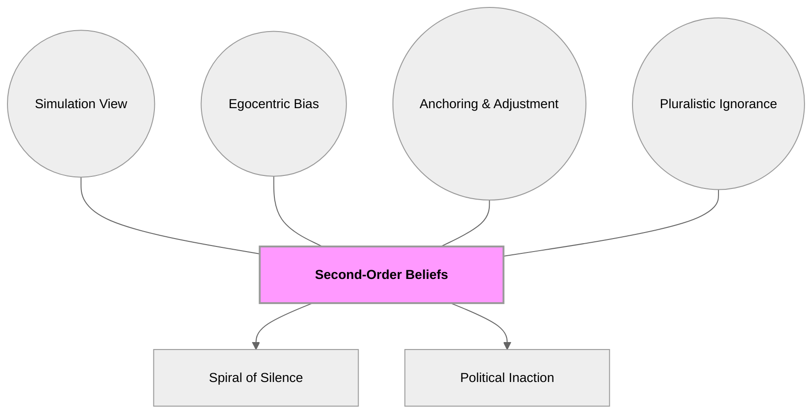
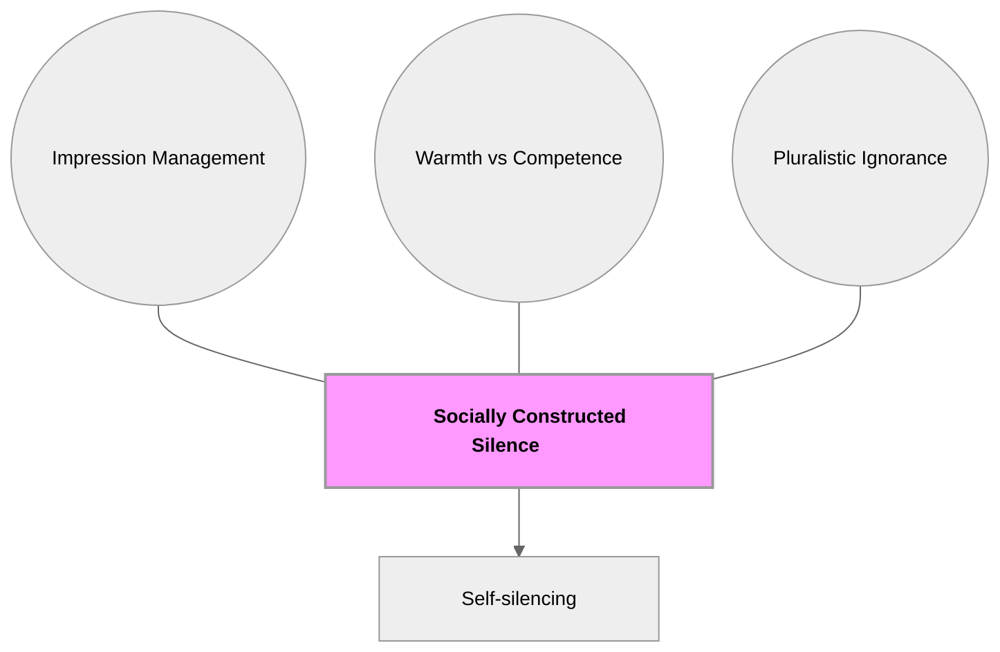
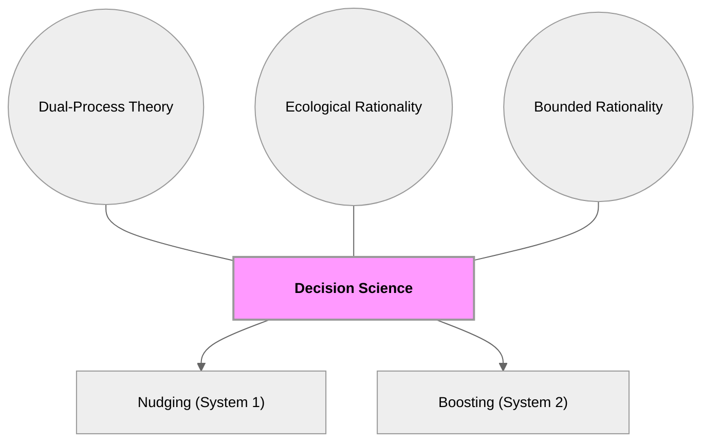
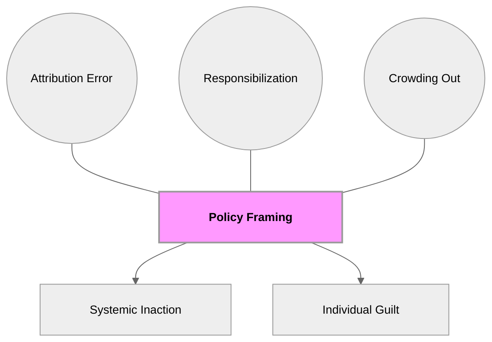
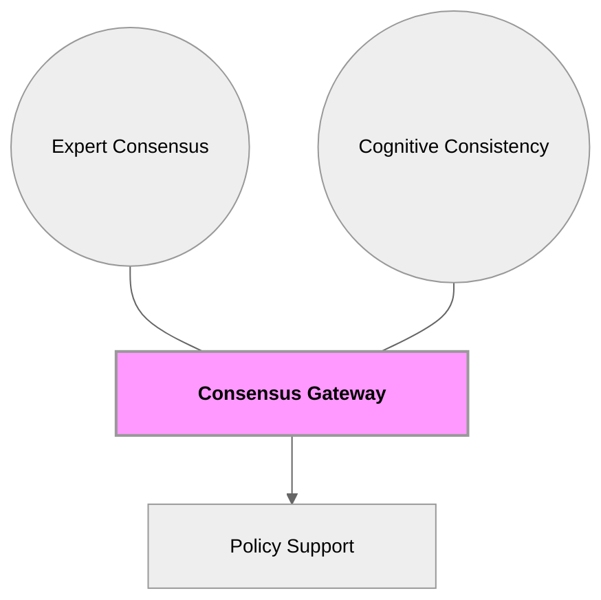
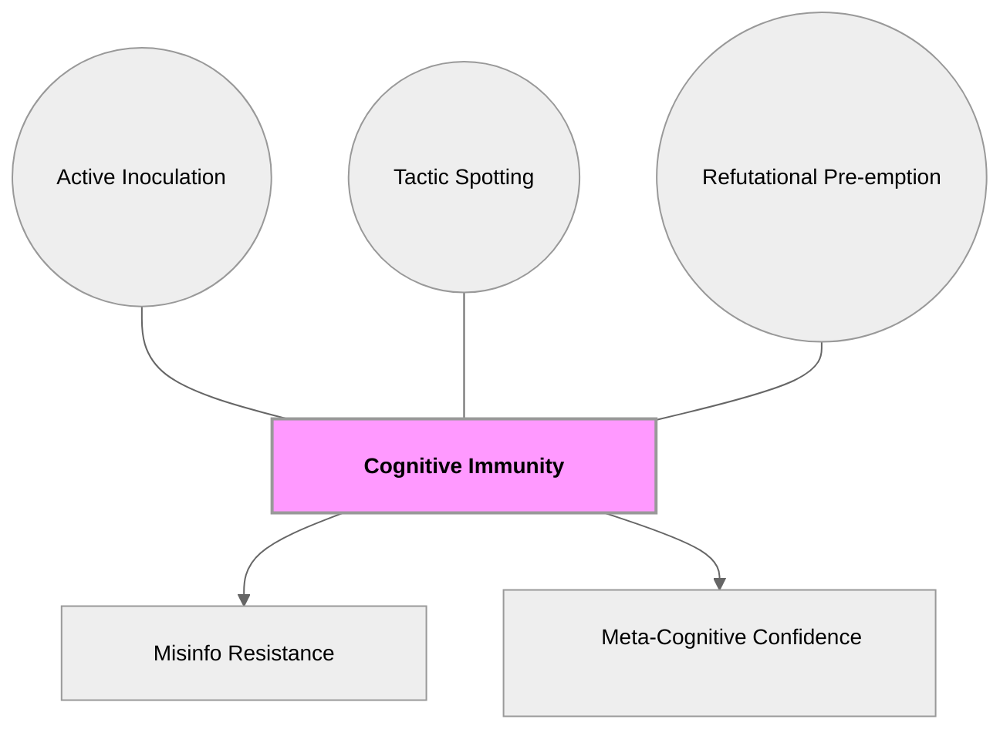

# Course Mastery Guide: SOW-BS033 Communication and Influence (Encyclopedia Edition)

This guide is a master-level study resource optimized for the MSc Behavioural Science curriculum. It features deep-dive literature summaries, GitHub-optimized conceptual models, and verbatim keyword styling.

### 1. Global Topology

**Figure 1**

*Structural Map of Social Influence and Communication Theories*

```mermaid
%%{init: { 'flowchart': { 'padding': 20, 'nodeSpacing': 50, 'rankSpacing': 50, 'useMaxWidth': false }, 'theme': 'neutral', 'themeVariables': { 'fontSize': '14px' }}}%%
graph TD
    A["&nbsp;&nbsp;&nbsp;&nbsp; SOW-BS033: &nbsp;&nbsp;&nbsp;&nbsp;<br/>&nbsp;&nbsp;&nbsp;&nbsp; Communication & Influence &nbsp;&nbsp;&nbsp;&nbsp;"]:::hub --> B["&nbsp;&nbsp;&nbsp;&nbsp; Information & Beliefs &nbsp;&nbsp;&nbsp;&nbsp;"]
    A --> C["&nbsp;&nbsp;&nbsp;&nbsp; Social Norms & Interactions &nbsp;&nbsp;&nbsp;&nbsp;"]
    A --> D["&nbsp;&nbsp;&nbsp;&nbsp; Choice Architecture &nbsp;&nbsp;&nbsp;&nbsp;"]
    A --> E["&nbsp;&nbsp;&nbsp;&nbsp; Systemic vs. Individual &nbsp;&nbsp;&nbsp;&nbsp;"]
    A --> F["&nbsp;&nbsp;&nbsp;&nbsp; Resistance & Inoculation &nbsp;&nbsp;&nbsp;&nbsp;"]

    B --> B1["&nbsp;&nbsp;&nbsp;&nbsp; Mildenberger &nbsp;&nbsp;&nbsp;&nbsp;"]
    B --> B2["&nbsp;&nbsp;&nbsp;&nbsp; Van der Linden &nbsp;&nbsp;&nbsp;&nbsp;"]
    B --> B3["&nbsp;&nbsp;&nbsp;&nbsp; Meijers & Rutjens &nbsp;&nbsp;&nbsp;&nbsp;"]

    C --> C1["&nbsp;&nbsp;&nbsp;&nbsp; Geiger & Swim &nbsp;&nbsp;&nbsp;&nbsp;"]
    C --> C2["&nbsp;&nbsp;&nbsp;&nbsp; Steentjes &nbsp;&nbsp;&nbsp;&nbsp;"]
    C --> C3["&nbsp;&nbsp;&nbsp;&nbsp; Klaperski &nbsp;&nbsp;&nbsp;&nbsp;"]

    D --> D1["&nbsp;&nbsp;&nbsp;&nbsp; Hertwig &nbsp;&nbsp;&nbsp;&nbsp;"]
    D --> D2["&nbsp;&nbsp;&nbsp;&nbsp; Dorresteijn &nbsp;&nbsp;&nbsp;&nbsp;"]
    D --> D3["&nbsp;&nbsp;&nbsp;&nbsp; Shiota &nbsp;&nbsp;&nbsp;&nbsp;"]

    E --> E1["&nbsp;&nbsp;&nbsp;&nbsp; Chater & Loewen &nbsp;&nbsp;&nbsp;&nbsp;"]
    E --> E2["&nbsp;&nbsp;&nbsp;&nbsp; Gonzales-Arcos &nbsp;&nbsp;&nbsp;&nbsp;"]

    F --> F1["&nbsp;&nbsp;&nbsp;&nbsp; Fransen &nbsp;&nbsp;&nbsp;&nbsp;"]
    F --> F2["&nbsp;&nbsp;&nbsp;&nbsp; Basol &nbsp;&nbsp;&nbsp;&nbsp;"]

    classDef hub font-weight:bold,stroke-width:3px;
    classDef default stroke-width:2px;
```

*Note.* This figure provides a comprehensive hierarchical overview of the SOW-BS033 course themes. It illustrates the primary conceptual domains—ranging from information-based belief systems (Week 1 & 5) to the social dynamics of interaction (Week 2), the environmental design of choice (Week 3), the critical evaluation of systemic vs. individual frames (Week 4), and the psychological mechanisms of resistance (Week 6). By mapping each core paper to its thematic pillar, this model facilitates the learning objective of outlining and explaining the diverse perspectives within communication science. The layout specifically demonstrates that behavioral influence is not a monolithic process, but rather a multi-layered interaction between individual cognition, social norms, and institutional structures.

---

### 🟢 Week 1: The Social Construction of Belief

#### Mildenberger & Tingley (2019): Beliefs about Climate Beliefs

**Detailed Abstract**  
This research challenges the **Information Deficit Model**, which assumes that providing scientific facts is the primary route to behavior change. The authors argue that collective action is paralyzed not by a lack of facts, but by biased **second-order beliefs**—what we *think* others believe. Through extensive surveys in the US and China, the authors identify a systemic **egocentric bias**, where individuals' own views anchor their estimates of the collective norm. This leads to a **pluralistic ignorance effect**, where a pro-climate majority incorrectly believes it is a minority. This misperception triggers a **spiral of silence**, where individuals self-censor to avoid perceived social isolation. Crucially, the study finds that political elites (e.g., congressional staffers) exhibit even higher levels of bias, often misjudging constituent support by wide margins. Correcting these meta-beliefs is shown to be a potent communicative intervention for increasing policy support.

**Figure 2**

*Theoretical Topology of Second-Order Belief Construction*

*Note.* This conceptual model explains the psychological construction of social reality as described by Mildenberger & Tingley. The central "Hub" represents the meta-cognitive state of holding a second-order belief. The circular satellite nodes depict the internal cognitive processes—Simulation (guessing others' minds), Egocentric Bias (using self as a reference), and Anchoring/Adjustment (failing to update guesses)—that inevitably lead to the distorted state of Pluralistic Ignorance. The rectangular output nodes show how these internal distortions manifest as external behavioral outcomes: individuals entering a "Spiral of Silence" and policy-makers remaining in a state of "Political Inaction" due to their misjudged mandate. This fulfills the objective of critically evaluating theoretical perspectives in light of empirical evidence.

**How to remember**  
Think of the **"Social Mirror."** You look into the mirror (society) and only see your own reflection (Egocentric Bias), then assume that's what the entire room looks like. 

**🔗 Mnemonic: S.E.A. Silence**  
- **S**imulation (Guessing others)
- **E**gocentric (Reflecting self)
- **A**nchoring (Sticking to the guess)
- leads to **Silence**.

---

### 🔵 Week 2: Interpersonal Communication & Social Norms

#### Geiger & Swim (2016): Climate of Silence

**Detailed Abstract**  
This paper explores the "Climate of Silence," where concern about climate change is high but public discussion is low. The authors identify **pluralistic ignorance** as the key driver—people mistakenly believe they are the only ones concerned. This is motivated by **impression management**, specifically the fear of appearing **incompetent** or uninformed. To protect their perceived **warmth** and **competence**, individuals engage in **self-silencing**. This creates a **socially constructed silence** that reinforces the false norm of disinterest.

**Figure 3**

*Psychological Barriers to Climate Discussion*

*Note.* This model illustrates the mediation of public expression by internal social evaluation concerns. The "Hub" is the collective state of silence. The "Impression Management" and "Warmth vs Competence" satellites show that the barrier to talking is not a lack of interest, but a strategic desire to manage how others perceive our intelligence and friendliness. The path leads to "Self-silencing," which empirically explains why concerned individuals remain quiet in social settings.

**How to remember**  
The **"Party Dance"** analogy: Everyone is standing against the wall, wanting to dance (concern) but assuming no one else wants to (Pluralistic Ignorance). No one wants to be the first one on the floor and look stupid (Impression Management).

---

### 🟡 Week 3: Beyond Nagging Nudges

#### Hertwig & Grune-Yanoff (2017): Nudging and Boosting

**Detailed Abstract**  
The authors distinguish between **Nudges** (steering behavior via environment) and **Boosts** (empowering behavior via skills). Nudges exploit System 1 **cognitive deficiencies**, whereas Boosts build **competences** by assuming **ecological rationality**—that people can be trained to use heuristics effectively.

**Figure 4**

*Taxonomy of Behavioral Policy Interventions*

*Note.* This figure provides a structural taxonomy of behavioral interventions. It maps how specific theoretical assumptions about the human mind lead to different policy choices. The "Dual-Process" and "Bounded Rationality" satellites explain the justification for Nudging (steering fallible minds), while "Ecological Rationality" explains the shift toward Boosting (training competent minds).

**How to remember**  
**"GPS vs. Map."** A Nudge is a GPS (tells you where to go); a Boost is learning to read a map (skill empowerment).

---

### 🟠 Week 4: I-frames, S-frames, and System Change

#### Chater & Loewenstein (2023): The i-frame and the s-frame

**Detailed Abstract**  
Argues that **i-frames** (individual focus) have enabled corporate **responsibilization**, shifting blame onto consumers and **crowding out** support for **s-frames** (systemic change).

**Figure 5**

*Structural Dynamics of Policy Framing*

*Note.* Models the negative externalities of individual-level framing. The "Responsibilization" and "Attribution Error" satellites explain how focus is diverted from corporate/legal systems to individual failings, resulting in "Systemic Inaction" and high levels of "Individual Guilt."

---

### 🔴 Week 5: The Credibility of Science Communication

#### Van der Linden et al. (2015): The Gateway Belief Model

**Detailed Abstract**  
The **Gateway Belief Model (GBM)** shows that scientific consensus messaging triggers **cognitive consistency**, cascading into support for policy action.

**Figure 6**

*The Consensus Domino Effect*

*Note.* This model illustrates the causal flow of consensus messaging. Shifting the perception of expert agreement (Hub) activates the psychological need for consistency, leading to a domino effect on causality and risk beliefs, ultimately increasing policy support.

#### Meijers & Rutjens (2014): Affirming Belief in Progress

**Detailed Abstract**  
Explores **Compensatory Control Theory**, showing a **hydraulic relationship** where belief in science reduces personal motivation through **moral licensing**.

---

### 🟣 Week 6: Resistance to Persuasion & Inoculation

#### Fransen et al. (2023): Sixty Years Later

**Detailed Abstract**  
Replicates **Inoculation Theory**, showing that **refutational pre-emption** builds resistance to attacks on **cultural truisms** by triggering **threat awareness**.

#### Basol et al. (2020): Good News about Bad News

**Detailed Abstract**  
A gamified approach to **active inoculation**, building **broad-spectrum inoculation** and **cognitive immunity** against misinformation tactics.

**Figure 7**

*The Mechanism of Cognitive Immunity*

*Note.* Models the build-up of mental defense. The Immunity Hub is established through Active participation (the game) and Tactic Spotting, leading to measurable resistance and meta-cognitive confidence in truth-judgment.

**How to remember**  
The **"Fire Drill."** You run a fake drill (inoculation) so your brain knows the exits when a real fire (misinformation) starts.
