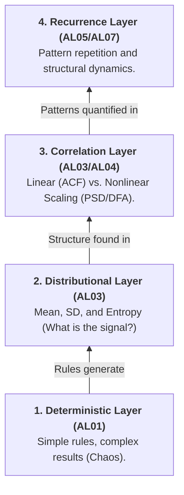

# Course Mastery Guide: Complexity Methods (Encyclopedia Edition)

> **Status:** This summary is currently under review by the author.

**Sources Used:** 
- Complexity Methods (CMBS) Assignments (AL01-AL07)
- Official Course Book: "Complexity Methods for Behavioural Science"
- [AL01: Univariate Systems](https://complexity-methods.github.io/assignments/CMBS/CMBSAL01_ASSIGNMENTS_uvSystems.html)
- [AL03: Basic TSA](https://complexity-methods.github.io/assignments/CMBS/CMBSAL03_ASSIGNMENTS_BasicTSA.html)
- [AL04: Global Scaling](https://complexity-methods.github.io/assignments/CMBS/CMBSAL04_ASSIGNMENTS_GlobalScaling.html)
- [AL05: AutoRQA](https://complexity-methods.github.io/assignments/CMBS/CMBSAL05_ASSIGNMENTS_AutoRQA.html)
- [AL07: Dynamic Complexity](https://complexity-methods.github.io/assignments/CMBS/CMBSAL07_ASSIGNMENTS_DynamicComplexity.html)
- Official Exam Database and GitHub Assignments (2025-2026)

This guide is a master-level study resource optimized for the MSc Behavioural Science curriculum. It provides a high-signal overview of all literature, conceptual models, and detailed key take-aways for every topic, specifically extracted from the exam database and GitHub assignments.

---

## 🏗️ The Conceptual Model: "The Complexity Hierarchy"

Complexity science moves from simple deterministic rules to the analysis of complex, self-organizing systems. We analyze these through different "lenses" of temporal organization.

### Visual Hierarchy

---

## 📅 Week 1: Univariate Models & Deterministic Chaos
**The Core Concept:** How simple, non-stochastic equations can generate unpredictable, "chaotic" behavior.

### 📄 The Logistic Map (Quadratic Map)
*   **Plain Language:** A simple recursive equation: $Y_{i+1} = r \cdot Y_i \cdot (1 - Y_i)$. Depending on the control parameter ($r$), the system can be stable, oscillate, or become completely chaotic.
*   **The Mnemonic:** 🦋 **The Butterfly Effect.** Small changes in $Y_0$ lead to massive differences in chaotic regimes ($r = 3.9+$).

**🚀 Key Take-Aways:**
- **Attractors:** Systems settle into fixed points, limit cycles (oscillations), or strange attractors (chaos).
- **Order Parameter:** Labels for qualitatively distinct behaviors (e.g., "point attractor" vs "strange attractor").
- **Phase Transition:** Sudden shifts in behavior as $r$ changes gradually.
- **Return Plot (Lag-1):** Plotting $Y_i$ vs $Y_{i+1}$. For the Logistic Map, this always forms a **Parabola**.

---

## 📅 Week 2: Basic Nonlinear Time Series Analysis
**The Core Concept:** Why traditional statistics (Mean/SD) fail to describe complex signals.

### 📄 Fluctuation & Regularity
*   **Plain Language:** Two series can have the exact same Mean and SD but totally different temporal structures (one random, one highly structured).

**🚀 Key Take-Aways:**
- **Relative Roughness (RR):** Quantifies local vs global variance. High RR = jagged/noisy; Low RR = smooth/structured.
- **Sample Entropy (SampEn):** Measures unpredictability. High SampEn = more random; Low SampEn = more periodic/structured. 
- **Stationarity:** The assumption that statistical properties don't change over time. Most complexity methods require checking or ensuring this via detrending.

---

## 📅 Week 3 & 4: Global Scaling & Fractals
**The Core Concept:** Looking for patterns that repeat across different time scales.

### 📄 Fractal Scaling (PSD, SDA, DFA)
*   **Plain Language:** In complex adaptive systems, there is no "characteristic scale." The "stick" you use to measure changes the result.

**🚀 Key Take-Aways:**
- **PSD Slope (Power Spectral Density):** Converts signal to the frequency domain. A linear slope in log-log coordinates indicates **Power-law scaling**.
- **Pink Noise (1/f):** A "signature of complexity" where the system balances flexibility and stability.
- **DFA (Detrended Fluctuation Analysis):** The gold standard for scaling. It removes local trends to see if the "leftover" fluctuations scale with bin size.

---

## 📅 Week 5 & 6: Auto-RQA (Recurrence Quantification)
**The Core Concept:** Analyzing how a system "visits" the same state over time.

### 📄 Recurrence Plots (RP)
*   **Plain Language:** A square matrix where a dot is placed whenever the system returns to a previous state. 

**🚀 Key Take-Aways:**
- **Recurrence Rate (RR):** How often the system repeats itself.
- **Determinism (DET):** Proportion of points forming diagonal lines (rule-following/predictability).
- **Laminarity (LAM):** Proportion of points forming vertical/horizontal lines (staying in the same state/stagnation).
- **Shannon Entropy (ENT):** Complexity of the line-length distribution.

---

## 📅 Week 7: Dynamic Complexity & Complex Networks
**The Core Concept:** Identifying critical transitions in real-time.

### 📄 Transitions in Networks
*   **Plain Language:** When a system is about to "break" or shift, fluctuations often increase (Critical Slowing Down).

**🚀 Key Take-Aways:**
- **Dynamic Complexity:** A measure combining distribution and fluctuation to spot shifts in behavioral regimes.
- **Network Topology:** Analyzing how nodes (variables) connect and influence each other over time.
