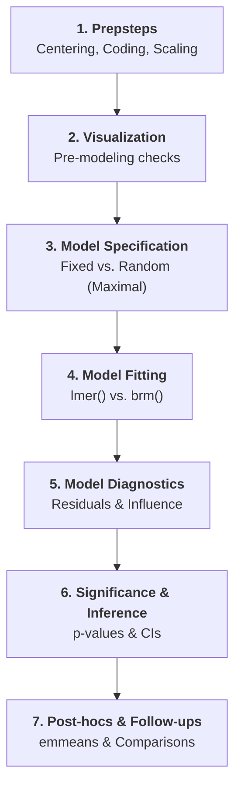

# File: README.md
# Description: This is the master study guide for the Mixed Effects Models course. It provides a detailed, step-by-step statistical framework based on the 7 "Typical Research Steps" from the 2026 curriculum.

# 🎓 Mixed Effects Models (MEM): The Complete Framework
> **Objective:** Grasp the core concept of MEM—modeling non-independent data by accounting for both fixed effects (average patterns) and random effects (variability across groups).

---

## 🏗️ The Statistical Roadmap: "The 7 Steps"

---

## 🟢 Phase 1: Preparation (The Prepsteps)
**Goal:** Prepare the data so that the model coefficients are interpretable.

*   **Centering:** Subtract the mean from continuous predictors.
    *   *Mnemonic:* ⚖️ **Balance.** Centering makes the intercept represent the average of the whole sample.
    *   `df$trial_c <- scale(df$trial, scale = FALSE)`
*   **Contrast Coding:** For factors with 2+ levels.
    *   *Treatment Coding:* Compare levels to a reference (baseline).
    *   *Sum-to-zero (Effect) Coding:* Compare levels to the grand mean.
    *   `contrasts(df$f_group) <- contr.sum(2)`
*   **Scaling:** Divide by SD (optional, but helps convergence).

---

## 🟢 Phase 2: Visualization (Pre-modeling)
**Goal:** Detect oddities and understand the raw distribution.

*   **Density Plot:** `ggplot(df, aes(x = DV)) + geom_density()`
*   **Boxplot by Group:** `ggplot(df, aes(x = group, y = DV)) + geom_boxplot()`
*   **Lattice Plot (Individual differences):**
    *   `lattice::densityplot(~ DV | pid, data = df)`
    *   *Hint:* 🧩 Check if some participants have much higher variances or different slopes.

---

## 🟢 Phase 3: Specification (The Model)
**Goal:** Define the "Influence Stack" of the model.

### 📄 Formula Anatomy: $Y_{ij} = (\beta_0 + u_{0j}) + (\beta_1 + u_{1j})X_{ij} + \epsilon_{ij}$
*   **Fixed Effects ($\beta$):** Constant across groups. The "average" effect.
*   **Random Effects ($u$):** Varies across groups. Capture the "deviations" from the average.
    *   **Random Intercept:** Different baselines (e.g., $u_{0j}$ for subject $j$).
    *   **Random Slope:** Different effects of a predictor (e.g., $u_{1j}$ for subject $j$).

### 📄 The "Maximal Model" Rule (Barr et al., 2013)
*   **Mandate:** Model all possible random effects justified by your experimental design.
*   **Syntax:** `DV ~ Fixed1 * Fixed2 + (1 + WithinFixed1 * WithinFixed2 | GroupingFactor)`
*   *|| Syntax:* `(1 + Slope || pid)` removes correlations between intercepts and slopes.

---

## 🟢 Phase 4: Model Fitting
**Goal:** Compute the parameters using iterative estimation.

*   **Frequentist (lme4):**
    *   `m1 <- lmer(DV ~ 1 + IV + (1 + IV | pid), data = df, REML = TRUE)`
    *   *Note:* Use `REML = FALSE` when comparing models with different fixed effects.
*   **Bayesian (brms):**
    *   `m1_brms <- brm(DV ~ 1 + IV + (1 + IV | pid), data = df)`

---

## 🟢 Phase 5: Diagnostics
**Goal:** Ensure the model assumptions (Linearity, Normality, Homoscedasticity) are met.

1.  **Residual Distribution:** `densityplot(resid(m1, scaled = TRUE))`
2.  **Q-Q Plot:** `qqPlot(resid(m1))`
3.  **Fitted vs. Residuals:** `plot(m1, type = c('p', 'smooth'))`
4.  **Influence Check:** Cook's Distance and dfbetas.
    *   `influence_m1 <- influence(m1, "pid")`
    *   `plot(cooks.distance(influence_m1), type = "h")`

---

## 🟢 Phase 6: Inference & Significance
**Goal:** Determine if your fixed effects are statistically reliable.

*   **Kenward-Roger (K-R) Correction:** Best for small/medium samples.
    *   `car::Anova(m1, test.statistic = "F", type = "III")`
*   **Likelihood Ratio Test (LRT):** Compare models with/without the effect.
    *   `drop1(m1, test = "Chisq")`
*   **Confidence Intervals (CIs):**
    *   `confint(m1, method = "profile")` (Likelihood-based)
    *   `confint(m1, method = "boot", nsim = 1000)` (Robust)
*   **ICC (Intraclass Correlation):** 
    *   Formula: $Var(RandomIntercept) / (Var(RandomIntercept) + Var(Residual))$
    *   *Interpretation:* Proportions of variance explained by grouping.

---

## 🟢 Phase 7: Post-hocs & Follow-ups
**Goal:** Break down interactions or factors with 3+ levels.

*   **Pairwise Comparisons:** `emmeans(m1, pairwise ~ Factor)`
*   **Follow-up Models:** Run separate models on subsets of the data (e.g., test IV for smokers only).
*   **Interaction Follow-ups:** 
    *   `emtrends(m1, "Factor", var = "ContinuousIV")`
    *   *Hint:* 🛑 Avoid "death by a thousand tests"; often, just plotting the interaction is enough.

---

## 🔗 Write-up Template (APA-style)
> "The data were analyzed with a linear mixed-effects model using the `lme4` package (Bates et al., 2015) in R. The model included a fixed intercept, fixed effects for [IV1] and [IV2], and their interaction. Following Barr et al. (2013), we used a maximal random-effects structure including a per-participant random intercept and random slopes for [Within-subject IVs]. P-values were determined using conditional F-tests with Kenward-Roger correction for degrees of freedom (car::Anova)."
