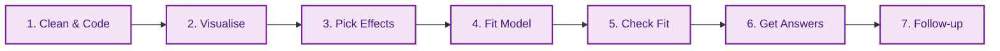

# File: README.md
# Description: This is the Master Study Guide for Mixed Effects Models (MEM). It is structured as a "Professor's Handout" to facilitate deep understanding, memorisation, and practical application. Expanded with technical depth, "Pro-Tips," and optimised visuals.

# 🎓 Mixed Effects Models (MEM): The Master Framework

## 🌍 The Larger Context: The Statistical Big Picture
> **Professor's Perspective:** "To understand MEM, you must see it not as a new tool, but as the 'Missing Link' in statistical evolution. For decades, we were forced to choose between the simplicity of ANOVA and the flexibility of Regression. MEM finally combined them, allowing us to model the messy, clustered reality of human behaviour without throwing away precious data."

### 📄 The Statistical Lineage
Mixed Effects Models sit at the intersection of several historical traditions. Understanding where they come from helps you understand why we use them today.

```mermaid
graph TD
    A[<b>1. The ANOVA Era</b><br/>Strictly categorical, balanced designs.<br/>Requires aggregation (losing data).] 
    --> B[<b>2. The GLM Era (Regression)</b><br/>Flexible predictors (continuous/categorical).<br/>Assumes everyone is a 'stranger' (independence).]
    
    B --> C[<b>3. The MEM Revolution</b><br/>Flexible like regression + handles 'families' (clusters).<br/>Models Trial-level data without aggregation.]
    
    C --> D[<b>4. The Bayesian Frontier (brms)</b><br/>Estimates complex models via simulation.<br/>Handles what Frequentist R often crashes on.]

    classDef legacy fill:#f5f5f5,stroke:#9e9e9e,color:#9e9e9e;
    classDef current fill:#e1f5fe,stroke:#01579b,color:#01579b;
    classDef future fill:#fff3e0,stroke:#e65100,color:#e65100;
    class A,B legacy;
    class C current;
    class D future;
```

### 📄 The "Aggregation Crisis" (Why MEM exists)
Before MEM became standard, researchers had a problem with repeated measures. If Joe contributed 50 trials, we would usually **aggregate** them into one "Joe Average."
*   **The Hidden Cost:** By averaging Joe, you delete the information about how Joe changed over time (learning/fatigue) and how much Joe fluctuated (within-person variance).
*   **The MEM Solution:** MEM keeps all 50 trials. It uses the "Trial-level" information to give more weight to stable participants and less to noisy ones, resulting in a more accurate picture of the population.

---

## 🏛️ The Statistical Roadmap: "The 7 Steps"
*Memorise this sequence. It is the logical flow of every professional analysis.*



---

## 📜 The Professor's Golden Rules (Memorise These!)
1.  **The Independence Rule:** If you measure the same thing multiple times (Repeated Measures), you **must** use MEM to avoid "Clumping Bias."
2.  **The 5-Level Rule:** Only use a variable as a **Grouping Factor** (Random Intercept) if it has at least 5 different levels (e.g., 5+ participants).
3.  **The Maximal Rule:** Always *start* with the most complex random-effects structure your design allows (Barr et al., 2013).
4.  **The Sum-to-Zero Rule:** If you use **Type 3 Sums of Squares**, you **must** use sum-to-zero coding (`contr.sum`). Otherwise, your main effects will be misleading.
5.  **The Centring Rule:** Always centre continuous predictors so the "starting line" (Intercept) makes physical sense.

---

## 📅 The Conceptual Evolution (The Logic Chain)

### 🟢 Stage 1: The "Why" (Week 1 - Politeness Data)
*   **The Lesson:** Standard $t$-tests are "Blind." They don't see that 10 data points come from the same person.
*   **Application:** If Subject A has a high voice and Subject B has a low voice, we only care about how *their own* voice changes when being polite.
*   **Pro-Tip:** Violating independence inflates Type 1 Error (false positives) because standard errors are underestimated.

### 🟢 Stage 2: The "Preparation" (Week 2 - Feather Contest)
*   **The Lesson:** Cleanliness is next to Godliness. If Trial 1-5 isn't centred, your results are anchored to "Trial 0" (impossible).
*   **Application:** **Winsorising** (capping extreme values) is safer than deleting data. Use the **MAD Rule** (`Median +/- 2.5*MAD`) to find the caps.
*   **Centring Formula:** $X_{centred} = X - \bar{X}$. This makes the Intercept the "Grand Mean."

### 🟢 Stage 3: The "Shield" (Weeks 3 & 4 - Sleepstudy)
*   **The Lesson:** $p$-values are fragile. The standard "Wald" $p$-value is too optimistic.
*   **Application:** Use **Kenward-Roger (KR)** corrections via `car::Anova()`. It acts as a shield, adjusting the degrees of freedom to protect against false positives in small samples.
*   **Estimation Pro-Tip:** **REML** (Restricted Maximum Likelihood) is for final parameter estimates; **ML** (Maximum Likelihood) is for comparing models with different fixed effects.

### 🟢 Stage 4: The "Magnifying Glass" (Week 5 - ChickWeight)
*   **The Lesson:** Interactions are just "Clues." A significant interaction tells you *something* is happening, but not *what*.
*   **Application:** Use `emmeans` to zoom in on specific days or diets to find where the effect "lives."
*   **UK English Note:** Always check for **heteroscedasticity** (uneven variance) when dealing with growth data like ChickWeight.

### 🟢 Stage 5: The "Pruning" (Week 6 - AAT Data)
*   **The Lesson:** Don't over-ask the data. If R gives a **Singularity Warning**, your model is too "greedy."
*   **Application:** **Principled Pruning.** 
    1. Remove random correlations (`||` syntax).
    2. Remove the smallest variance component (often random slopes for interactions).
    3. Simplify only until the warning disappears.

---

## 🖼️ The Visual Diagnostic Gallery

| Plot | Professor's Mnemonic | The Application Check |
| :--- | :--- | :--- |
| **Density** | 🌊 **The Wave** | Is it skewed? (If yes, try log-transformation or **Winsorising**). |
| **Lattice** | 🪟 **The Windows** | Is there a "Rebel" participant who goes against the grain? (Check individual slopes). |
| **Q-Q** | 📏 **The Diagonal** | Are the dots "hugging" the line? (If they snake away, your $p$-values are suspect). |
| **Residual** | ☁️ **The Cloud** | Is there a "Funnel"? (If the cloud expands, you've violated Homoscedasticity). |

---

## 🧹 Data Management & Outliers (Expanded)
*Source: Week 2, Slide 113; Class 6 Workflow*

### 📄 Winsorising vs. Exclusion
*   **Winsorising:** Replace extreme values with the nearest "acceptable" value (e.g., the 95th percentile). This preserves your sample size.
*   **Exclusion:** Delete the row. Only do this if the value is a clear technical error (e.g., RT = 1ms).
*   **The MAD Rule:** `Median +/- 2.5 * MAD`. MAD is the "robust brother" of Standard Deviation—it isn't swayed by the outliers it's trying to find.

### 📄 The "lm() Trick"
*   **Goal:** Check if a random slope is estimable *in principle*.
*   **Method:** Run a standard `lm()` on just **one** participant. If `lm()` can't estimate the effect for one person, `lmer()` can't estimate it as a random slope for the whole group.

---

## ❓ The Professor's Self-Check (Active Recall)
*Ask yourself these questions to verify your mastery. If you can't answer one, re-read the section above.*

### 🔹 Level 1: Basic Recall
1.  What is the "5-Level Rule" for grouping factors?
2.  What does a "Singularity" warning actually mean in plain English?
3.  Which R package is the "Gold Standard" for obtaining $p$-values in this course?
4.  What is the difference between `(1 + IV | Group)` and `(1 + IV || Group)`?

### 🔹 Level 2: Conceptual Understanding
1.  Why is it "cheating" to run a standard $t$-test on repeated-measures data? (Hint: Type 1 Error).
2.  If my data has a long right-tail (skewed), why should I look at "The Wave" before running the model?
3.  Explain why **Winsorising** is often preferred over **Exclusion** in real-world messy data.
4.  Why must you use **Sum-to-zero coding** when running a Type 3 ANOVA?

### 🔹 Level 3: Application (The Exam Challenge)
1.  **Scenario:** You are testing an AAT task with 40 participants. You get a Singularity warning. You currently have `(1 + Emotion * Target | pid)`. What is your **first** step to prune the model according to "Principled Pruning"?
2.  **Scenario:** You find a significant interaction between `Gender` and `Time`. Your professor asks: "Which gender improved faster?" Which R command do you use to answer this?
3.  **Scenario:** You are using `car::Anova(type = 3)`. You forgot to use `contr.sum`. Why will your professor mark your "Main Effects" results as incorrect?
4.  **Scenario:** You have 3 observations per participant for a continuous predictor. Is this enough to justify a random slope? (Hint: See Week 5 slides).

---

## 🔗 How to use this guide with LLMs
To simulate an oral exam, paste this guide into an LLM and say:
> *"I am preparing for a Mixed Effects Models exam. Act as a strict but helpful professor. Use the 'Professor's Self-Check' questions in this guide to quiz me one by one. Do not move to the next question until I have correctly applied the conceptual logic."*
