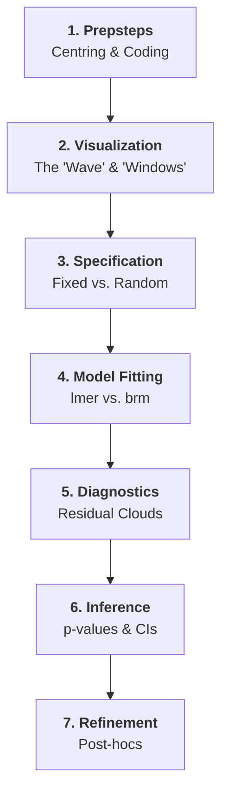

# File: README.md
# Description: This is the master study guide for the Mixed Effects Models course. It provides a detailed framework based on the 7 "Typical Research Steps" from the 2026 curriculum. Updated with UK English and source references.

# 🎓 Mixed Effects Models (MEM): The Complete Framework
> **Conceptual Summary:** MEM is the senior sibling of standard regression. While standard regression assumes all data points are independent (like 100 different people), MEM handles "clumpy" data (like 10 people measured 10 times). By splitting effects into **Fixed** (average pattern) and **Random** (individual deviation), we generalise our results from a specific sample to the entire population without inflating our error rates.

---

## 🏗️ The Statistical Roadmap: "The 7 Steps"

---

## 🟢 Phase 1: Preparation (The Prepsteps)
*Source: Week 2, "The Prepsteps" Homework*

*   **Centring:** Subtracting the mean from continuous predictors. 
    *   *Mnemonic:* ⚖️ **Balance.** Makes the intercept represent the average of the whole sample.
*   **Contrast Coding:** Essential for factors with 2+ levels.
    *   *Treatment Coding:* Compares to a baseline.
    *   *Sum-to-zero (Effect) Coding:* Compares to the grand mean (Required for Type 3 SS).
    *   `contrasts(df$factor) <- contr.sum(2)`

---

## 🟢 Phase 2: Visualisation (Pre-modelling)
*Source: Week 2, Class Slides 60-70*

| Plot | Mnemonic | Visual Description |
| :--- | :--- | :--- |
| **Density Plot** | 🌊 **The Wave** | A single curve showing the "height" (frequency) of values. |
| **Boxplot** | 📦 **The Box** | Shows the median and spread across different groups. |
| **Lattice Plot** | 🪟 **The Windows** | Small separate panels for each participant to spot "odd" individuals. |

---

## 🟢 Phase 3: Specification (Fixed vs. Random)
*Source: Week 5, Class Slides 34-41*

### 📄 The Formulation Rules
1.  **Fixed Effects ($\beta$):** 
    *   *Rule:* Use when levels represent **all possible values** or are **directly manipulated**.
    *   *Examples:* Gender (M/F), Treatment (Drug/Placebo), Time (Week 1, 2, 3).
2.  **Random Effects ($u$):**
    *   *Rule:* Use when levels are a **random subset** of a larger population.
    *   *Examples:* Participants (pid), Stimuli (actor_id), Schools.
    *   *Rule of Thumb:* A grouping factor needs at least **5 levels** to estimate variance safely.

### 📄 The "Maximal Model" (Barr et al., 2013)
*   Include every within-unit fixed effect as a random slope if possible.
*   `reaction_time ~ emotion * target + (1 + emotion * target | pp_code) + (1 + emotion * target | actor_id)`

---

## 🟢 Phase 4: Model Fitting
*Source: Week 4, Class Slides; Week 7 R Script*

*   **Frequentist:** `m1 <- lmer(DV ~ Fixed + (Random_Slope | Group), data = df)`
*   **Bayesian:** `brum <- brm(DV ~ Fixed + (Random_Slope | Group), data = df)` (Near identical conclusions, different maths).

---

## 🟢 Phase 5: Diagnostics
*Source: Week 2, HW Diagnostics Section*

| Tool | Mnemonic | What to look for? |
| :--- | :--- | :--- |
| **Q-Q Plot** | 📏 **The Diagonal** | Do the dots fall on the straight line? (Normality). |
| **Fitted vs. Resid** | ☁️ **The Cloud** | Is there a random "cloud" of dots? (No patterns = Homoscedasticity). |
| **Cook's Distance** | 🎣 **The Outlier** | Are any vertical bars much higher than others? (Influential cases). |

---

## 🟢 Phase 6: Inference (Significance)
*Source: Week 4, Example Script; Week 5, Slide 65*

### 📄 Sums of Squares (SS) Types
*   **Type 1:** Sequential. Order of predictors matters (rarely used in MEM).
*   **Type 2:** Hierarchical. Tests main effects *before* interactions.
*   **Type 3:** **Simultaneous (Default).** Tests each effect against all others.
    *   *Context:* This course uses **Type 3** for `car::Anova`. It requires sum-to-zero coding to be accurate!
*   **Methods:**
    *   **Kenward-Roger (KR):** The "Gold Standard" for $p$-values.
    *   **Likelihood Ratio Test (LRT):** Comparing models (use `REML = FALSE`).

---

## 🟢 Phase 7: Post-hocs & Follow-ups
*Source: Week 5, Slides 12-24*

*   **Post-hocs:** Use `emmeans` for pairwise comparisons. 
    *   *Mnemonic:* 🔎 **Magnifying Glass.** Zooming in on specific group differences.
*   **Follow-ups:** Separate models on subsets of data to explain an interaction.

---

## 🔗 Write-up Template (UK English)
> "The data were analysed using a linear mixed-effects model (lme4). The model included fixed effects for [X] and [Y]. We followed a maximal random-effects structure (Barr et al., 2013). P-values were determined using Type 3 Kenward-Roger F-tests (car::Anova)."
