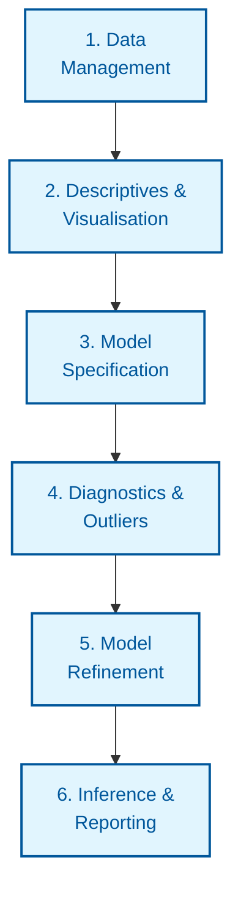

# File: README.md
# Description: This is the master study guide for the Mixed Effects Models course. It provides a detailed framework based on the 7 "Typical Research Steps" from the 2026 curriculum. Updated with UK English, Winsorising, and extensive grounded examples.

# 🎓 Mixed Effects Models (MEM): The Master Framework
> **In Plain English:** Imagine you're testing a new drug on 10 people, and you measure them 5 times each. Standard statistics thinks you have 50 different people. **MEM knows better.** It knows that Joe's 5 measurements are "linked" because they all come from Joe. By using **Fixed Effects** (the average drug effect) and **Random Effects** (Joe's personal baseline and reaction), we get the truth without being fooled by individual quirks.

---

## 🏗️ The Statistical Roadmap: "The 7 Steps"

---

## 📅 The Conceptual Evolution (Lecture-by-Lecture)

### 🟢 Week 1: The Foundation (Politeness Data)
*   **The Study:** Testing voice pitch (frequency) in polite vs informal speech.
*   **The Problem:** Some people have naturally high voices. If you just average all "polite" vs "informal" pitch, you might just be measuring the difference between the people, not the attitude.
*   **The Logic:** We need to account for **Subjects** (Who is speaking) and **Scenarios** (What are they saying).
*   **Easy Concept:** You are looking for the *shift* within each person.

### 🟢 Week 2: The Workflow (The Feather Contest)
*   **The Study:** Comparing smokers vs non-smokers in a feather-spitting contest.
*   **The Logic:** We must "Prep" the data. We **Centre** Trial (so 0 = the middle of the contest) and use **Sum-to-zero coding**.
*   **Easy Concept:** If you don't centre Trial, your "Starting Line" (Intercept) is at Trial 0. But there was no Trial 0! Centring moves the starting line to a place that actually exists.

### 🟢 Week 3 & 4: Inferential Precision (The Sleepstudy)
*   **The Study:** Reaction times after days of sleep deprivation.
*   **The Logic:** Standard $p$-values (Wald tests) are risky. We use **Kenward-Roger (KR)** corrections.
*   **Easy Concept:** KR is like a **"Small Sample Shield."** It stops you from being too confident if you only have a few subjects. It makes the model "earn" its $p$-value.

### 🟢 Week 5: Interactions (The ChickWeight Study)
*   **The Study:** Does a chick's weight gain over time depend on its Diet?
*   **The Logic:** Interaction! `Time * Diet`. We use `emmeans` to find which diet is best on Day 21.
*   **Easy Concept:** An interaction says "The effect of Time is different for different Diets." Post-hocs are the **Magnifying Glass** that tells you exactly *how* different.

### 🟢 Week 6: The Maximal Model (The AAT Study)
*   **The Study:** Approach (Pull) vs Avoid (Push) for Happy vs Angry faces.
*   **The Logic:** "Keep it Maximal" (Barr et al., 2013). But real data often crashes (**Singularity**).
*   **Easy Concept:** A "Maximal Model" tries to capture every tiny quirk of every person. If the data is too messy, R gives a **Singularity Warning**, which means: "I'm guessing here because the data is too thin."
*   **The Fix:** **Principled Pruning.** Remove random correlations first (`||`), then remove non-significant slopes.

### 🟢 Week 7: Crossed Random Effects (School23)
*   **The Study:** Math scores of students in different schools.
*   **The Logic:** Students are nested in schools. SES (Rich/Poor) varies.
*   **Easy Concept:** This is **"The Cross."** We aren't just looking at people; we are looking at how environments (Schools) change the way people (Students) react to things (SES).

---

## 🧹 Data Cleaning: Winsorising & Outliers
*Source: Week 2, Slide 113; General Stats Convention*

### 📄 What is Winsorising?
Instead of deleting an outlier (which loses data), you **"cap"** it. 
*   **Example:** In an RT task, most people take 500ms. One person takes 10,000ms because they sneezed. 
*   **The Fix:** You change that 10,000ms to the 95th percentile value (e.g., 1,500ms).
*   **Direct Language:** You're saying "This value is extreme, so I'll treat it as 'just very high' rather than 'impossibly high'."

### 📄 The "MAD" Rule
The course recommends the **Median Absolute Deviation (MAD)** over standard SD.
*   **Why?** The Mean and SD are "fooled" by outliers. The Median isn't.
*   **Rule of Thumb:** Use `Median +/- 2.5 * MAD` as your cut-off for "too extreme."

---

## 🖼️ Visualisation Guide (The Plot Gallery)

### 🌊 1. The Wave (Density Plot)
*   **What it means:** Is your data "Normal"?
*   **Look for:** Skewness. RT data usually has a long "tail" to the right.
*   [View Example Density Plot](https://upload.wikimedia.org/wikipedia/commons/thumb/1/16/Normal_distribution_pdf.png/640px-Normal_distribution_pdf.png)

### 🪟 2. The Windows (Lattice/Individual Plots)
*   **What it means:** Does everyone behave the same?
*   **Look for:** One panel that goes "down" while everyone else goes "up."
*   [View Example Lattice Plot](https://upload.wikimedia.org/wikipedia/commons/thumb/0/05/Anscombe%27s_quartet_3.svg/638px-Anscombe%27s_quartet_3.svg.png)

### 📏 3. The Diagonal (Q-Q Plot)
*   **What it means:** Are your residuals normal?
*   **Look for:** Dots snaking away from the line. If they stay on the line, you're good.
*   [View Example Q-Q Plot](https://upload.wikimedia.org/wikipedia/commons/thumb/c/c1/Q-Q_plot_of_normal_distribution.png/640px-Q-Q_plot_of_normal_distribution.png)

### ☁️ 4. The Cloud (Residual Plot)
*   **What it means:** Is the error "fair" across all values?
*   **Look for:** The "Funnel." If the cloud gets wider on the right, your model is getting "less certain" as values increase (Heteroscedasticity).
*   [View Example Residual Plot](https://upload.wikimedia.org/wikipedia/commons/thumb/a/a2/Residuals_vs_Fitted_plot.png/640px-Residuals_vs_Fitted_plot.png)

---

---

## 🔄 Typical Steps of Research: The In-Depth Workflow
*Source: Synthesised from Week 2 Prepsteps, Class 6 Workflow, and Homework Rhythm*

### 📄 Step 1: Data Management (The Invisible Work)
Before any code runs, you must ensure R understands your data structure.
*   **Importing:** `read.csv()` or `read.delim()`.
*   **Formatting:** Reshaping from "Wide" to "Long" format (essential for MEM) using `melt()`.
*   **Variable Typing:** Converting IDs and Conditions into **Factors** (`as.factor()`).
*   **Centring:** Continuous predictors must be centred (`scale(center=T, scale=F)`) to make the intercept meaningful.

### 📄 Step 2: Descriptives & Visualisation
Understand the "shape" of your sample before asking for $p$-values.
*   **The Table:** Use `describeBy()` from the `psych` package to get means and SDs per cell.
*   **The Check:** Use `with(df, table(pp_code, condition))` to ensure every participant has enough data in every cell (The **lm() trick** foundation).
*   **The Plots:** Run "The Wave" (Density) to check for skewness and "The Windows" (Lattice) to spot individual differences.

### 📄 Step 3: Model Specification
Following the **Maximal Model** mandate (Barr et al., 2013).
*   Define the Fixed Effects based on the research question.
*   Add Random Intercepts for all grouping factors (e.g., `(1|pid) + (1|item_id)`).
*   Add Random Slopes for all fixed effects that vary **within** those factors.

### 📄 Step 4: Diagnostics & Outlier Management
Is the model lying to you?
*   **Residual Check:** Look for "The Cloud" (Homoscedasticity) and "The Diagonal" (Normality).
*   **Outlier Management:** Use the **MAD Rule** (`Median +/- 2.5*MAD`) to identify extreme cases.
*   **Decision:** Do you **Winsorise** (cap the value) or **Exclude** (delete the row)? *Course hint: Be transparent about this in the write-up.*

### 📄 Step 5: Model Refinement
Handling the dreaded **Singularity** warning.
*   **Principled Pruning:** If the maximal model is too complex, remove random correlations first using the `||` syntax.
*   **Comparison:** Compare the simplified model to the maximal model to ensure conclusions don't shift.

### 📄 Step 6: Inference & Reporting
*   **The Truth:** Run `car::Anova(model, type = 3, test = "F")` for the final effects.
*   **The Write-up:** Describe the model formula, the $p$-value method (Kenward-Roger), and the specific means/CIs. Use the UK English template provided above.
