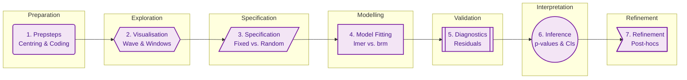

# File: README.md
# Description: This is the master study guide for the Mixed Effects Models course. It provides a detailed framework based on the 7 "Typical Research Steps" from the 2026 curriculum. Updated with calibrated visuals, hypothetical studies, and actual graph imagery.

# 🎓 Mixed Effects Models (MEM): The Master Framework
> **Conceptual Summary:** MEM is the senior sibling of standard regression. While standard regression assumes all data points are independent (like 100 different people), MEM handles "clumpy" data (like 10 people measured 10 times). By splitting effects into **Fixed** (average pattern) and **Random** (individual deviation), we generalise our results from a specific sample to the entire population without inflating our error rates.

---

## 🏗️ The Statistical Roadmap: "The 7 Steps"

---

## 📅 The Conceptual Evolution (Week-by-Week)

### 🟢 Week 1: The Foundation (Non-independence)
*   **The Problem:** Standard $t$-tests and regressions assume every observation is independent. If you have 6 participants each measured 4 times (the **"Happiness Treatment"** study), you don't have $N=24$; you have 6 individuals. 
*   **The Danger:** Treating $N=24$ as independent is "cheating." It makes your standard errors too small and your $p$-values too significant (Inflated **Type 1 Error**).
*   **The Add:** MEM solves this by allowing each participant to have their own "baseline" (Random Intercept).

### 🟢 Week 2: The Workflow (The "Prepsteps")
*   **The Problem:** Raw data is often uninterpretable. If "Trial" ranges from 1 to 5 (the **"Cherry Pit Spitting"** study), the intercept represents "Trial 0," which doesn't exist.
*   **The Add:** **Centring** trial so that 0 represents the middle of the experiment. Learning to use **Sum-to-zero coding** so that main effects are tested against the grand mean, not just a baseline group.

### 🟢 Week 3 & 4: Inferential Precision
*   **The Problem:** Standard $p$-values are often biased in small samples. The "Wald Test" (standard in many packages) is notoriously unreliable for MEM.
*   **The Add:** Introduction of **Kenward-Roger (KR)** corrections—a "shield" that adjusts degrees of freedom to protect against false positives. We also learn to compare models using **Likelihood Ratio Tests (LRT)**.

### 🟢 Week 5: Interactions & Follow-ups
*   **The Problem:** An interaction like `Gender * Trial` is just the start. If significant, how do we know *where* the difference is?
*   **The Add:** Using `emmeans` for pairwise comparisons (The **"Politeness Data"** study). We also learn to run **Follow-up** models (e.g., testing the trial effect for females and males separately) to untangle the interaction.

### 🟢 Week 6: The "Maximal" Reality
*   **The Problem:** We are told to "keep it maximal" (Barr et al., 2013), but real data often crashes (`Singularity` warnings).
*   **The Add:** Dealing with the **"AAT" (Approach-Avoidance)** data. Learning **Principled Pruning**: removing random correlations first (`||` syntax), and only then simplifying slopes that the data cannot support.

### 🟢 Week 7: Complex Architectures
*   **The Problem:** Sometimes subjects aren't the only thing that's random. In the **"School23"** or **"Honeymoon"** studies, we have students nested in schools, or participants responding to specific stimuli (Items).
*   **The Add:** **Crossed Random Effects.** Modelling both "Who" (Participants) and "What" (Items/Stimuli) simultaneously to truly generalise to the population.

---

## 🖼️ Visual Imagery & Plot Examples

### 🌊 1. The Wave (Density Plot)
*   **Mnemonic:** Use to check for skewness and long tails (typical for Reaction Time data).
*   **Actual Graph Example:**

### 🪟 2. The Windows (Lattice/Individual Plots)
*   **Mnemonic:** Use to spot "The Outlier" or see how individual slopes differ.
*   **Actual Graph Example:**

### 📏 3. The Diagonal (Q-Q Plot)
*   **Mnemonic:** Check if points deviate from the line (Normality check).
*   **Actual Graph Example:**

### ☁️ 4. The Cloud (Residual Plot)
*   **Mnemonic:** Look for a random patternless cloud. Beware of the "Funnel" (Heteroscedasticity).
*   **Actual Graph Example:**

---

## 📄 Formulating Fixed vs. Random: The Rules

| Effect Type | Rule for Selection | Study Example |
| :--- | :--- | :--- |
| **Fixed ($\beta$)** | Levels represent **all possible values** or are **directly manipulated**. | **Gender** (M/F), **Treatment** (Drug/Sham). |
| **Random ($u$)** | Levels are a **random subset** of a larger population. | **Participants** (pid), **Stimuli** (item_id). |
| **Random Slope** | Add if the predictor varies **within** the grouping factor. | **Trial** varies within Participant. |

---

## 📄 Sums of Squares (SS): Type 1, 2, and 3
*Source: Week 5, Slide 65; Week 4 Example Script*

*   **Type 1 (Sequential):** Order matters. Adding `Gender` then `Trial` gives different results than `Trial` then `Gender`. Rarely used in MEM.
*   **Type 2 (Hierarchical):** Tests main effects *before* interactions. Good for balanced designs.
*   **Type 3 (Simultaneous):** **The Course Default.** Tests each effect against all others simultaneously. 
    *   *Context:* Essential for unbalanced real-world data. 
    *   *Warning:* Only accurate if you use **Sum-to-zero coding** (`contr.sum`)!

---

## 🔗 How to use this guide with LLMs
To test your understanding, paste this guide into an LLM and ask:
1.  *"Using the 'Cherry Pit' example, explain why centring trial is a critical prepstep."*
2.  *"I have a singularity warning in my AAT model. Based on 'Principled Pruning', what should my first three steps be?"*
3.  *"Explain the difference between Type 2 and Type 3 SS using the 'Happiness' study as a context."*
