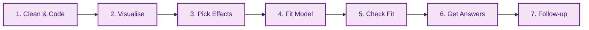

# File: README.md
# Description: This is the Master Study Guide for Mixed Effects Models (MEM). It is structured as a "Professor's Handout" to facilitate deep understanding, memorisation, and practical application. Updated with active recall checks and "Golden Rules."

# 🎓 Mixed Effects Models (MEM): The Master Framework
> **Professor's Intuition:** "Standard regression assumes every data point is a stranger. MEM assumes data points belong to 'families' (Participants, Schools, Items). If you ignore the family ties, you're not just being messy—you're cheating the statistics by inflating your confidence (Type 1 Error)."

---

## 🏛️ The Statistical Roadmap: "The 7 Steps"
*Memorise this sequence. It is the logical flow of every professional analysis.*

---

## 📜 The Professor's Golden Rules (Memorise These!)
1.  **The Independence Rule:** If you measure the same thing multiple times (Repeated Measures), you **must** use MEM to avoid "Clumping Bias."
2.  **The 5-Level Rule:** Only use a variable as a **Grouping Factor** (Random Intercept) if it has at least 5 different levels (e.g., 5+ participants).
3.  **The Maximal Rule:** Always *start* with the most complex random-effects structure your design allows (Barr et al., 2013).
4.  **The Sum-to-Zero Rule:** If you use **Type 3 Sums of Squares**, you **must** use sum-to-zero coding (`contr.sum`). Otherwise, your main effects will be misleading.
5.  **The Centring Rule:** Always centre continuous predictors so the "starting line" (Intercept) makes physical sense.

---

## 📅 The Conceptual Evolution (The Logic Chain)

### 🟢 Stage 1: The "Why" (Week 1 - Politeness Data)
*   **The Lesson:** Standard $t$-tests are "Blind." They don't see that 10 data points come from the same person.
*   **Application:** If Subject A has a high voice and Subject B has a low voice, we only care about how *their own* voice changes when being polite.

### 🟢 Stage 2: The "Preparation" (Week 2 - Feather Contest)
*   **The Lesson:** Cleanliness is next to Godliness. If Trial 1-5 isn't centred, your results are anchored to "Trial 0" (impossible).
*   **Application:** **Winsorising** (capping extreme values) is safer than deleting data. Use the **MAD Rule** (`Median +/- 2.5*MAD`) to find the caps.

### 🟢 Stage 3: The "Shield" (Weeks 3 & 4 - Sleepstudy)
*   **The Lesson:** $p$-values are fragile. The standard "Wald" $p$-value is too optimistic.
*   **Application:** Use **Kenward-Roger (KR)** corrections. It acts as a shield, toughening the requirements for significance in small samples.

### 🟢 Stage 4: The "Magnifying Glass" (Week 5 - ChickWeight)
*   **The Lesson:** Interactions are just "Clues." A significant interaction tells you *something* is happening, but not *what*.
*   **Application:** Use `emmeans` to zoom in on specific days or diets to find where the effect "lives."

### 🟢 Stage 5: The "Pruning" (Week 6 - AAT Data)
*   **The Lesson:** Don't over-ask the data. If R gives a **Singularity Warning**, your model is too "greedy."
*   **Application:** **Principled Pruning.** Remove random correlations (`||`) first. Simplify only what is necessary to get a stable fit.

---

## 🖼️ The Visual Diagnostic Gallery

| Plot | Professor's Mnemonic | The Application Check |
| :--- | :--- | :--- |
| **Density** | 🌊 **The Wave** | Is it skewed? (If yes, try log-transformation). |
| **Lattice** | 🪟 **The Windows** | Is there a "Rebel" participant who goes against the grain? |
| **Q-Q** | 📏 **The Diagonal** | Are the dots "hugging" the line? (If they snake away, your $p$-values are suspect). |
| **Residual** | ☁️ **The Cloud** | Is there a "Funnel"? (If the cloud expands, you've violated Homoscedasticity). |

---

## ❓ The Professor's Self-Check (Active Recall)
*Ask yourself these questions to verify your mastery. If you can't answer one, re-read the section above.*

### 🔹 Level 1: Basic Recall
1.  What is the "5-Level Rule" for grouping factors?
2.  What does a "Singularity" warning actually mean in plain English?
3.  Which R function is the "Gold Standard" for obtaining $p$-values in this course?

### 🔹 Level 2: Conceptual Understanding
1.  Why is it "cheating" to run a standard $t$-test on repeated-measures data? (Hint: Type 1 Error).
2.  If my data has a long right-tail (skewed), why should I look at "The Wave" before running the model?
3.  Explain the difference between **Winsorising** and **Excluding** an outlier. Which is "kinder" to your sample size?

### 🔹 Level 3: Application (The Exam Challenge)
1.  **Scenario:** You are testing an AAT task with 40 participants. You get a Singularity warning. You currently have `(1 + Emotion * Target | pid)`. What is your **first** step to prune the model according to "Principled Pruning"?
2.  **Scenario:** You find a significant interaction between `Gender` and `Time`. Your professor asks: "Which gender improved faster?" Which R command do you use to answer this?
3.  **Scenario:** You are using `car::Anova(type = 3)`. You forgot to use `contr.sum`. Why will your professor mark your "Main Effects" results as incorrect?

---

## 🔗 How to use this guide with LLMs
To simulate an oral exam, paste this guide into an LLM and say:
> *"I am preparing for a Mixed Effects Models exam. Act as a strict but helpful professor. Use the 'Professor's Self-Check' questions in this guide to quiz me one by one. Do not move to the next question until I have correctly applied the conceptual logic."*
