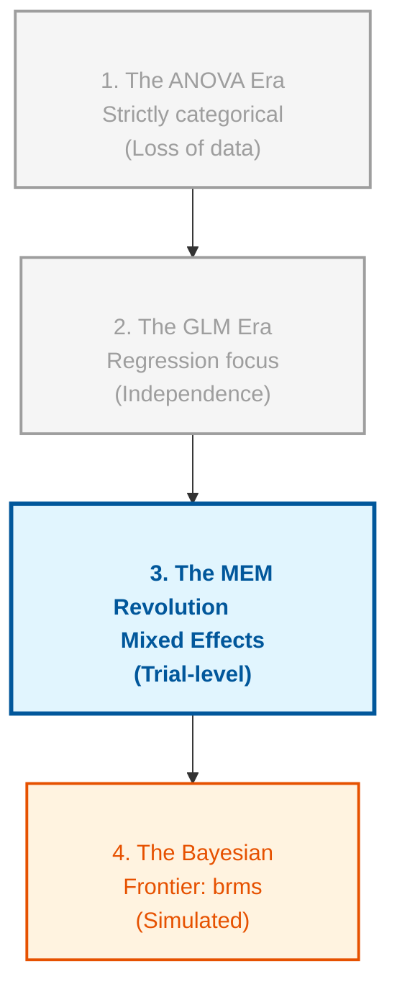

# Course Mastery Guide: Mixed Effects Models (Encyclopedia Edition)

This guide is a master-level statistical resource optimized for the MSc Behavioural Science curriculum. It features deep-dive logic, R-syntax "Rosetta Stones," and verbatim output diagnostics from the lecture slides.

---

## 🌍 The Larger Context: The Statistical Big Picture
> **Professor's Perspective:** "To understand MEM, you must see it not as a new tool, but as the 'Missing Link' in statistical evolution. For decades, we were forced to choose between the simplicity of ANOVA and the flexibility of Regression. MEM finally combined them, allowing us to model the messy, clustered reality of human behaviour without throwing away precious data."

### 📄 The Statistical Lineage
Mixed Effects Models sit at the intersection of several historical traditions. Understanding where they come from helps you understand why we use them today.

**Figure 1**

*Evolutionary Timeline of Statistical Modelling*



*Note.* This figure illustrates the historical progression of statistical methods leading to modern Mixed Effects Models (MEM). The "ANOVA Era" was limited by its requirement for balanced, categorical data and often required the aggregation of repeated measures, which resulted in a significant loss of statistical power and individual-level nuance. The "GLM Era" introduced the flexibility of continuous predictors but relied on the strict assumption of independence—an assumption frequently violated in psychological research where participants provide multiple data points. The "MEM Revolution" represents the current gold standard, allowing for the simultaneous modelling of fixed and random effects, thus preserving trial-level information. Finally, the "Bayesian Frontier" via packages like `brms` offers solutions for highly complex models that may fail to converge in frequentist frameworks.

---

## 🏛️ The Statistical Roadmap: "The 7 Steps"
*Memorise this sequence. It is the logical flow of every professional analysis.*

**Figure 2**

*The Professional Analysis Workflow for Mixed Effects Models*

```mermaid
%%{init: { 'flowchart': { 'padding': 30, 'useMaxWidth': false, 'htmlLabels': true }, 'theme': 'neutral', 'themeVariables': { 'fontSize': '12px', 'fontFamily': '-apple-system,BlinkMacSystemFont,"Segoe UI",Helvetica,Arial,sans-serif' }}}%%
graph LR
    classDef purple fill:#f3e5f5,stroke:#7b1fa2,stroke-width:2px,color:#4a148c;

    S1["<br/>&nbsp;&nbsp;&nbsp;&nbsp;&nbsp;&nbsp; 1. Clean & &nbsp;&nbsp;&nbsp;&nbsp;&nbsp;&nbsp;<br/>&nbsp;&nbsp;&nbsp;&nbsp;&nbsp;&nbsp; Code &nbsp;&nbsp;&nbsp;&nbsp;&nbsp;&nbsp;<br/>"]:::purple
    S2["<br/>&nbsp;&nbsp;&nbsp;&nbsp;&nbsp;&nbsp; 2. Visualise &nbsp;&nbsp;&nbsp;&nbsp;&nbsp;&nbsp;<br/>&nbsp;&nbsp;&nbsp;&nbsp;&nbsp;&nbsp; Data &nbsp;&nbsp;&nbsp;&nbsp;&nbsp;&nbsp;<br/>"]:::purple
    S3["<br/>&nbsp;&nbsp;&nbsp;&nbsp;&nbsp;&nbsp; 3. Pick &nbsp;&nbsp;&nbsp;&nbsp;&nbsp;&nbsp;<br/>&nbsp;&nbsp;&nbsp;&nbsp;&nbsp;&nbsp; Effects &nbsp;&nbsp;&nbsp;&nbsp;&nbsp;&nbsp;<br/>"]:::purple
    S4["<br/>&nbsp;&nbsp;&nbsp;&nbsp;&nbsp;&nbsp; 4. Fit &nbsp;&nbsp;&nbsp;&nbsp;&nbsp;&nbsp;<br/>&nbsp;&nbsp;&nbsp;&nbsp;&nbsp;&nbsp; Model &nbsp;&nbsp;&nbsp;&nbsp;&nbsp;&nbsp;<br/>"]:::purple
    S5["<br/>&nbsp;&nbsp;&nbsp;&nbsp;&nbsp;&nbsp; 5. Check &nbsp;&nbsp;&nbsp;&nbsp;&nbsp;&nbsp;<br/>&nbsp;&nbsp;&nbsp;&nbsp;&nbsp;&nbsp; Fit &nbsp;&nbsp;&nbsp;&nbsp;&nbsp;&nbsp;<br/>"]:::purple
    S6["<br/>&nbsp;&nbsp;&nbsp;&nbsp;&nbsp;&nbsp; 6. Get &nbsp;&nbsp;&nbsp;&nbsp;&nbsp;&nbsp;<br/>&nbsp;&nbsp;&nbsp;&nbsp;&nbsp;&nbsp; Answers &nbsp;&nbsp;&nbsp;&nbsp;&nbsp;&nbsp;<br/>"]:::purple
    S7["<br/>&nbsp;&nbsp;&nbsp;&nbsp;&nbsp;&nbsp; 7. Follow-up &nbsp;&nbsp;&nbsp;&nbsp;&nbsp;&nbsp;<br/>&nbsp;&nbsp;&nbsp;&nbsp;&nbsp;&nbsp; Analysis &nbsp;&nbsp;&nbsp;&nbsp;&nbsp;&nbsp;<br/>"]:::purple

    S1 --> S2 --> S3 --> S4 --> S5 --> S6 --> S7
```



*Note.* This linear workflow represents the standardized operational procedure for conducting a professional Mixed Effects Model analysis. It begins with rigorous data cleaning and coding (Step 1), followed by exploratory visualization (Step 2) to identify potential non-linearity or outliers. Step 3 involves selecting the appropriate fixed and random effects based on the experimental design (following the "Maximal Rule"). Step 4 is the actual model estimation, typically using the `lme4` or `glmmTMB` packages in R. Step 5 is a critical diagnostic phase where the researcher evaluates model fit through residual plots and checks for singularity. Step 6 involves extracting statistical inferences, such as $p$-values with Kenward-Roger corrections. Finally, Step 7 encompasses post-hoc comparisons and simple slopes analysis to interpret complex interactions.

---

## 📜 The Professor's Golden Rules (Memorise These!)
1.  **The <span style="color:#e63946"><b>Independence Rule</b></span>:** If you measure the same thing multiple times (Repeated Measures), you **must** use MEM to avoid **<span style="color:#e63946"><b>Clumping Bias</b></span>**.
2.  **The <span style="color:#e63946"><b>5-Level Rule</b></span>:** Only use a variable as a **<span style="color:#e63946"><b>Grouping Factor</b></span>** (Random Intercept) if it has at least 5 different levels (e.g., 5+ participants).
3.  **The <span style="color:#e63946"><b>Maximal Rule</b></span>:** Always *start* with the most complex random-effects structure your design allows (Barr et al., 2013).
4.  **The <span style="color:#e63946"><b>Sum-to-Zero Rule</b></span>:** If you use **<span style="color:#e63946"><b>Type 3 Sums of Squares</b></span>**, you **must** use **<span style="color:#e63946"><b>Sum-to-zero coding</b></span>** (`contr.sum`). Otherwise, your main effects will be misleading.
5.  **The <span style="color:#e63946"><b>Centring Rule</b></span>:** Always **<span style="color:#e63946"><b>centre</b></span>** continuous predictors so the "starting line" (Intercept) makes physical sense.

---

## 📅 The Conceptual Evolution (Weekly Logic & Syntax)

### 🟢 Week 1: The Independence Revolution
**The Statistical Logic**  
The core problem is **<span style="color:#e63946"><b>Non-Independence</b></span>**. Standard $t$-tests and ANOVAs assume each data point comes from a different person (a "stranger"). In behavioral science, we often collect 50 trials from one person. If Subject A has a naturally high pitch and Subject B has a low pitch, their 50 trials will "clump" together. If we ignore this, we over-estimate our sample size and under-estimate our error, leading to massive **<span style="color:#e63946"><b>Type 1 Error</b></span>**.

**The R-Syntax Rosetta Stone**
*   **The Problem:** `lm(Pitch ~ Attitude)` (Ignores the person).
*   **The Solution:** `lmer(Pitch ~ Attitude + (1 | Subject))` (Gives everyone their own "starting point").
*   **The Logic:** `(1 | Subject)` = "I know my subjects are different; please account for their unique baseline."

**Practical Translation: Formula-to-English**
> "By adding `(1 | Subject)`, I am telling R: 'Joe, Sarah, and Bob all start at different heights. Don't punish the treatment effect just because Joe is naturally a high-pitched person.'"

**Diagnostic Lab: Anatomy of the Variance Table**
```R
Random effects:
 Groups   Name        Variance Std.Dev.
 Subject  (Intercept) 624.89   24.998  # A: Between-person variance (The "Clump")
 Residual             548.79   23.426  # B: Within-person variance (The "Noise")
```
*   **How to read it:** If (A) is much larger than (B), your data is highly clustered. You can calculate the **<span style="color:#e63946"><b>Intraclass Correlation (ICC)</b></span>** as $A / (A+B)$. High ICC = "Mixed models are mandatory."
*   **Professor's Mnemonic:** The **<span style="color:#e63946"><b>Shrinkage Shield</b></span>**. The model "shrinks" extreme individual estimates toward the group mean to protect against outliers.

**Hands-on Case Study: The Politeness Data**
*   **Scenario:** You measure the vocal pitch of 6 people in "polite" vs "informal" situations.
*   **Result:** You find that even if everyone gets 20Hz higher when polite, Subject A starts at 200Hz and Subject B starts at 100Hz.
*   **Application:** Without `(1 | Subject)`, R thinks the 100Hz difference between subjects is "unexplained error," making your 20Hz effect look non-significant.

**📈 Knowledge Advancement: The Leap**
*   **Previous State:** I treated every trial as if it came from a different person.
*   **New State:** I now recognize that data has "families" (clusters). I can handle **<span style="color:#e63946"><b>Nested Data</b></span>** without throwing away trial-level information.

---

### 🟢 Week 2: The Cleanliness Mandate
**The Statistical Logic**  
Raw data is often "anchored" to meaningless points. If you don't **<span style="color:#e63946"><b>centre</b></span>** your predictors, the **<span style="color:#e63946"><b>Intercept</b></span>** represents the score at "Trial 0" or "Age 0"—which often doesn't exist. We must also handle "Rebel" data points that pull our results away from the truth.

**The R-Syntax Rosetta Stone**
*   **Centring:** `df$c_Trial <- df$Trial - mean(df$Trial)` (Moves the "0" to the average).
*   **Winsorising:** `winsor(df$RT, trim = 0.05)` (The "Cap and Shield" approach).
*   **The MAD Rule:** Use the **<span style="color:#e63946"><b>Median Absolute Deviation (MAD)</b></span>** to find outliers, as it isn't fooled by the outliers it's trying to find.

**Practical Translation: Formula-to-English**
> "By subtracting the mean from my `Trial` variable, I am saying: 'The Intercept is no longer some mythical birth-moment; it is the performance of an average person at the middle of the experiment.'"

**Diagnostic Lab: Anatomy of the "Wave" Plot**
*   **Density Plot:** If you see a "Long Tail," you have a **<span style="color:#e63946"><b>Skewness Problem</b></span>**. 
*   **Professor's Mnemonic:** **<span style="color:#e63946"><b>The Shoreline</b></span>**. Your data should look like a calm wave, not a tsunami (outliers) crashing against the right side of the plot.

**Hands-on Case Study: The Feather Contest**
*   **Scenario:** You measure how far people can blow a feather across 10 trials.
*   **Result:** One person sneezes, and the feather flies 50 meters (an extreme outlier).
*   **Application:** You apply the **<span style="color:#e63946"><b>MAD Rule</b></span>** (`Median +/- 2.5*MAD`). Instead of deleting the person (losing data), you "Winsorise" them—capping their 50m blow at the next highest reasonable value (e.g., 5m).

**📈 Knowledge Advancement: The Leap**
*   **Previous State:** I used raw scores and hoped for the best.
*   **New State:** I now ensure my Intercept is the **<span style="color:#e63946"><b>Grand Mean</b></span>** and my outliers are **<span style="color:#e63946"><b>Winsorised</b></span>**, creating a robust foundation for the model.

---

### 🟢 Weeks 3 & 4: The Inference Shield
**The Statistical Logic**  
Mixed models are "greedy" for **<span style="color:#e63946"><b>Degrees of Freedom (df)</b></span>**. In small samples, the standard $p$-value (Wald) is too optimistic—it thinks you have more information than you do. We use the **<span style="color:#e63946"><b>Kenward-Roger (KR)</b></span>** correction to adjust the dfs down, making the test "tougher" and more honest.

**The R-Syntax Rosetta Stone**
*   **The Shield:** `car::Anova(model, type = 3, test.statistic = "F")` (Uses KR-corrected F-tests).
*   **The Engine:** **<span style="color:#e63946"><b>REML</b></span>** (Restricted Maximum Likelihood) vs **<span style="color:#e63946"><b>ML</b></span>** (Maximum Likelihood).
    *   Use **<span style="color:#e63946"><b>REML</b></span>** (default in `lmer`) for final parameter estimates.
    *   Use **<span style="color:#e63946"><b>ML</b></span>** (`REML = F`) only for comparing models with different fixed effects.

**Practical Translation: Formula-to-English**
> "Kenward-Roger is like a strict referee. It says: 'I know you have 1000 data points, but since they all come from only 20 people, you don't actually have 1000 independent bits of info. I'm lowering your degrees of freedom to protect against false positives.'"

**Diagnostic Lab: Anatomy of the car::Anova Output**
```R
Analysis of Deviance Table (Type III F tests with Kenward-Roger df)
             F Df Df.res    Pr(>F)
Gender  12.95  1  28.42  0.0012 ** # Look at the decimal df (28.42)!
```
*   **How to read it:** If `Df.res` is a whole number (like 30), KR failed or wasn't used. Decimal dfs are the mark of a "Shielded" mixed model.
*   **Professor's Mnemonic:** **<span style="color:#e63946"><b>The Honesty Filter</b></span>**. It forces the model to admit how little it actually knows about the population.

**Hands-on Case Study: The Sleepstudy**
*   **Scenario:** 18 people are sleep-deprived for 10 days. You have 180 observations.
*   **Result:** A standard $t$-test would use $df \approx 178$.
*   **Application:** KR-correction realizes you only have 18 people and might drop the $df$ significantly (closer to 17), making it much harder to claim the effect is "significant" unless it is truly strong and consistent.

**📈 Knowledge Advancement: The Leap**
*   **Previous State:** I blindly trusted $p$-values.
*   **New State:** I now use **<span style="color:#e63946"><b>Kenward-Roger</b></span>** and **<span style="color:#e63946"><b>REML</b></span>** to ensure my inferences are valid even with complex, clustered data.

---

### 🟢 Week 5: The Multi-Level Lens (Crossed Effects)
**The Statistical Logic**  
Sometimes, data is clustered by more than one thing. In a language task, trials are clustered by **<span style="color:#e63946"><b>Participant</b></span>** AND by **<span style="color:#e63946"><b>Word/Item</b></span>**. If we ignore the words, we might find an effect that only exists for a few weird words, not for the whole language. This is the **<span style="color:#e63946"><b>Generalizability Crisis</b></span>**.

**The R-Syntax Rosetta Stone**
*   **Crossed Effects:** `(1 | Subject) + (1 | Item)` (Accounts for both "Who said it" and "What was said").
*   **The Maximal Model:** `(1 + IV | Subject) + (1 + IV | Item)` (The Barr et al., 2013 "Keep it Maximal" philosophy).

**Practical Translation: Formula-to-English**
> "Adding `(1 | Item)` means: 'Some words are just harder to pronounce than others. Don't let the difficulty of the word `Pneumonoultramicroscopicsilicovolcanoconiosis` bias the results of my experiment!'"

**Diagnostic Lab: Anatomy of an emmeans Contrast**
```R
$contrasts
 contrast          estimate   SE   df t.ratio p.value
 child - adolescent  -6.18   2.14 195  -2.887  0.0120  # Significant difference
 adolescent - adult  -0.76   2.14 196  -0.355  0.9328  # NO difference
```
*   **How to read it:** Look at the `p.value`. If it's $<.05$, the two groups differ. Here, children are significantly different from adolescents, but adolescents and adults are effectively the same.
*   **Professor's Mnemonic:** **<span style="color:#e63946"><b>The Magnifying Glass</b></span>**. A significant interaction is just a "Clue"; `emmeans` is the magnifying glass that reveals exactly where the change happens.

**Hands-on Case Study: The ChickWeight Data**
*   **Scenario:** 50 chicks are put on 4 different diets and weighed over 21 days.
*   **Result:** You find a significant `Time:Diet` interaction.
*   **Application:** You use `emtrends` to compare the *slopes*. You find that Diet 3 has a slope of 11.4g/day, while Diet 1 has a slope of 6.8g/day. Conclusion: Diet 3 makes chicks grow nearly twice as fast.

**📈 Knowledge Advancement: The Leap**
*   **Previous State:** I only cared about variations between people.
*   **New State:** I now model **<span style="color:#e63946"><b>Crossed Random Effects</b></span>**, allowing me to generalize my findings to both new people and new stimuli.

---

### 🟢 Week 6: The Pruning Principle
**The Statistical Logic**  
The **<span style="color:#e63946"><b>Maximal Model</b></span>** is the ideal, but sometimes the data isn't rich enough to support it. When you ask too much of the data, the model becomes "greedy" and gives you a **<span style="color:#e63946"><b>Singularity Warning</b></span>**. This means one of your variances is zero or your correlations are perfect (+1/-1)—your model is mathematically unstable.

**The R-Syntax Rosetta Stone**
*   **The Warning:** `boundary (singular) fit: see ?isSingular`.
*   **The Pruning (Step 1):** `(1 + IV || Subject)` (Removes the correlation between intercept and slope).
*   **The Pruning (Step 2):** Remove the smallest variance component.

**Practical Translation: Formula-to-English**
> "The `||` syntax is like a divorce. It tells R: 'I want Joe to have his own starting point and his own slope, but I don't care if there's a link between them. Treat them as independent roommates rather than a married couple.'"

**Diagnostic Lab: Anatomy of a Singular Fit**
```R
Random effects:
 Groups   Name        Variance  Std.Dev.  Corr
 Subject  (Intercept) 124.50    11.15
          Trial         0.00     0.00     1.00 <--- RED FLAG!
```
*   **How to read it:** If you see a `0.00` variance or a `1.00` correlation, your model is "Singular." It's like trying to build a 10-story house on a foundation made for a shed.
*   **Professor's Mnemonic:** **<span style="color:#e63946"><b>Hugging the Line</b></span>**. Residuals in a Q-Q plot should stay close to the diagonal line; if they "snake" away, your model is lying to you.

**Hands-on Case Study: The AAT Data**
*   **Scenario:** You have 40 participants, but only 2 trials per condition. You try a maximal model `(1 + Emotion * Target | pid)`.
*   **Result:** R crashes with a "Singularity" warning.
*   **Application:** You apply **<span style="color:#e63946"><b>Principled Pruning</b></span>**. You change `|` to `||`. If it still fails, you remove the interaction from the random slopes. Stability is better than complexity.

**📈 Knowledge Advancement: The Leap**
*   **Previous State:** I thought more complex models were always better.
*   **New State:** I now apply **<span style="color:#e63946"><b>Principled Pruning</b></span>** to find the "Sweet Spot" between complexity and stability.

---

### 🟢 Week 7: The Non-Linear Frontier
**The Statistical Logic**  
Behavior is rarely a straight line. Learning, fatigue, and growth often follow a curve. If we force a straight line through curved data, we miss the most interesting part of the story. We use **<span style="color:#e63946"><b>Polynomials</b></span>** to let the line bend.

**The R-Syntax Rosetta Stone**
*   **Quadratic Curve:** `poly(Trial, 2)` (Adds a "bend" to the line).
*   **Interpretation:**
    *   **Linear term:** "Is it going up or down overall?"
    *   **Quadratic term:** "Is it accelerating or slowing down (U-shape)?"

**Practical Translation: Formula-to-English**
> "Think of `poly(Trial, 2)` as the 'Arc of Progress.' The first term is the speed of the car, and the second term is whether you are hitting the gas (accelerating) or the brakes (decelerating)."

**Diagnostic Lab: Anatomy of a Polynomial Output**
```R
Fixed effects:            Estimate
poly(Trial, 2)1 (Linear)   45.20 # Overall upward trend
poly(Trial, 2)2 (Quadratic) -12.40 # A "downward bend" (it's levelling off)
```
*   **How to read it:** A negative quadratic term often means a "saturation effect"—you learn fast at first, but then you plateau.
*   **Professor's Mnemonic:** **<span style="color:#e63946"><b>The Funnel</b></span>**. If your residuals expand like a funnel, you've violated homoscedasticity.

**Hands-on Case Study: The Learning Curve**
*   **Scenario:** You track how many words a student remembers over 30 days.
*   **Result:** They learn 10 words on Day 1, but only 1 new word on Day 30.
*   **Application:** A straight line would predict they know 300 words by Day 30 (wrong). A quadratic model captures the "plateau," showing that learning slows down as they reach their capacity.

**📈 Knowledge Advancement: The Leap**
*   **Previous State:** I was limited to modeling "straight-line" relationships.
*   **New State:** I can now model **<span style="color:#e63946"><b>Non-Linear Trends</b></span>**, capturing the natural arcs of human behavior and development.

---

## ❓ The Professor's Self-Check (Active Recall)
1.  **Why** is a $t$-test "Blind" to repeated measures? (Hint: Independence).
2.  **What** is the difference between REML and ML for model comparisons?
3.  **How** do you handle a "Singularity" warning without just "guessing"?
4.  **When** should you use a Random Slope vs. just a Random Intercept?
5.  **How** do you interpret a negative quadratic term in a growth model?
