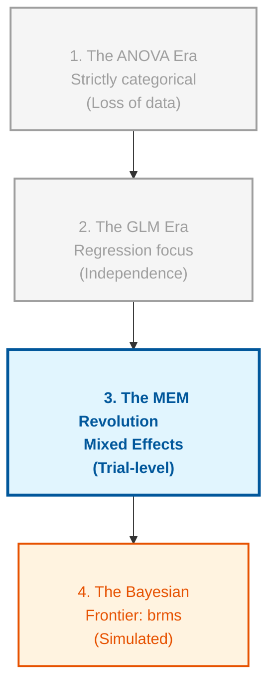

# File: README.md
# Description: This is the Master Study Guide for Mixed Effects Models (MEM). It is structured as a "Professor's Handout" to facilitate deep understanding, memorisation, and practical application. Expanded with technical depth, "Pro-Tips," and optimised visuals.

# 🎓 Mixed Effects Models (MEM): The Master Framework

## 🌍 The Larger Context: The Statistical Big Picture
> **Professor's Perspective:** "To understand MEM, you must see it not as a new tool, but as the 'Missing Link' in statistical evolution. For decades, we were forced to choose between the simplicity of ANOVA and the flexibility of Regression. MEM finally combined them, allowing us to model the messy, clustered reality of human behaviour without throwing away precious data."

### 📄 The Statistical Lineage
Mixed Effects Models sit at the intersection of several historical traditions. Understanding where they come from helps you understand why we use them today.

**Figure 1**

*Evolutionary Timeline of Statistical Modelling*

*Note.* This figure illustrates the historical progression of statistical methods leading to modern Mixed Effects Models (MEM). The "ANOVA Era" was limited by its requirement for balanced, categorical data and often required the aggregation of repeated measures, which resulted in a significant loss of statistical power and individual-level nuance. The "GLM Era" introduced the flexibility of continuous predictors but relied on the strict assumption of independence—an assumption frequently violated in psychological research where participants provide multiple data points. The "MEM Revolution" represents the current gold standard, allowing for the simultaneous modelling of fixed and random effects, thus preserving trial-level information. Finally, the "Bayesian Frontier" via packages like `brms` offers solutions for highly complex models that may fail to converge in frequentist frameworks.

### 📄 The "Aggregation Crisis" (Why MEM exists)
Before MEM became standard, researchers had a problem with repeated measures. If Joe contributed 50 trials, we would usually **aggregate** them into one "Joe Average."
*   **The Hidden Cost:** By averaging Joe, you delete the information about how Joe changed over time (learning/fatigue) and how much Joe fluctuated (within-person variance).
*   **The MEM Solution:** MEM keeps all 50 trials. It uses the "Trial-level" information to give more weight to stable participants and less to noisy ones, resulting in a more accurate picture of the population.

---

## 🏛️ The Statistical Roadmap: "The 7 Steps"
*Memorise this sequence. It is the logical flow of every professional analysis.*

**Figure 2**

*The Professional Analysis Workflow for Mixed Effects Models*

```mermaid
%%{init: { 'flowchart': { 'padding': 30, 'useMaxWidth': false, 'htmlLabels': true }, 'theme': 'neutral', 'themeVariables': { 'fontSize': '12px', 'fontFamily': '-apple-system,BlinkMacSystemFont,"Segoe UI",Helvetica,Arial,sans-serif' }}}%%
graph LR
    classDef purple fill:#f3e5f5,stroke:#7b1fa2,stroke-width:2px,color:#4a148c;

    S1["<br/>&nbsp;&nbsp;&nbsp;&nbsp;&nbsp;&nbsp; 1. Clean & &nbsp;&nbsp;&nbsp;&nbsp;&nbsp;&nbsp;<br/>&nbsp;&nbsp;&nbsp;&nbsp;&nbsp;&nbsp; Code &nbsp;&nbsp;&nbsp;&nbsp;&nbsp;&nbsp;<br/>"]:::purple
    S2["<br/>&nbsp;&nbsp;&nbsp;&nbsp;&nbsp;&nbsp; 2. Visualise &nbsp;&nbsp;&nbsp;&nbsp;&nbsp;&nbsp;<br/>&nbsp;&nbsp;&nbsp;&nbsp;&nbsp;&nbsp; Data &nbsp;&nbsp;&nbsp;&nbsp;&nbsp;&nbsp;<br/>"]:::purple
    S3["<br/>&nbsp;&nbsp;&nbsp;&nbsp;&nbsp;&nbsp; 3. Pick &nbsp;&nbsp;&nbsp;&nbsp;&nbsp;&nbsp;<br/>&nbsp;&nbsp;&nbsp;&nbsp;&nbsp;&nbsp; Effects &nbsp;&nbsp;&nbsp;&nbsp;&nbsp;&nbsp;<br/>"]:::purple
    S4["<br/>&nbsp;&nbsp;&nbsp;&nbsp;&nbsp;&nbsp; 4. Fit &nbsp;&nbsp;&nbsp;&nbsp;&nbsp;&nbsp;<br/>&nbsp;&nbsp;&nbsp;&nbsp;&nbsp;&nbsp; Model &nbsp;&nbsp;&nbsp;&nbsp;&nbsp;&nbsp;<br/>"]:::purple
    S5["<br/>&nbsp;&nbsp;&nbsp;&nbsp;&nbsp;&nbsp; 5. Check &nbsp;&nbsp;&nbsp;&nbsp;&nbsp;&nbsp;<br/>&nbsp;&nbsp;&nbsp;&nbsp;&nbsp;&nbsp; Fit &nbsp;&nbsp;&nbsp;&nbsp;&nbsp;&nbsp;<br/>"]:::purple
    S6["<br/>&nbsp;&nbsp;&nbsp;&nbsp;&nbsp;&nbsp; 6. Get &nbsp;&nbsp;&nbsp;&nbsp;&nbsp;&nbsp;<br/>&nbsp;&nbsp;&nbsp;&nbsp;&nbsp;&nbsp; Answers &nbsp;&nbsp;&nbsp;&nbsp;&nbsp;&nbsp;<br/>"]:::purple
    S7["<br/>&nbsp;&nbsp;&nbsp;&nbsp;&nbsp;&nbsp; 7. Follow-up &nbsp;&nbsp;&nbsp;&nbsp;&nbsp;&nbsp;<br/>&nbsp;&nbsp;&nbsp;&nbsp;&nbsp;&nbsp; Analysis &nbsp;&nbsp;&nbsp;&nbsp;&nbsp;&nbsp;<br/>"]:::purple

    S1 --> S2 --> S3 --> S4 --> S5 --> S6 --> S7
```

*Note.* This linear workflow represents the standardized operational procedure for conducting a professional Mixed Effects Model analysis. It begins with rigorous data cleaning and coding (Step 1), followed by exploratory visualization (Step 2) to identify potential non-linearity or outliers. Step 3 involves selecting the appropriate fixed and random effects based on the experimental design (following the "Maximal Rule"). Step 4 is the actual model estimation, typically using the `lme4` or `glmmTMB` packages in R. Step 5 is a critical diagnostic phase where the researcher evaluates model fit through residual plots and checks for singularity. Step 6 involves extracting statistical inferences, such as $p$-values with Kenward-Roger corrections. Finally, Step 7 encompasses post-hoc comparisons and simple slopes analysis to interpret complex interactions.

---

## 📜 The Professor's Golden Rules (Memorise These!)
1.  **The <b>Independence Rule</b>:** If you measure the same thing multiple times (Repeated Measures), you **must** use MEM to avoid **<b>Clumping Bias</b>**.
2.  **The <b>5-Level Rule</b>:** Only use a variable as a **<b>Grouping Factor</b>** (Random Intercept) if it has at least 5 different levels (e.g., 5+ participants).
3.  **The <b>Maximal Rule</b>:** Always *start* with the most complex random-effects structure your design allows (Barr et al., 2013).
4.  **The <b>Sum-to-Zero Rule</b>:** If you use **<b>Type 3 Sums of Squares</b>**, you **must** use **<b>Sum-to-zero coding</b>** (`contr.sum`). Otherwise, your main effects will be misleading.
5.  **The <b>Centring Rule</b>:** Always **<b>centre</b>** continuous predictors so the "starting line" (Intercept) makes physical sense.

---

## 📅 The Conceptual Evolution (Weekly Detailed Analysis)

### 🟢 Week 1: The "Why" - Politeness & Independence
**Detailed Abstract**  
The course begins by addressing the **<b>Independence Assumption</b>**. Standard $t$-tests and ANOVAs assume each data point is a "stranger." In repeated-measures designs, this is false. Violating this leads to **<b>Clumping Bias</b>** (underestimated standard errors). Using the **<b>Politeness Data</b>**, we see that Subject A has a naturally high voice and Subject B a low one; we only care about the **<b>Within-Person Variance</b>**.

**Core Definitions**  
*   **<b>Fixed Effects</b>**: Variables whose levels are the only ones we care about (e.g., Condition).
*   **<b>Random Effects</b>**: Variables whose levels are sampled from a larger population (e.g., Subjects, Items).
*   **<b>Shrinkage</b>**: The process where extreme individual estimates are "pulled" toward the group mean.

### 🟢 Week 2: Preparation - Data Cleaning & Centring
**Detailed Abstract**  
Data must be prepared before fitting. The **<b>Centring Rule</b>** is vital: $X_{centred} = X - \bar{X}$. This makes the Intercept the "Grand Mean." We also handle outliers via **<b>Winsorising</b>** (capping extreme values) using the **<b>MAD Rule</b>** (`Median +/- 2.5*MAD`).

**Core Definitions**  
*   **<b>Winsorising</b>**: Replacing outliers with the nearest "acceptable" value.
*   **<b>Mean Centring</b>**: Shifting a variable so its mean is zero.

### 🟢 Weeks 3 & 4: The Shield - Kenward-Roger & REML
**Detailed Abstract**  
Frequentist $p$-values are often too "brave." The **<b>Kenward-Roger (KR)</b>** correction acts as a shield, adjusting the **<b>Degrees of Freedom</b>** to protect against **<b>Type 1 Error</b>**. We also distinguish between **<b>REML</b>** (for final estimates) and **<b>ML</b>** (for model comparisons).

**Core Definitions**  
*   **<b>REML</b>**: Restricted Maximum Likelihood; unbiased for variance components.
*   **<b>Wald Test</b>**: A common but often over-optimistic test for significance.

### 🟢 Week 5: The Magnifying Glass - Interactions & Emmeans
**Detailed Abstract**  
Significant interactions are "Clues." We use **<b>Estimated Marginal Means (emmeans)</b>** to zoom in and perform **<b>Post-hoc Comparisons</b>**. In growth data like **<b>ChickWeight</b>**, we must also check for **<b>Heteroscedasticity</b>** (uneven variance).

**Core Definitions**  
*   **<b>Interaction Effect</b>**: When the effect of one IV depends on the level of another IV.
*   **<b>Simple Slopes</b>**: Testing the effect of one variable at specific levels of another.

### 🟢 Week 6: The Pruning - Singularity & Convergence
**Detailed Abstract**  
Complexity has a cost. If R gives a **<b>Singularity Warning</b>**, the model is over-fitted. We apply **<b>Principled Pruning</b>**: (1) remove random correlations (`||`), (2) remove the smallest variance component.

**Core Definitions**  
*   **<b>Singularity</b>**: When a variance component is estimated as zero or -1/1 correlation.
*   **<b>Convergence</b>**: When the algorithm finds the "best" parameters successfully.

---

## 🖼️ The Visual Diagnostic Gallery

| Plot | Professor's Mnemonic | The Application Check |
| :--- | :--- | :--- |
| **Density** | 🌊 **The Wave** | Is it skewed? (If yes, try log-transformation or **Winsorising**). |
| **Lattice** | 🪟 **The Windows** | Is there a "Rebel" participant who goes against the grain? (Check individual slopes). |
| **Q-Q** | 📏 **The Diagonal** | Are the dots "hugging" the line? (If they snake away, your $p$-values are suspect). |
| **Residual** | ☁️ **The Cloud** | Is there a "Funnel"? (If the cloud expands, you've violated Homoscedasticity). |

---

## 🧹 Data Management & Outliers (Expanded)
*Source: Week 2, Slide 113; Class 6 Workflow*

### 📄 Winsorising vs. Exclusion
*   **Winsorising:** Replace extreme values with the nearest "acceptable" value (e.g., the 95th percentile). This preserves your sample size.
*   **Exclusion:** Delete the row. Only do this if the value is a clear technical error (e.g., RT = 1ms).
*   **The MAD Rule:** `Median +/- 2.5 * MAD`. MAD is the "robust brother" of Standard Deviation—it isn't swayed by the outliers it's trying to find.

### 📄 The "lm() Trick"
*   **Goal:** Check if a random slope is estimable *in principle*.
*   **Method:** Run a standard `lm()` on just **one** participant. If `lm()` can't estimate the effect for one person, `lmer()` can't estimate it as a random slope for the whole group.

---

## ❓ The Professor's Self-Check (Active Recall)
*Ask yourself these questions to verify your mastery. If you can't answer one, re-read the section above.*

### 🔹 Level 1: Basic Recall
1.  What is the "5-Level Rule" for grouping factors?
2.  What does a "Singularity" warning actually mean in plain English?
3.  Which R package is the "Gold Standard" for obtaining $p$-values in this course?
4.  What is the difference between `(1 + IV | Group)` and `(1 + IV || Group)`?

### 🔹 Level 2: Conceptual Understanding
1.  Why is it "cheating" to run a standard $t$-test on repeated-measures data? (Hint: Type 1 Error).
2.  If my data has a long right-tail (skewed), why should I look at "The Wave" before running the model?
3.  Explain why **Winsorising** is often preferred over **Exclusion** in real-world messy data.
4.  Why must you use **Sum-to-zero coding** when running a Type 3 ANOVA?

### 🔹 Level 3: Application (The Exam Challenge)
1.  **Scenario:** You are testing an AAT task with 40 participants. You get a Singularity warning. You currently have `(1 + Emotion * Target | pid)`. What is your **first** step to prune the model according to "Principled Pruning"?
2.  **Scenario:** You find a significant interaction between `Gender` and `Time`. Your professor asks: "Which gender improved faster?" Which R command do you use to answer this?
3.  **Scenario:** You are using `car::Anova(type = 3)`. You forgot to use `contr.sum`. Why will your professor mark your "Main Effects" results as incorrect?
4.  **Scenario:** You have 3 observations per participant for a continuous predictor. Is this enough to justify a random slope? (Hint: See Week 5 slides).

---

## 🔗 How to use this guide with LLMs
To simulate an oral exam, paste this guide into an LLM and say:
> *"I am preparing for a Mixed Effects Models exam. Act as a strict but helpful professor. Use the 'Professor's Self-Check' questions in this guide to quiz me one by one. Do not move to the next question until I have correctly applied the conceptual logic."*
