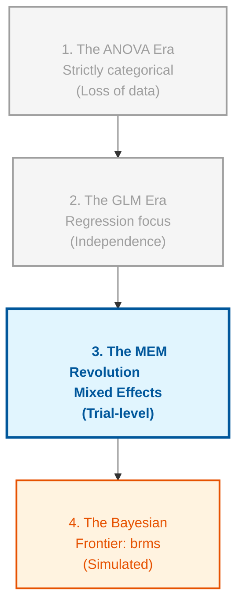

# Course Mastery Guide: Mixed Effects Models (Encyclopedia Edition)

This guide is a master-level statistical resource optimized for the MSc Behavioural Science curriculum. It features deep-dive logic, R-syntax "Rosetta Stones," and surgical definitions of every symbol and parameter.

---

## 🌍 The Larger Context: The Statistical Big Picture
> **Professor's Perspective:** "To understand MEM, you must see it not as a new tool, but as the 'Missing Link' in statistical evolution. For decades, we were forced to choose between the simplicity of ANOVA and the flexibility of Regression. MEM finally combined them, allowing us to model the messy, clustered reality of human behaviour without throwing away precious data."

### 📄 The Statistical Lineage
Mixed Effects Models sit at the intersection of several historical traditions. Understanding where they come from helps you understand why we use them today.

**Figure 1**

*Evolutionary Timeline of Statistical Modelling*



---

## 🛠️ The Anatomy of a Formula: What every symbol means
Before diving into weeks, you must decode the `lmer` syntax symbol-by-symbol.

*   **`~` (The Tilde):** "Is predicted by."
*   **`1` (The Intercept):** The "Anchor." It represents the baseline value (where the line hits the Y-axis).
*   **`+` (The Plus):** "In addition to." We are layering different sources of influence.
*   **`|` (The Grouping Pipe):** The "Divider." It separates **what varies** (on the left) from **who is varying** (on the right).
*   **`( ... | Subject )` (The Random Effect):** "Allow these specific things to be different for every unique Subject."

---

## 📅 The Conceptual Evolution (Weekly Logic & Syntax)

### 🟢 Week 1: The Independence Revolution
**The Statistical Logic**  
The core problem is **<span style="color:#e63946"><b>Non-Independence</b></span>**. Standard $t$-tests assume each data point comes from a different person (a "stranger"). In behavioral science, we often collect 50 trials from one person.

**The Formula Explained**
$$Y_{ij} = \beta_0 + u_{0j} + e_{ij}$$
*   $Y_{ij}$: The specific score for person $j$ on trial $i$.
*   $\beta_0$: The **<span style="color:#e63946"><b>Fixed Intercept</b></span>** (The "Grand Average" starting point for everyone).
*   $u_{0j}$: The **<span style="color:#e63946"><b>Random Intercept</b></span>** (How much person $j$ differs from the average).
*   $e_{ij}$: The **<span style="color:#e63946"><b>Residual Error</b></span>** (The remaining noise/luck for that specific trial).

**The R-Syntax Rosetta Stone**
*   **The Solution:** `lmer(Pitch ~ Attitude + (1 | Subject))`
*   **The Bottom Line:** Adding `(1 | Subject)` means "I recognize that people aren't identical; I'm giving everyone their own starting point so I can see the treatment effect more clearly."

**The functions explained**
*   `lmer()`: The primary tool for **<span style="color:#e63946"><b>Linear Mixed-Effects Models</b></span>**.
*   `(1 | Subject)`: Creates a **<span style="color:#e63946"><b>Random Intercept</b></span>**.
*   **<span style="color:#e63946"><b>ICC (Intraclass Correlation)</b></span>**: The percentage of "Clumping." It answers: "How much of the variance is just due to people being different from each other?"

**Practical Translation: Formula-to-English**
> "Joe and Sarah start at different heights. Don't punish the treatment effect just because Joe is naturally a high-pitched person."

**Diagnostic Lab: Anatomy of the Variance Table**
```R
Random effects:
 Groups   Name        Variance Std.Dev.
 Subject  (Intercept) 624.89   24.998  # A: Between-person variance (The "Clump")
 Residual             548.79   23.426  # B: Within-person variance (The "Noise")
```

**📈 Knowledge Advancement: The Leap**
*   **New State:** I now recognize that data has "families" (clusters). I can handle **<span style="color:#e63946"><b>Nested Data</b></span>** without throwing away trial-level information.

---

### 🟢 Week 2: The Cleanliness Mandate
**The Statistical Logic**  
Raw data is often "anchored" to meaningless points. If you don't **<span style="color:#e63946"><b>centre</b></span>** your predictors, the **<span style="color:#e63946"><b>Intercept</b></span>** represents the score at "Trial 0"—which often doesn't exist.

**The Formula Explained**
$$X_{centered} = X_i - \bar{X}$$
*   $X_i$: The original score.
*   $\bar{X}$: The average score of the whole group.
*   **What this means:** We are shifting the "0" to the middle of the data.

**The R-Syntax Rosetta Stone**
*   **Centring:** `df$c_Trial <- df$Trial - mean(df$Trial)`
*   **The Bottom Line:** Centering makes the **<span style="color:#e63946"><b>Intercept</b></span>** meaningful. It now represents the performance of an "Average Person" at the "Average Timepoint."

**The functions explained**
*   `winsor()`: Replaces outliers with the nearest "acceptable" value.
*   **<span style="color:#e63946"><b>MAD (Median Absolute Deviation)</b></span>**: A measure of spread that isn't fooled by the outliers it's trying to find.

**Practical Translation: Formula-to-English**
> "The Intercept is no longer some mythical birth-moment; it is the performance of an average person at the middle of the experiment."

---

### 🟢 Weeks 3 & 4: The Inference Shield
**The Statistical Logic**  
Mixed models are "greedy" for **<span style="color:#e63946"><b>Degrees of Freedom (df)</b></span>**. In small samples, the standard $p$-value is too optimistic.

**The R-Syntax Rosetta Stone**
*   **The Shield:** `car::Anova(model, type = 3, test.statistic = "F")`
*   **The Bottom Line:** If you see **<span style="color:#e63946"><b>Decimal Degrees of Freedom</b></span>** (e.g., 28.42), the "Inference Shield" (Kenward-Roger) is working. It means your $p$-value is "honest" and protected against false positives.

**The functions explained**
*   **<span style="color:#e63946"><b>Kenward-Roger (KR)</b></span>**: A correction that lowers your degrees of freedom to account for the fact that data points from the same person aren't truly independent.
*   **<span style="color:#e63946"><b>REML</b></span>**: Use this for your final results. It provides the most accurate estimates of variances.

---

### 🟢 Week 5: The Multi-Level Lens (Interactions)
**The Statistical Logic**  
When an interaction is present, the "Main Effects" change their meaning entirely. They are no longer "overall" effects.

**The Formula Explained**
$$Y = \beta_0 + \beta_1 A + \beta_2 B + \beta_3 (A \times B)$$
*   $\beta_1$: The effect of $A$ **specifically when $B$ is zero** (or at its average, if centered).
*   $\beta_3$: The **<span style="color:#e63946"><b>Interaction</b></span>**. It answers: "How much does the effect of $A$ change for every 1-unit increase in $B$?"

**The R-Syntax Rosetta Stone**
*   **The Interaction:** `weight ~ Time * Diet`
*   **Crossed Effects:** `(1 | Subject) + (1 | Item)`
*   **The Bottom Line:** A significant interaction is a "Warning." It tells you that you cannot talk about the main effect of `Time` without also mentioning `Diet`.

**The functions explained**
*   `emmeans()`: "Model-based" means. They represent the "pure" average after the model has filtered out the random noise.
*   **<span style="color:#e63946"><b>Simple Slopes</b></span>**: Testing the effect of one variable at a specific level of another.

**Practical Translation: Formula-to-English**
> "A significant interaction means: 'The effect of the drug depends on the age of the patient. It works for kids, but not for adults.'"

---

### 🟢 Week 6: The Pruning Principle
**The Statistical Logic**  
When you ask too much of the data, the model becomes "greedy" and gives you a **<span style="color:#e63946"><b>Singularity Warning</b></span>**.

**The R-Syntax Rosetta Stone**
*   **The Warning:** `boundary (singular) fit`.
*   **The Pruning:** `(1 + IV || Subject)`
*   **The Bottom Line:** A "Singular Fit" means you are trying to estimate a difference that doesn't exist in the data. You are trying to find a unique "Slope" for Joe, but Joe doesn't have enough data points to define a unique slope.

**The functions explained**
*   `||` (Double Pipe): The **<span style="color:#e63946"><b>Zero-Correlation Constraint</b></span>**. It tells R to stop looking for a link between the baseline and the slope.
*   **<span style="color:#e63946"><b>Principled Pruning</b></span>**: Removing the most complex random effects until the model becomes mathematically stable.

---

### 🟢 Week 7: The Non-Linear Frontier
**The Statistical Logic**  
Behavior is rarely a straight line. We use **<span style="color:#e63946"><b>Polynomials</b></span>** to let the line bend.

**The Formula Explained**
$$Y = \beta_0 + \beta_1 X + \beta_2 X^2$$
*   $\beta_1$: The **<span style="color:#e63946"><b>Linear Term</b></span>** (Overall direction: Up or Down).
*   $\beta_2$: The **<span style="color:#e63946"><b>Quadratic Term</b></span>** (The "Bend": Acceleration or Plateau).

**The R-Syntax Rosetta Stone**
*   **The Curve:** `poly(Trial, 2)`
*   **The Bottom Line:** A **Negative Quadratic** term means the effect is "levelling off" (e.g., learning slows down over time). A **Positive Quadratic** means the effect is "accelerating" (e.g., growth gets faster and faster).

**The functions explained**
*   **<span style="color:#e63946"><b>Orthogonal Polynomials</b></span>**: A way to model curves where the linear and quadratic terms don't "fight" (interfere) with each other.

---

## ❓ The Professor's Self-Check (Active Recall)
1.  **What** does the `|` symbol actually do in an `lmer` formula?
2.  **Why** do we see decimal degrees of freedom in a good mixed model?
3.  **What** does a "Singular Fit" mean for the stability of your model?
4.  **How** does the meaning of a "Main Effect" change when an interaction is significant?
5.  **What** part of the polynomial formula tells you if a trend is "levelling off"?
