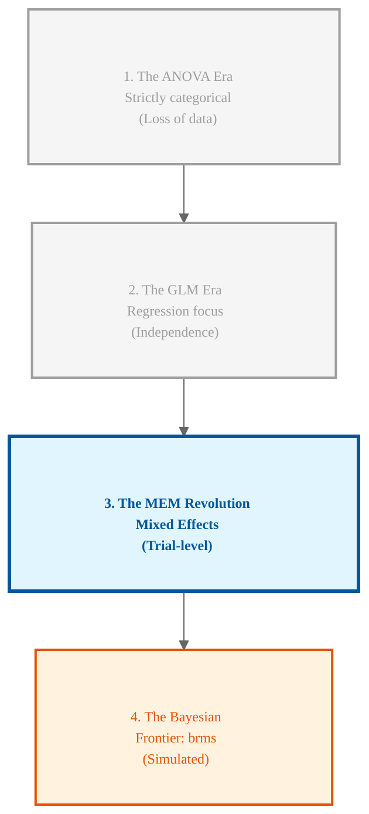

# Course Mastery Guide: Mixed Effects Models (Encyclopedia Edition)

> **Status:** This summary is currently under review by the author.

This guide is a master-level statistical resource optimized for the MSc Behavioural Science curriculum. It features deep-dive logic, R-syntax "Rosetta Stones," and surgical definitions of every symbol and parameter.

---

## 🌍 The Larger Context: The Statistical Big Picture
> **Professor's Perspective:** "To understand MEM, you must see it not as a new tool, but as the 'Missing Link' in statistical evolution. For decades, we were forced to choose between the simplicity of ANOVA and the flexibility of Regression. MEM finally combined them, allowing us to model the messy, clustered reality of human behaviour without throwing away precious data."

### 📄 The Statistical Lineage
Mixed Effects Models sit at the intersection of several historical traditions. Understanding where they come from helps you understand why we use them today.

**Figure 1**

*Evolutionary Timeline of Statistical Modelling*



---

## 🛠️ The Anatomy of a Formula: What every symbol means
Before diving into weeks, you must decode the `lmer` syntax symbol-by-symbol.

*   **`~` (The Tilde):** "Is predicted by."
*   **`1` (The Intercept):** The "Anchor." It represents the baseline value (where the line hits the Y-axis).
*   **`+` (The Plus):** "In addition to." We are layering different sources of influence.
*   **`|` (The Grouping Pipe):** The "Divider." It separates **what varies** (on the left) from **who is varying** (on the right).
*   **`( ... | Subject )` (The Random Effect):** "Allow these specific things to be different for every unique Subject."

---

## 📅 The Conceptual Evolution (Weekly Logic & Syntax)

### 🟢 Week 1: Introduction to LMMs and the Independence Revolution
**The Statistical Logic**  
The core problem is **<span style="color:#e63946"><b>Non-Independence</b></span>**. Standard $t$-tests assume each data point comes from a different person (a "stranger"). In behavioral science, we often collect 50 trials from one person.

**The Formula Explained**
$$Y_{ij} = \beta_0 + u_{0j} + e_{ij}$$
*   $Y_{ij}$: The specific score for person $j$ on trial $i$.
*   $\beta_0$: The **<span style="color:#e63946"><b>Fixed Intercept</b></span>** (The "Grand Average" starting point for everyone).
*   $u_{0j}$: The **<span style="color:#e63946"><b>Random Intercept</b></span>** (How much person $j$ differs from the average).
*   $e_{ij}$: The **<span style="color:#e63946"><b>Residual Error</b></span>** (The remaining noise/luck for that specific trial).

**The R-Syntax Rosetta Stone**
*   **The Solution:** `lmer(Pitch ~ Attitude + (1 | Subject))`
*   **The Bottom Line:** Adding `(1 | Subject)` means "I recognize that people aren't identical; I'm giving everyone their own starting point so I can see the treatment effect more clearly."

**The Functions Explained**
*   #### <span style="color:#457b9d">lmer()</span>
    *   **Meaning:** Linear Mixed-Effects Regression.
    *   **Does:** Estimates both **<span style="color:#e63946"><b>Fixed Effects</b></span>** (population-level averages) and **<span style="color:#e63946"><b>Random Effects</b></span>** (individual-level variations) simultaneously. It uses Maximum Likelihood to find the parameters that make the observed data most probable.
    *   **Used:** Whenever your data is **<span style="color:#e63946"><b>nested</b></span>** or **<span style="color:#e63946"><b>clustered</b></span>** (e.g., trials within participants, students within classrooms).
    *   **Example:** `lmer(RT ~ Condition + (1 | Subject))` models how Reaction Time varies by Condition while accounting for the fact that some participants are naturally faster than others.

*   #### <span style="color:#457b9d">ICC (Intraclass Correlation)</span>
    *   **Meaning:** A measure of the proportion of variance explained by the grouping factor.
    *   **Does:** Calculates the ratio of **<span style="color:#e63946"><b>Between-group variance</b></span>** to **<span style="color:#e63946"><b>Total variance</b></span>**.
    *   **Used:** To quantify the degree of **<span style="color:#e63946"><b>Clumping</b></span>** in your data. An ICC near 1 means participants are very consistent with themselves but very different from each other; an ICC near 0 means the clustering doesn't matter much.
    *   **Example:** If your ICC for "Subject" is 0.40, it means 40% of the differences in scores are simply due to stable differences between people.

**Practical Translation: Formula-to-English**
*   **`(1 | Subject)`** $\rightarrow$ "Joe and Sarah start at different heights. Don't punish the treatment effect just because Joe is naturally a high-pitched person."

**Diagnostic Lab: Anatomy of the Variance Table**
```R
Random effects:
 Groups   Name        Variance Std.Dev.
 Subject  (Intercept) 624.89   24.998  # A: Between-person variance (The "Clump")
 Residual             548.79   23.426  # B: Within-person variance (The "Noise")
```

**📈 Knowledge Advancement: The Leap**
*   **New State:** I now recognize that data has "families" (clusters). I can handle **<span style="color:#e63946"><b>Nested Data</b></span>** without throwing away trial-level information.

---

### 🟢 Week 2: Data Preparation, Centring, and Outliers
**The Statistical Logic**  
Raw data is often "anchored" to meaningless points. If you don't **<span style="color:#e63946"><b>centre</b></span>** your predictors, the **<span style="color:#e63946"><b>Intercept</b></span>** represents the score at "Trial 0"—which often doesn't exist.

**The Formula Explained**
$$X_{centered} = X_i - \bar{X}$$
*   $X_i$: The original score.
*   $\bar{X}$: The average score of the whole group.
*   **What this means:** We are shifting the "0" to the middle of the data.

**The R-Syntax Rosetta Stone**
*   **Centring:** `df$c_Trial <- df$Trial - mean(df$Trial)`
*   **The Bottom Line:** Centering makes the **<span style="color:#e63946"><b>Intercept</b></span>** meaningful. It now represents the performance of an "Average Person" at the "Average Timepoint."

**The Functions Explained**
*   #### <span style="color:#457b9d">winsor()</span>
    *   **Meaning:** Winsorisation of data.
    *   **Does:** Caps extreme values at a specific percentile (e.g., 5th and 95th) instead of deleting them. This limits the influence of outliers while preserving the **<span style="color:#e63946"><b>sample size</b></span>**.
    *   **Used:** When you have "rebel" data points (outliers) that would otherwise pull your regression line away from the true population trend.
    *   **Example:** `winsor(df$RT, trim = 0.05)` replaces any Reaction Time in the top or bottom 5% with the value at the 95th or 5th percentile respectively.

*   #### <span style="color:#457b9d">MAD (Median Absolute Deviation)</span>
    *   **Meaning:** A robust measure of statistical dispersion.
    *   **Does:** Calculates the median of the absolute deviations from the data's median. It provides a measure of spread that is much less affected by outliers than the Standard Deviation.
    *   **Used:** To identify outliers using the **<span style="color:#e63946"><b>MAD Rule</b></span>** (`Median +/- 2.5 * MAD`).
    *   **Example:** If your median is 500ms and MAD is 50ms, any score beyond 625ms (500 + 2.5*50) is flagged as an outlier.

**Practical Translation: Formula-to-English**
*   **`X - mean(X)`** $\rightarrow$ "The Intercept is no longer some mythical birth-moment; it is the performance of an average person at the middle of the experiment."

---

### 🟢 Weeks 3 & 4: Inference, p-values, and the Inference Shield
**The Statistical Logic**  
Mixed models are "greedy" for **<span style="color:#e63946"><b>Degrees of Freedom (df)</b></span>**. In small samples, the standard $p$-value is too optimistic.

**The R-Syntax Rosetta Stone**
*   **The Shield:** `car::Anova(model, type = 3, test.statistic = "F")`
*   **The Bottom Line:** If you see **<span style="color:#e63946"><b>Decimal Degrees of Freedom</b></span>** (e.g., 28.42), the "Inference Shield" (Kenward-Roger) is working. It means your $p$-value is "honest" and protected against false positives.

**The Functions Explained**
*   #### <span style="color:#457b9d">Kenward-Roger (KR)</span>
    *   **Meaning:** A small-sample correction for F-tests in LMMs.
    *   **Does:** Adjusts the **<span style="color:#e63946"><b>Degrees of Freedom</b></span>** downwards and the F-statistic slightly to account for the fact that data points within a cluster are not fully independent. This protects against **<span style="color:#e63946"><b>Type 1 Error</b></span>**.
    *   **Used:** In almost all behavioral science LMMs, especially when the number of clusters (participants) is relatively small (e.g., < 50).
    *   **Example:** Using `test.statistic = "F"` in `car::Anova()` invokes this correction, often resulting in non-integer degrees of freedom.

*   #### <span style="color:#457b9d">REML (Restricted Maximum Likelihood)</span>
    *   **Meaning:** A method for estimating variance components.
    *   **Does:** Separates the estimation of **<span style="color:#e63946"><b>Random Effects</b></span>** (variances) from the **<span style="color:#e63946"><b>Fixed Effects</b></span>**. Unlike standard ML, REML provides unbiased estimates of variances because it accounts for the degrees of freedom used by the fixed effects.
    *   **Used:** Always for your **<span style="color:#e63946"><b>final model estimates</b></span>**.
    *   **Example:** `lmer(..., REML = TRUE)` (the default) ensures your standard errors and variances are not systematically underestimated.

---

### 🟢 Week 5: Random Slopes, Interactions, and Follow-up Tests
**The Statistical Logic**  
When an interaction is present, the "Main Effects" change their meaning entirely. They are no longer "overall" effects.

**The Formula Explained**
$$Y = \beta_0 + \beta_1 A + \beta_2 B + \beta_3 (A \times B)$$
*   $\beta_1$: The effect of $A$ **specifically when $B$ is zero** (or at its average, if centered).
*   $\beta_3$: The **<span style="color:#e63946"><b>Interaction</b></span>**. It answers: "How much does the effect of $A$ change for every 1-unit increase in $B$?"

**The R-Syntax Rosetta Stone**
*   **The Interaction:** `weight ~ Time * Diet`
*   **Crossed Effects:** `(1 | Subject) + (1 | Item)`
*   **The Bottom Line:** A significant interaction is a "Warning." It tells you that you cannot talk about the main effect of `Time` without also mentioning `Diet`.

**The Functions Explained**
*   #### <span style="color:#457b9d">emmeans()</span>
    *   **Meaning:** Estimated Marginal Means (Least-Squares Means).
    *   **Does:** Calculates predicted means for different levels of your predictors, "averaging out" the effects of other variables in the model. These represent the "pure" model-based averages.
    *   **Used:** To perform **<span style="color:#e63946"><b>Post-hoc Comparisons</b></span>** or to visualize interactions.
    *   **Example:** `emmeans(model, pairwise ~ Condition)` compares the mean score of each Condition while controlling for all other factors in the model.

*   #### <span style="color:#457b9d">test(joint = TRUE)</span>
    *   **Meaning:** Joint (Omnibus) test of significance.
    *   **Does:** Tests whether a group of coefficients (e.g., all levels of a factor or an interaction) are simultaneously equal to zero.
    *   **Used:** To see if an overall effect or interaction is significant before "zooming in" on specific pairwise differences.
    *   **Example:** `test(emtrends(model, ~ Diet, var = "Time"), joint = TRUE)` tests whether the relationship between Time and Weight differs significantly across the various Diets.

**Practical Translation: Formula-to-English**
*   **`Time * Diet`** $\rightarrow$ "A significant interaction means: 'The effect of the drug depends on the age of the patient. It works for kids, but not for adults.'"

---

### 🟢 Week 6: Model Selection and the Pruning Principle
**The Statistical Logic**  
When you ask too much of the data, the model becomes "greedy" and gives you a **<span style="color:#e63946"><b>Singularity Warning</b></span>**.

**The R-Syntax Rosetta Stone**
*   **The Warning:** `boundary (singular) fit`.
*   **The Pruning:** `(1 + IV || Subject)`
*   **The Bottom Line:** A "Singular Fit" means you are trying to estimate a difference that doesn't exist in the data. You are trying to find a unique "Slope" for Joe, but Joe doesn't have enough data points to define a unique slope.

**The Functions Explained**
*   #### <span style="color:#457b9d">|| (Double Pipe)</span>
    *   **Meaning:** Zero-Correlation Constraint.
    *   **Does:** Forces the correlation between the **<span style="color:#e63946"><b>Random Intercept</b></span>** and the **<span style="color:#e63946"><b>Random Slope</b></span>** to be exactly zero. This reduces the number of parameters the model has to estimate.
    *   **Used:** As the first step in **<span style="color:#e63946"><b>Principled Pruning</b></span>** when a model fails to converge or is singular.
    *   **Example:** `(1 + Condition || Subject)` allows every participant to have their own intercept and their own effect of Condition, but assumes that being faster at baseline doesn't predict being more affected by the condition.

*   #### <span style="color:#457b9d">step()</span>
    *   **Meaning:** Automated backward elimination (Pruning).
    *   **Does:** Systematically removes non-significant random effects (slopes) and then fixed effects based on likelihood ratio tests or AIC.
    *   **Used:** To find a more **<span style="color:#e63946"><b>parsimonious</b></span>** model that is mathematically stable while still capturing the important variance.
    *   **Example:** `lmerTest::step(model)` will suggest which random slopes can be safely removed from the model.

---

### 🟢 Week 7: Non-linear Trends and Polynomials
**The Statistical Logic**  
Behavior is rarely a straight line. We use **<span style="color:#e63946"><b>Polynomials</b></span>** to let the line bend.

**The Formula Explained**
$$Y = \beta_0 + \beta_1 X + \beta_2 X^2$$
*   $\beta_1$: The **<span style="color:#e63946"><b>Linear Term</b></span>** (Overall direction: Up or Down).
*   $\beta_2$: The **<span style="color:#e63946"><b>Quadratic Term</b></span>** (The "Bend": Acceleration or Plateau).

**The R-Syntax Rosetta Stone**
*   **The Curve:** `poly(Trial, 2)`
*   **The Bottom Line:** A **Negative Quadratic** term means the effect is "levelling off" (e.g., learning slows down over time). A **Positive Quadratic** means the effect is "accelerating" (e.g., growth gets faster and faster).

**The Functions Explained**
*   #### <span style="color:#457b9d">poly(..., raw = FALSE)</span>
    *   **Meaning:** Orthogonal Polynomials.
    *   **Does:** Creates new versions of your predictor variable (Linear, Quadratic, etc.) that are perfectly independent of each other (uncorrelated).
    *   **Used:** To model curves (non-linear trends) without the linear and quadratic terms "fighting" for the same variance, which would otherwise cause massive **<span style="color:#e63946"><b>Multicollinearity</b></span>**.
    *   **Example:** `lmer(Score ~ poly(Trial, 2) + (1 | Subject))` models a curved learning trend across trials.

*   #### <span style="color:#457b9d">poly(..., raw = TRUE)</span>
    *   **Meaning:** Raw (Natural) Polynomials.
    *   **Does:** Simply squares the original variable (e.g., $Trial^2$). These are much easier to interpret in terms of the original scale of the data but suffer from high correlation between terms.
    *   **Used:** When **<span style="color:#e63946"><b>interpretability</b></span>** of the specific curve in the original units is more important than statistical efficiency.
    *   **Example:** If you want to predict height at age 5, raw polynomials might be easier to calculate by hand, but orthogonal ones are better for testing if the "bend" is significant.
