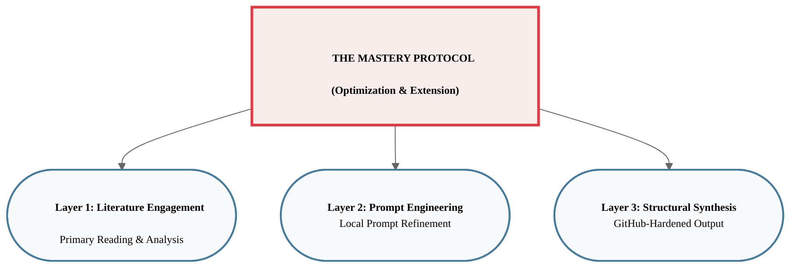

# The Knowledge Engine: MSc Behavioural Science Mastery Guides

This repository is the result of a high-performance synthesis protocol I designed for the MSc Behavioural Science curriculum. It is not a shortcut; it is a **cognitive extension**.

## 🧠 The Philosophy: The Extension Principle

The core philosophy of this project is the **optimisation of my summary writing** through a synthesis of deep primary literature engagement and my manually refined, locally-stored LLM prompts. 

I believe that Large Language Models (LLMs) are not a replacement for the primary work of reading. Instead, I use them as a powerful tool for **rapid revision** and the **structural outlining** of complex topics. These guides are engineered specifically for those of us who have already done the heavy lifting of reading the papers. They act as an architectural map—an extension of my own understanding—ensuring that high-signal insights remain accessible and actionable.

---

## 🏗️ The Mastery Stack: Engineering Standards

Every guide in this repository adheres to a strict visual and semantic protocol I have developed to maximize retention and minimize cognitive load.

### 1. Semantic Precision
*   **Verbatim Keywords:** Every technical term, theory, or mechanism is styled as a `<b>Verbatim Keyword</b>`. This ensures that my mental model remains anchored to the exact language used in the literature.
*   **Salient Priming:** Research paper titles are highlighted in a salient steel blue (`#457b9d`) to facilitate instant categorization by source and year.

### 2. Structural Mapping (GitHub-Hardened)
I use "GitHub-Hardened" Mermaid diagrams to visualize conceptual hierarchies. These are engineered for zero-clipping and professional aesthetics directly within the GitHub UI.

### 3. Cognitive Anchoring
*   **Click-Down Clarity:** All complex glossaries are tucked into `
` menus to maintain a high-signal overview while keeping technical depth one click away.
*   **Salient Mnemonics:** Each weekly theme is distilled into a salient "How to Remember" block, providing a mental hook for rapid recall.

---

## 📂 Repository Navigation

*   [**Communication & Influence**](./Communication_Influence/Mastery_Guide_SOW_BS033.md): Social norms, belief systems, and resistance strategies.
*   [**Mixed-Effects Models**](./Mixed_Effects_Models/Mastery_Guide_Mixed_Effects_Models.md): Hierarchical data structures and statistical mastery.
*   [**Complexity Methods**](./Complexity_Methods/Complete%20Literature%20Over.md): Non-linear dynamics and system-level analysis.

---

> **Note:** These summaries are produced using my local LLM prompts that I have manually iterated upon to ensure the highest signal-to-noise ratio. They are meant to be used as a companion to, not a substitute for, the original research.
